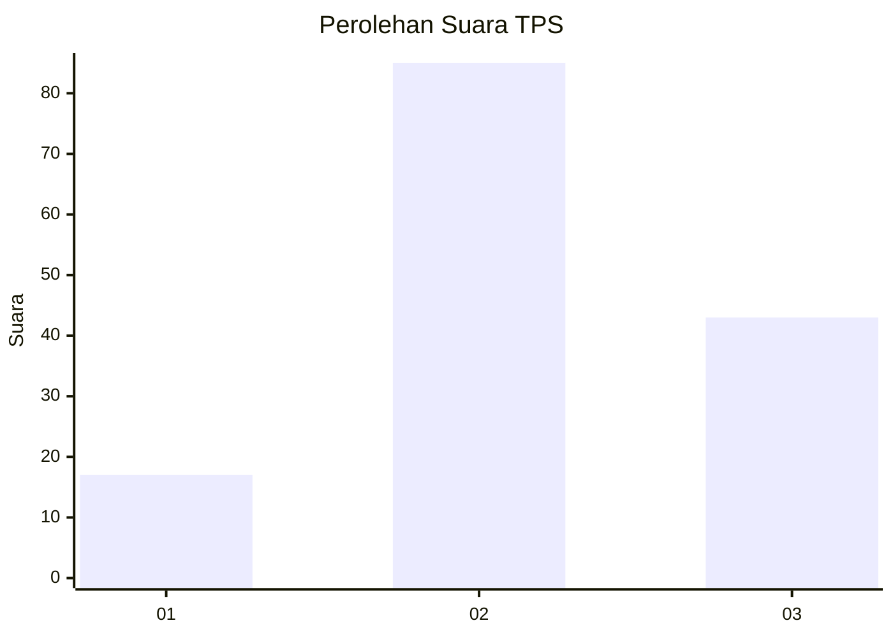
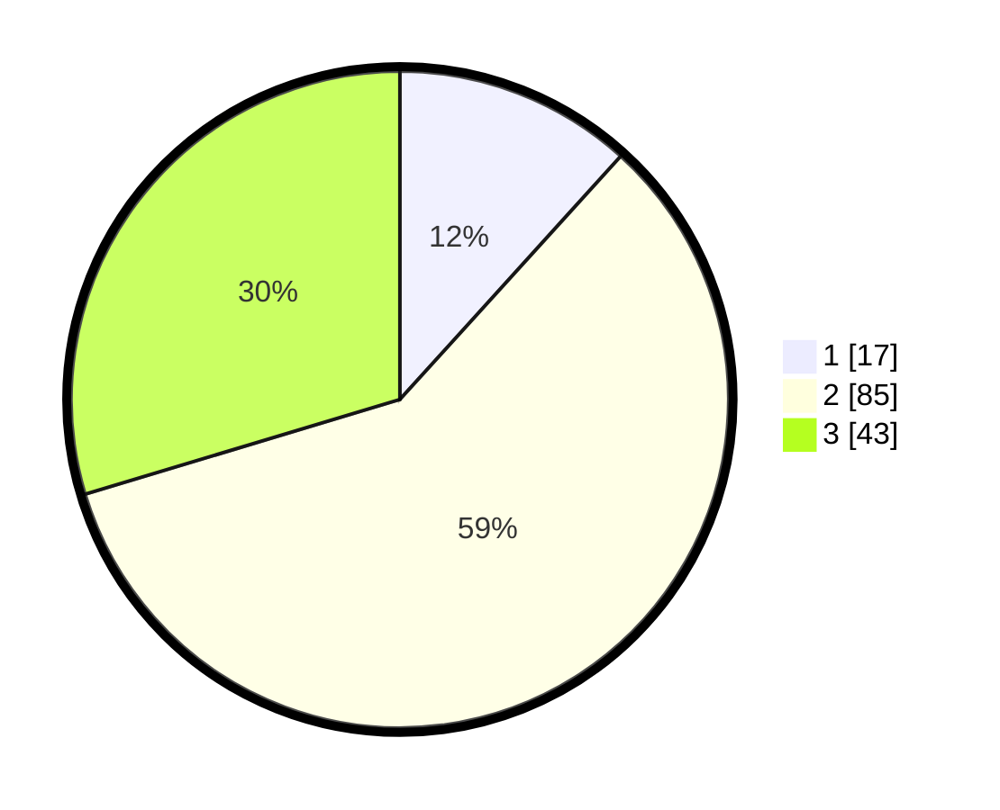

# Hasil

## Grafik

## Tabel

| No. | Nama Paslon    | Suara | Suara (raw) | Persentase |
|:--- |:-------------- | -----:| -----------:| ----------:|
| 1   | ANIES MUHAIMIN | 17    | [17][p-1]   | 11,72      |
| 2   | PRABOWO GIBRAN | 85    | [85][p-2]   | 58,62      |
| 3   | GANJAR MAHFUD  | 43    | [43][p-3]   | 29,66      |

[p-1]: https://github.com/gigit-pemilu/pemilu-2024/blob/main/pilpres/hitung-suara/sub/35-jawa-timur/sub/08-lumajang/sub/10-lumajang/sub/2001-banjarwaru/sub/004-tps/sub/paslon-1.txt
[p-2]: https://github.com/gigit-pemilu/pemilu-2024/blob/main/pilpres/hitung-suara/sub/35-jawa-timur/sub/08-lumajang/sub/10-lumajang/sub/2001-banjarwaru/sub/004-tps/sub/paslon-2.txt
[p-3]: https://github.com/gigit-pemilu/pemilu-2024/blob/main/pilpres/hitung-suara/sub/35-jawa-timur/sub/08-lumajang/sub/10-lumajang/sub/2001-banjarwaru/sub/004-tps/sub/paslon-3.txt

## Foto C Plano

https://sirekap-obj-formc.kpu.go.id/6284/pemilu/ppwp/35/08/10/20/01/3508102001004-20240214-230549--2b6fe92e-51ee-4749-9d68-f6b95fea8c59.jpg

https://sirekap-obj-formc.kpu.go.id/6284/pemilu/ppwp/35/08/10/20/01/3508102001004-20240214-230900--f35bad3a-cb94-4ccd-8d5f-45a4b41cebef.jpg

https://sirekap-obj-formc.kpu.go.id/6284/pemilu/ppwp/35/08/10/20/01/3508102001004-20240214-231039--ec745aea-7df6-44b2-8ac9-97e32c60cf00.jpg

## Metadata

| Key        | Value               |
| ---------- | ------------------- |
| Time Stamp | 2024-02-15 22:00:27 |

