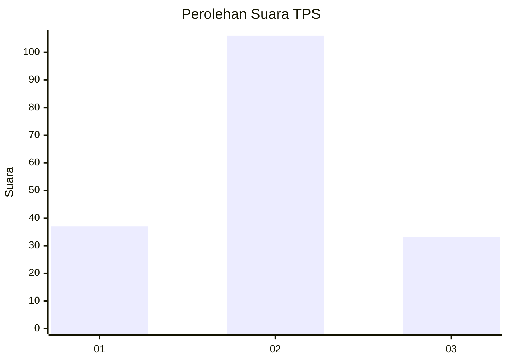
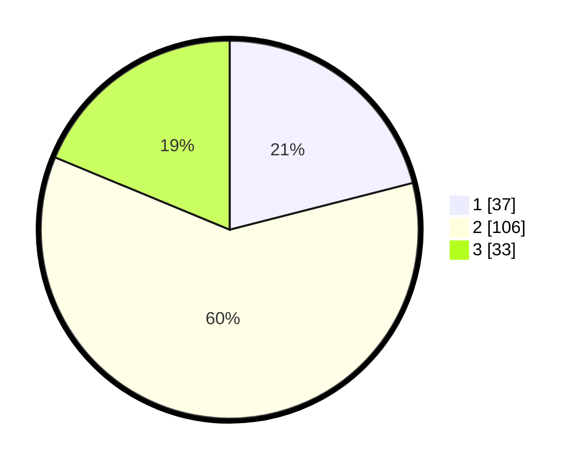

# Hasil

## Grafik

## Tabel

| No. | Nama Paslon    | Suara | Suara (raw) | Persentase |
|:--- |:-------------- | -----:| -----------:| ----------:|
| 1   | ANIES MUHAIMIN | 37    | [37][p-1]   | 21,02      |
| 2   | PRABOWO GIBRAN | 106   | [106][p-2]  | 60,23      |
| 3   | GANJAR MAHFUD  | 33    | [33][p-3]   | 18,75      |

[p-1]: https://github.com/gigit-pemilu/pemilu-2024-35-jawa-timur/blob/main/pilpres/hitung-suara/sub/35-jawa-timur/sub/08-lumajang/sub/10-lumajang/sub/2002-labruk-lor/sub/009-tps/sub/paslon-1.txt
[p-2]: https://github.com/gigit-pemilu/pemilu-2024-35-jawa-timur/blob/main/pilpres/hitung-suara/sub/35-jawa-timur/sub/08-lumajang/sub/10-lumajang/sub/2002-labruk-lor/sub/009-tps/sub/paslon-2.txt
[p-3]: https://github.com/gigit-pemilu/pemilu-2024-35-jawa-timur/blob/main/pilpres/hitung-suara/sub/35-jawa-timur/sub/08-lumajang/sub/10-lumajang/sub/2002-labruk-lor/sub/009-tps/sub/paslon-3.txt

## Foto C Plano

https://sirekap-obj-formc.kpu.go.id/7304/pemilu/ppwp/35/08/10/20/02/3508102002009-20240214-194642--b8ce99ab-d588-42bf-8123-9db83dfc8052.jpg

https://sirekap-obj-formc.kpu.go.id/7304/pemilu/ppwp/35/08/10/20/02/3508102002009-20240214-194705--157c8d35-67f9-426a-8db1-ce020310059e.jpg

https://sirekap-obj-formc.kpu.go.id/7304/pemilu/ppwp/35/08/10/20/02/3508102002009-20240214-201526--2b546f87-7067-4b7b-93ac-7aae4be1c5b0.jpg

## Metadata

| Key        | Value               |
| ---------- | ------------------- |
| Time Stamp | 2024-02-14 21:46:01 |

