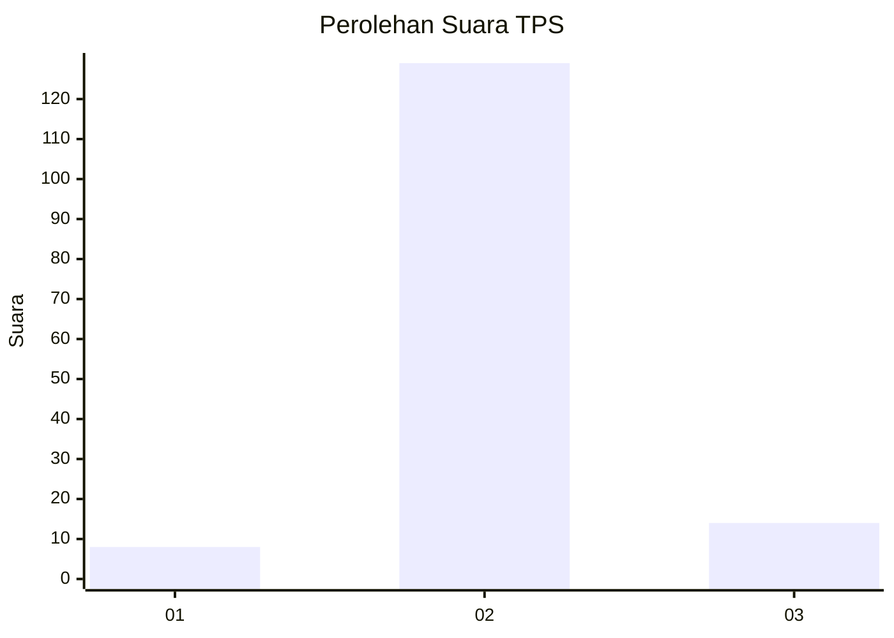
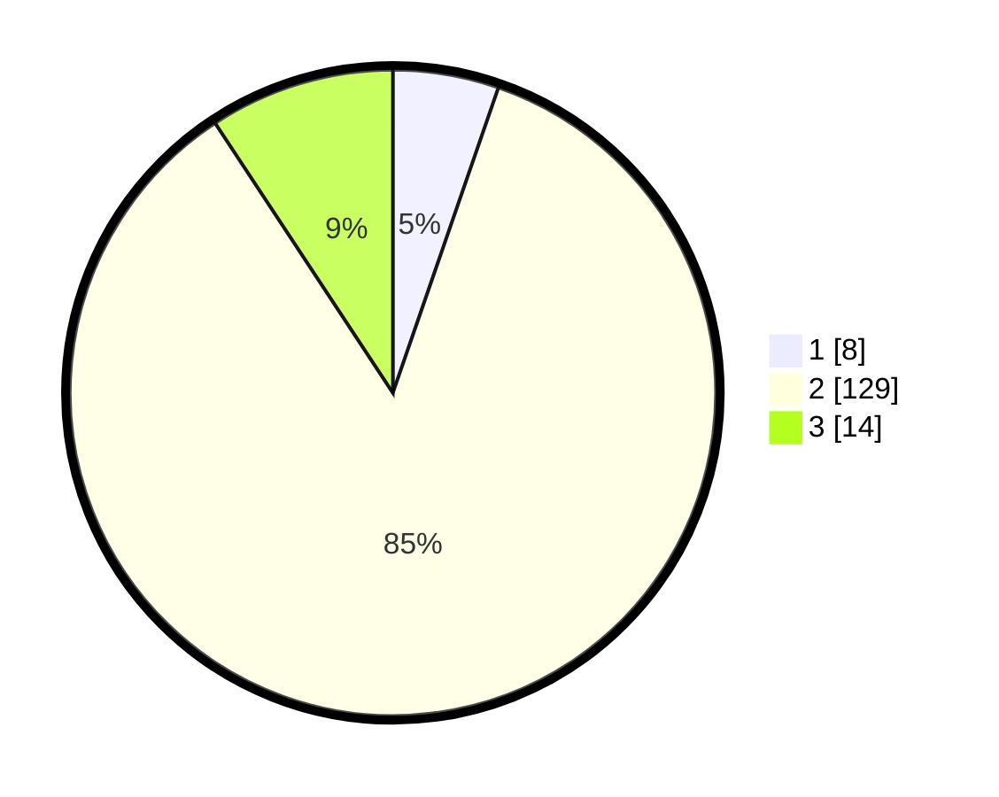

# Hasil

## Grafik

## Tabel

| No. | Nama Paslon    | Suara | Suara (raw) | Persentase |
|:--- |:-------------- | -----:| -----------:| ----------:|
| 1   | ANIES MUHAIMIN | 8     | [8][p-1]    | 5,30       |
| 2   | PRABOWO GIBRAN | 129   | [129][p-2]  | 85,43      |
| 3   | GANJAR MAHFUD  | 14    | [14][p-3]   | 9,27       |

[p-1]: https://github.com/gigit-pemilu/pemilu-2024-35-jawa-timur/blob/main/pilpres/hitung-suara/sub/35-jawa-timur/sub/08-lumajang/sub/10-lumajang/sub/2002-labruk-lor/sub/012-tps/sub/paslon-1.txt
[p-2]: https://github.com/gigit-pemilu/pemilu-2024-35-jawa-timur/blob/main/pilpres/hitung-suara/sub/35-jawa-timur/sub/08-lumajang/sub/10-lumajang/sub/2002-labruk-lor/sub/012-tps/sub/paslon-2.txt
[p-3]: https://github.com/gigit-pemilu/pemilu-2024-35-jawa-timur/blob/main/pilpres/hitung-suara/sub/35-jawa-timur/sub/08-lumajang/sub/10-lumajang/sub/2002-labruk-lor/sub/012-tps/sub/paslon-3.txt

## Foto C Plano

https://sirekap-obj-formc.kpu.go.id/748b/pemilu/ppwp/35/08/10/20/02/3508102002012-20240215-002827--ab526bdc-f0c3-451d-91d0-31722746fb07.jpg

https://sirekap-obj-formc.kpu.go.id/748b/pemilu/ppwp/35/08/10/20/02/3508102002012-20240215-011608--136788ea-e3f4-4b2b-a63d-120f6c50fd24.jpg

https://sirekap-obj-formc.kpu.go.id/748b/pemilu/ppwp/35/08/10/20/02/3508102002012-20240215-002937--92ad14ea-c6b4-4f00-8b33-daa94027738e.jpg

## Metadata

| Key        | Value               |
| ---------- | ------------------- |
| Time Stamp | 2024-02-15 23:29:50 |

