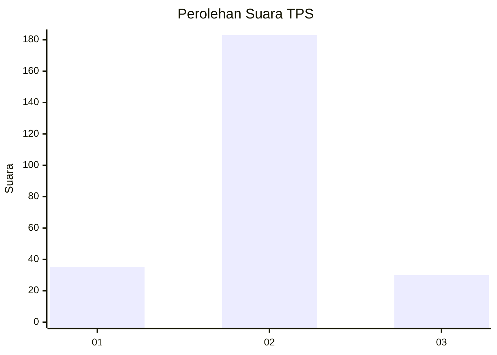
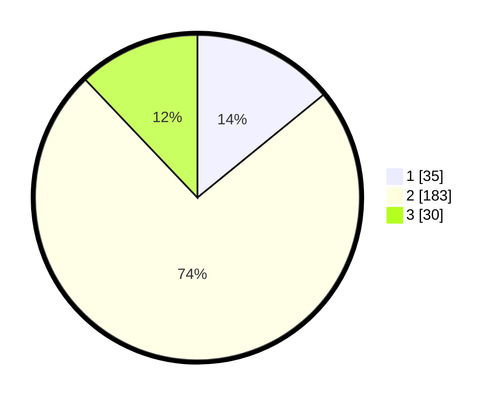

# Hasil

## Grafik

## Tabel

| No. | Nama Paslon    | Suara | Suara (raw) | Persentase |
|:--- |:-------------- | -----:| -----------:| ----------:|
| 1   | ANIES MUHAIMIN | 35    | [35][p-1]   | 14,11      |
| 2   | PRABOWO GIBRAN | 183   | [183][p-2]  | 73,79      |
| 3   | GANJAR MAHFUD  | 30    | [30][p-3]   | 12,10      |

[p-1]: https://github.com/gigit-pemilu/pemilu-2024/blob/main/pilpres/hitung-suara/sub/35-jawa-timur/sub/08-lumajang/sub/11-pasrujambe/sub/2001-pasrujambe/sub/003-tps/sub/paslon-1.txt
[p-2]: https://github.com/gigit-pemilu/pemilu-2024/blob/main/pilpres/hitung-suara/sub/35-jawa-timur/sub/08-lumajang/sub/11-pasrujambe/sub/2001-pasrujambe/sub/003-tps/sub/paslon-2.txt
[p-3]: https://github.com/gigit-pemilu/pemilu-2024/blob/main/pilpres/hitung-suara/sub/35-jawa-timur/sub/08-lumajang/sub/11-pasrujambe/sub/2001-pasrujambe/sub/003-tps/sub/paslon-3.txt

## Foto C Plano

https://sirekap-obj-formc.kpu.go.id/1583/pemilu/ppwp/35/08/11/20/01/3508112001003-20240214-202433--bde2f37c-18e0-4de4-b37c-aa5b943a6acc.jpg

https://sirekap-obj-formc.kpu.go.id/1583/pemilu/ppwp/35/08/11/20/01/3508112001003-20240216-094029--45d79e24-9289-4bb8-93a7-ae80f6b9ffc4.jpg

https://sirekap-obj-formc.kpu.go.id/1583/pemilu/ppwp/35/08/11/20/01/3508112001003-20240214-202943--71e46264-f999-49d3-a2ea-abd1f643db1f.jpg

## Metadata

| Key        | Value               |
| ---------- | ------------------- |
| Time Stamp | 2024-02-16 10:30:29 |

## DATA PEMILIH TETAP

Jumlah pemilih dalam DPT: **297**.
 * L: **146**.
 * P: **151**.

## DATA PENGGUNA HAK PILIH

Jumlah pengguna hak pilih dalam DPT: **251**.
 * L: **119**.
 * P: **132**.

Jumlah pengguna hak pilih dalam DPTb: **1**.
 * L: **0**.
 * P: **1**.

Jumlah pengguna hak pilih dalam DPK: **2**.
 * L: **1**.
 * P: **1**.

Jumlah pengguna hak pilih: **254**.
 * L: **120**.
 * P: **134**.

## JUMLAH SUARA SAH DAN TIDAK SAH

JUMLAH SELURUH SUARA SAH: **248**.

JUMLAH SUARA TIDAK SAH: **6**.

JUMLAH SELURUH SUARA SAH DAN SUARA TIDAK SAH: **254**.

