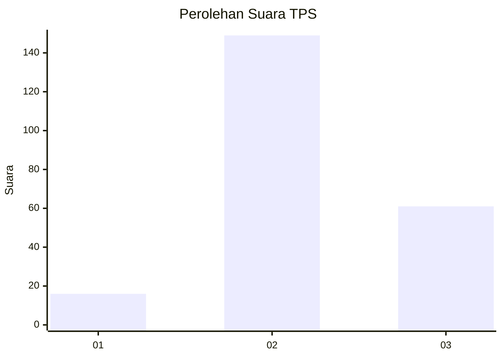

# Hasil

## Grafik

## Tabel

| No. | Nama Paslon    | Suara | Suara (raw) | Persentase |
|:--- |:-------------- | -----:| -----------:| ----------:|
| 1   | ANIES MUHAIMIN | 16    | [16][p-1]   | 7,08       |
| 2   | PRABOWO GIBRAN | 149   | [149][p-2]  | 65,93      |
| 3   | GANJAR MAHFUD  | 61    | [61][p-3]   | 26,99      |

[p-1]: https://github.com/gigit-pemilu/pemilu-2024/blob/main/pilpres/hitung-suara/sub/35-jawa-timur/sub/08-lumajang/sub/11-pasrujambe/sub/2001-pasrujambe/sub/005-tps/sub/paslon-1.txt
[p-2]: https://github.com/gigit-pemilu/pemilu-2024/blob/main/pilpres/hitung-suara/sub/35-jawa-timur/sub/08-lumajang/sub/11-pasrujambe/sub/2001-pasrujambe/sub/005-tps/sub/paslon-2.txt
[p-3]: https://github.com/gigit-pemilu/pemilu-2024/blob/main/pilpres/hitung-suara/sub/35-jawa-timur/sub/08-lumajang/sub/11-pasrujambe/sub/2001-pasrujambe/sub/005-tps/sub/paslon-3.txt

## Foto C Plano

https://sirekap-obj-formc.kpu.go.id/c5e6/pemilu/ppwp/35/08/11/20/01/3508112001005-20240214-202455--c5e8485c-8936-46bd-85c5-3d808c8f765e.jpg

https://sirekap-obj-formc.kpu.go.id/c5e6/pemilu/ppwp/35/08/11/20/01/3508112001005-20240214-202635--f3913ad9-33a1-4a1a-87c3-09eb8bad0799.jpg

https://sirekap-obj-formc.kpu.go.id/c5e6/pemilu/ppwp/35/08/11/20/01/3508112001005-20240214-202956--61fd83c8-9512-48c6-9bc1-89a6d158bd4c.jpg

## Metadata

| Key        | Value               |
| ---------- | ------------------- |
| Time Stamp | 2024-02-16 12:51:22 |

