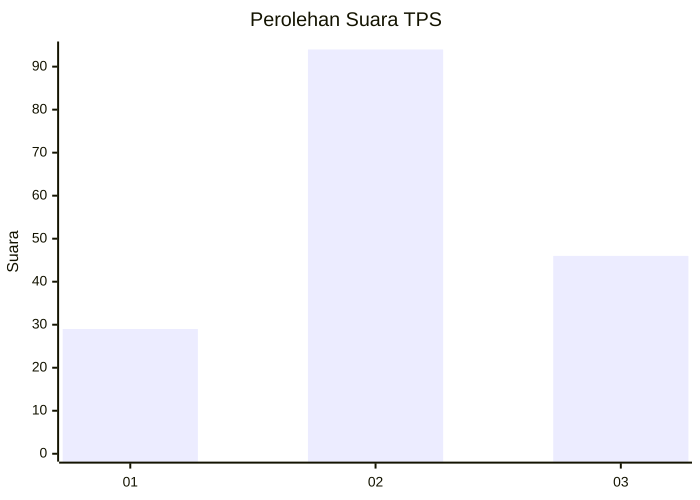
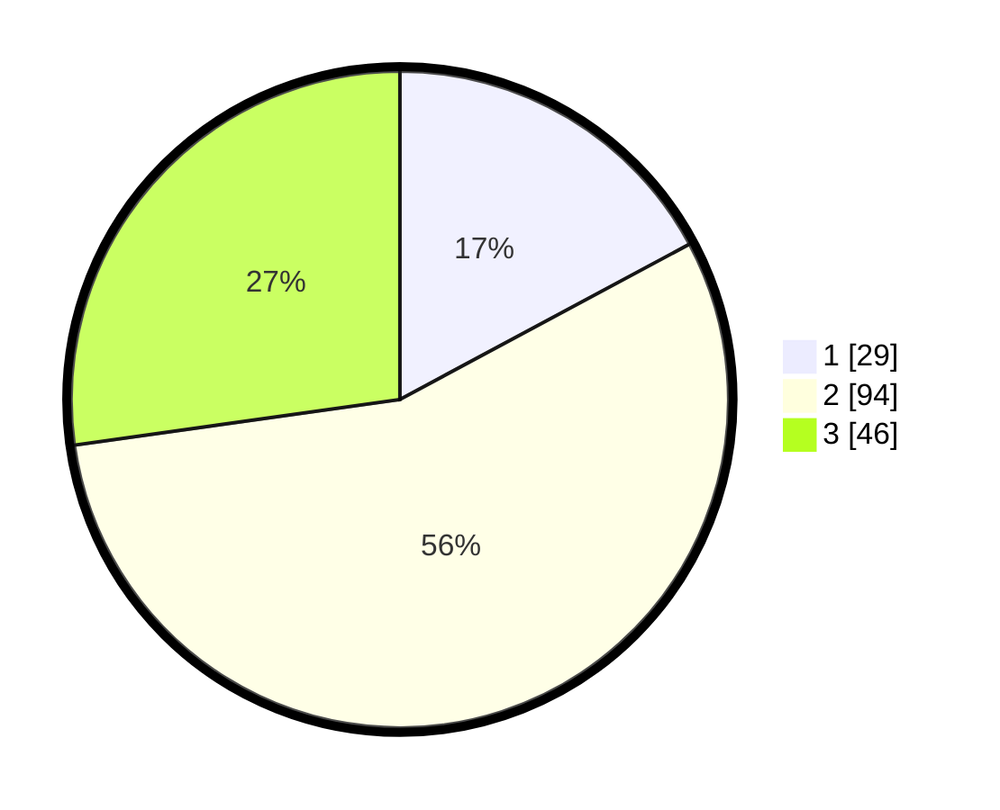

# Hasil

## Grafik

## Tabel

| No. | Nama Paslon    | Suara | Suara (raw) | Persentase |
|:--- |:-------------- | -----:| -----------:| ----------:|
| 1   | ANIES MUHAIMIN | 29    | [29][p-1]   | 17,16      |
| 2   | PRABOWO GIBRAN | 94    | [94][p-2]   | 55,62      |
| 3   | GANJAR MAHFUD  | 46    | [46][p-3]   | 27,22      |

[p-1]: https://github.com/gigit-pemilu/pemilu-2024-35-jawa-timur/blob/main/pilpres/hitung-suara/sub/35-jawa-timur/sub/08-lumajang/sub/11-pasrujambe/sub/2001-pasrujambe/sub/023-tps/sub/paslon-1.txt
[p-2]: https://github.com/gigit-pemilu/pemilu-2024-35-jawa-timur/blob/main/pilpres/hitung-suara/sub/35-jawa-timur/sub/08-lumajang/sub/11-pasrujambe/sub/2001-pasrujambe/sub/023-tps/sub/paslon-2.txt
[p-3]: https://github.com/gigit-pemilu/pemilu-2024-35-jawa-timur/blob/main/pilpres/hitung-suara/sub/35-jawa-timur/sub/08-lumajang/sub/11-pasrujambe/sub/2001-pasrujambe/sub/023-tps/sub/paslon-3.txt

## Foto C Plano

https://sirekap-obj-formc.kpu.go.id/2a23/pemilu/ppwp/35/08/11/20/01/3508112001023-20240215-023609--65cb4aea-f519-4bfc-81e8-a6ac835127ae.jpg

https://sirekap-obj-formc.kpu.go.id/2a23/pemilu/ppwp/35/08/11/20/01/3508112001023-20240215-005606--ee2852b2-b9dd-482b-bf06-edaa1852c656.jpg

https://sirekap-obj-formc.kpu.go.id/2a23/pemilu/ppwp/35/08/11/20/01/3508112001023-20240215-005709--ee2504b0-76cd-4e62-a5bd-516652f923bd.jpg

## Metadata

| Key        | Value               |
| ---------- | ------------------- |
| Time Stamp | 2024-02-15 12:00:28 |

