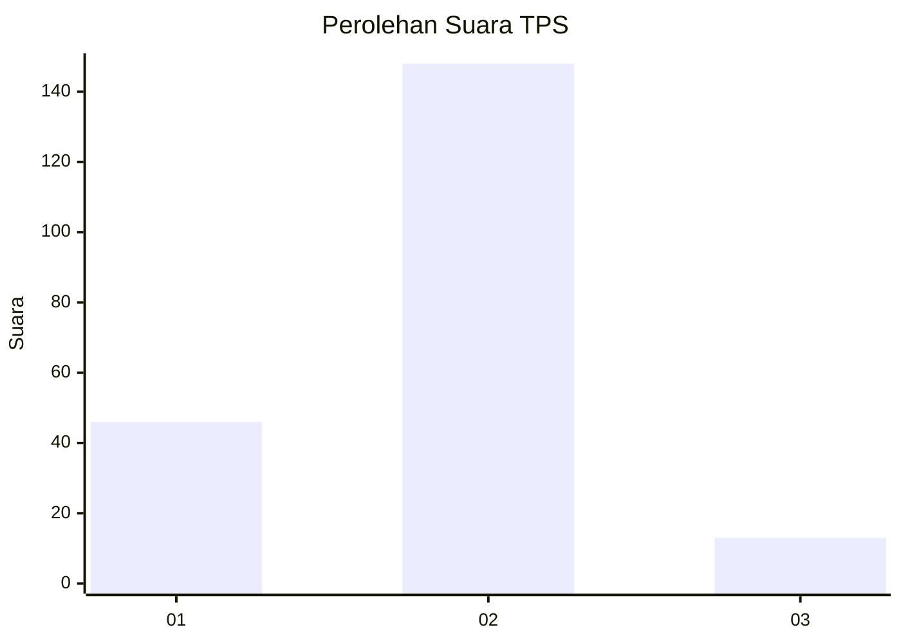

# Hasil

## Grafik

## Tabel

| No. | Nama Paslon    | Suara | Suara (raw) | Persentase |
|:--- |:-------------- | -----:| -----------:| ----------:|
| 1   | ANIES MUHAIMIN | 46    | [46][p-1]   | 22,22      |
| 2   | PRABOWO GIBRAN | 148   | [148][p-2]  | 71,50      |
| 3   | GANJAR MAHFUD  | 13    | [13][p-3]   | 6,28       |

[p-1]: https://github.com/gigit-pemilu/pemilu-2024-35-jawa-timur/blob/main/pilpres/hitung-suara/sub/35-jawa-timur/sub/08-lumajang/sub/11-pasrujambe/sub/2002-jambekumbu/sub/006-tps/sub/paslon-1.txt
[p-2]: https://github.com/gigit-pemilu/pemilu-2024-35-jawa-timur/blob/main/pilpres/hitung-suara/sub/35-jawa-timur/sub/08-lumajang/sub/11-pasrujambe/sub/2002-jambekumbu/sub/006-tps/sub/paslon-2.txt
[p-3]: https://github.com/gigit-pemilu/pemilu-2024-35-jawa-timur/blob/main/pilpres/hitung-suara/sub/35-jawa-timur/sub/08-lumajang/sub/11-pasrujambe/sub/2002-jambekumbu/sub/006-tps/sub/paslon-3.txt

## Foto C Plano

https://sirekap-obj-formc.kpu.go.id/463e/pemilu/ppwp/35/08/11/20/02/3508112002006-20240214-202421--99c0b451-0cba-452a-87c0-01eb7951a6a3.jpg

https://sirekap-obj-formc.kpu.go.id/463e/pemilu/ppwp/35/08/11/20/02/3508112002006-20240214-203413--14c660dd-04ac-4312-bcf9-7670244d4618.jpg

https://sirekap-obj-formc.kpu.go.id/463e/pemilu/ppwp/35/08/11/20/02/3508112002006-20240214-214354--7bf03685-c734-499e-a662-bd60e20e1bf6.jpg

## Metadata

| Key        | Value               |
| ---------- | ------------------- |
| Time Stamp | 2024-02-17 16:36:25 |

