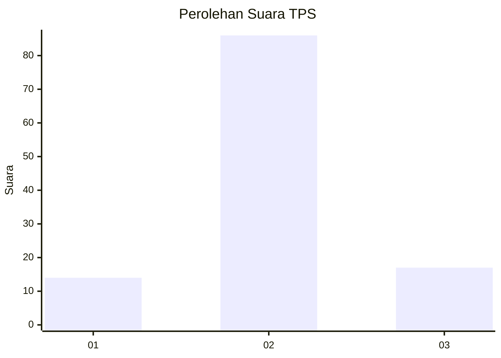
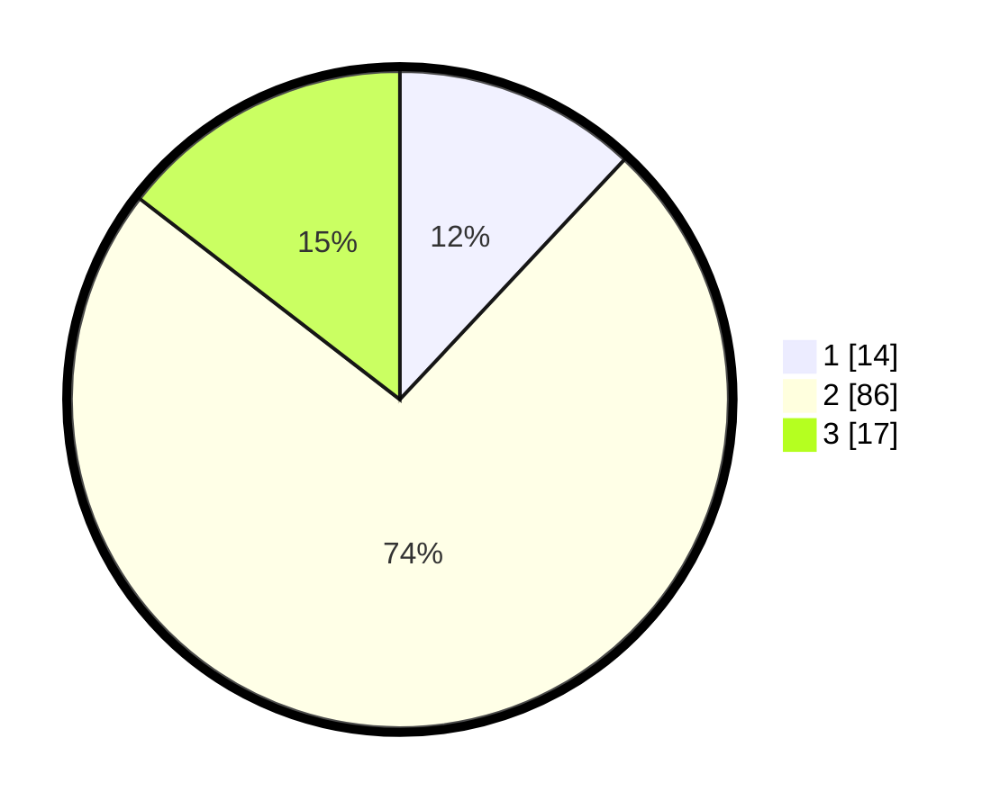

# Hasil

## Grafik

## Tabel

| No. | Nama Paslon    | Suara | Suara (raw) | Persentase |
|:--- |:-------------- | -----:| -----------:| ----------:|
| 1   | ANIES MUHAIMIN | 14    | [14][p-1]   | 11,97      |
| 2   | PRABOWO GIBRAN | 86    | [86][p-2]   | 73,50      |
| 3   | GANJAR MAHFUD  | 17    | [17][p-3]   | 14,53      |

[p-1]: https://github.com/gigit-pemilu/pemilu-2024/blob/main/pilpres/hitung-suara/sub/35-jawa-timur/sub/08-lumajang/sub/11-pasrujambe/sub/2004-jambearum/sub/010-tps/sub/paslon-1.txt
[p-2]: https://github.com/gigit-pemilu/pemilu-2024/blob/main/pilpres/hitung-suara/sub/35-jawa-timur/sub/08-lumajang/sub/11-pasrujambe/sub/2004-jambearum/sub/010-tps/sub/paslon-2.txt
[p-3]: https://github.com/gigit-pemilu/pemilu-2024/blob/main/pilpres/hitung-suara/sub/35-jawa-timur/sub/08-lumajang/sub/11-pasrujambe/sub/2004-jambearum/sub/010-tps/sub/paslon-3.txt

## Foto C Plano

https://sirekap-obj-formc.kpu.go.id/c9e9/pemilu/ppwp/35/08/11/20/04/3508112004010-20240215-000636--e8026b6c-98ab-498b-be2d-896de2fb7180.jpg

https://sirekap-obj-formc.kpu.go.id/c9e9/pemilu/ppwp/35/08/11/20/04/3508112004010-20240215-000921--c4365d86-d504-4acf-9112-02c1d41d2b09.jpg

https://sirekap-obj-formc.kpu.go.id/c9e9/pemilu/ppwp/35/08/11/20/04/3508112004010-20240214-233940--1d8489cb-11a5-4c46-997a-05db9fc07241.jpg

## Metadata

| Key        | Value               |
| ---------- | ------------------- |
| Time Stamp | 2024-02-17 16:36:25 |

