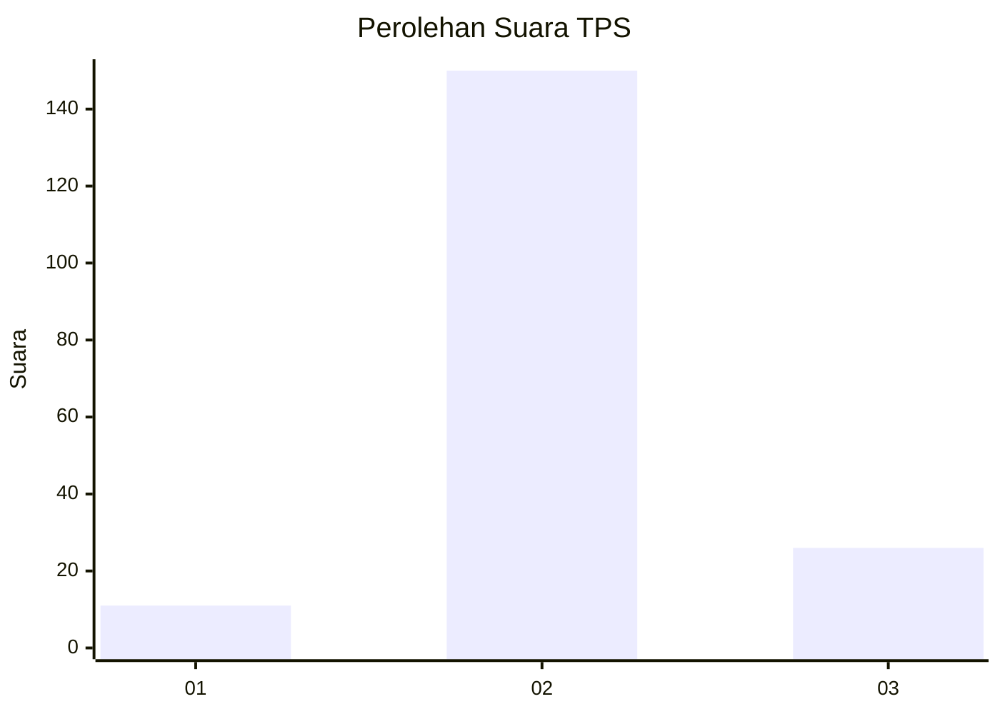
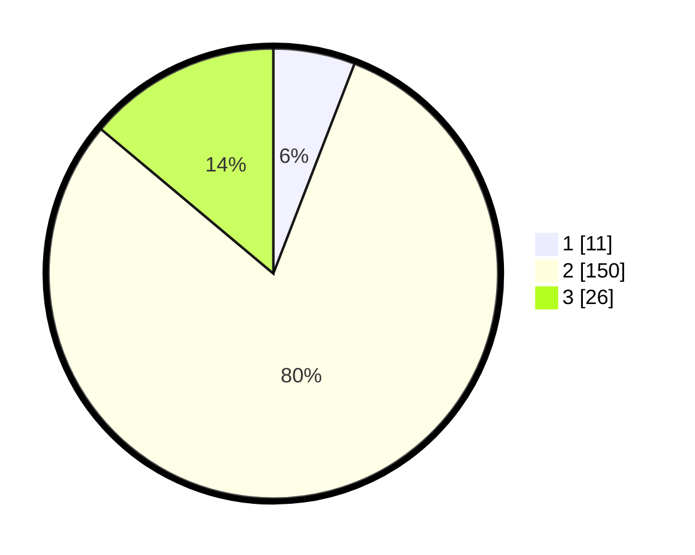

# Hasil

## Grafik

## Tabel

| No. | Nama Paslon    | Suara | Suara (raw) | Persentase |
|:--- |:-------------- | -----:| -----------:| ----------:|
| 1   | ANIES MUHAIMIN | 11    | [11][p-1]   | 5,88       |
| 2   | PRABOWO GIBRAN | 150   | [150][p-2]  | 80,21      |
| 3   | GANJAR MAHFUD  | 26    | [26][p-3]   | 13,90      |

[p-1]: https://github.com/gigit-pemilu/pemilu-2024-35-jawa-timur/blob/main/pilpres/hitung-suara/sub/35-jawa-timur/sub/08-lumajang/sub/11-pasrujambe/sub/2006-pagowan/sub/006-tps/sub/paslon-1.txt
[p-2]: https://github.com/gigit-pemilu/pemilu-2024-35-jawa-timur/blob/main/pilpres/hitung-suara/sub/35-jawa-timur/sub/08-lumajang/sub/11-pasrujambe/sub/2006-pagowan/sub/006-tps/sub/paslon-2.txt
[p-3]: https://github.com/gigit-pemilu/pemilu-2024-35-jawa-timur/blob/main/pilpres/hitung-suara/sub/35-jawa-timur/sub/08-lumajang/sub/11-pasrujambe/sub/2006-pagowan/sub/006-tps/sub/paslon-3.txt

## Foto C Plano

https://sirekap-obj-formc.kpu.go.id/00ab/pemilu/ppwp/35/08/11/20/06/3508112006006-20240215-013719--8c7c644e-6bd1-4c29-974c-d3bea167316c.jpg

https://sirekap-obj-formc.kpu.go.id/00ab/pemilu/ppwp/35/08/11/20/06/3508112006006-20240215-013733--38b6dc16-fa63-43f9-a72d-097b40c4607c.jpg

https://sirekap-obj-formc.kpu.go.id/00ab/pemilu/ppwp/35/08/11/20/06/3508112006006-20240215-013740--13884d57-0caa-4eaf-ac36-a4ffe5c2d876.jpg

## Metadata

| Key        | Value               |
| ---------- | ------------------- |
| Time Stamp | 2024-02-19 06:16:00 |

