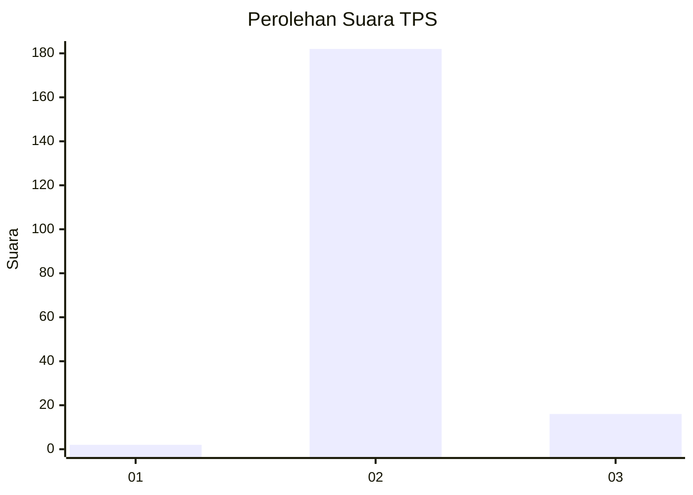
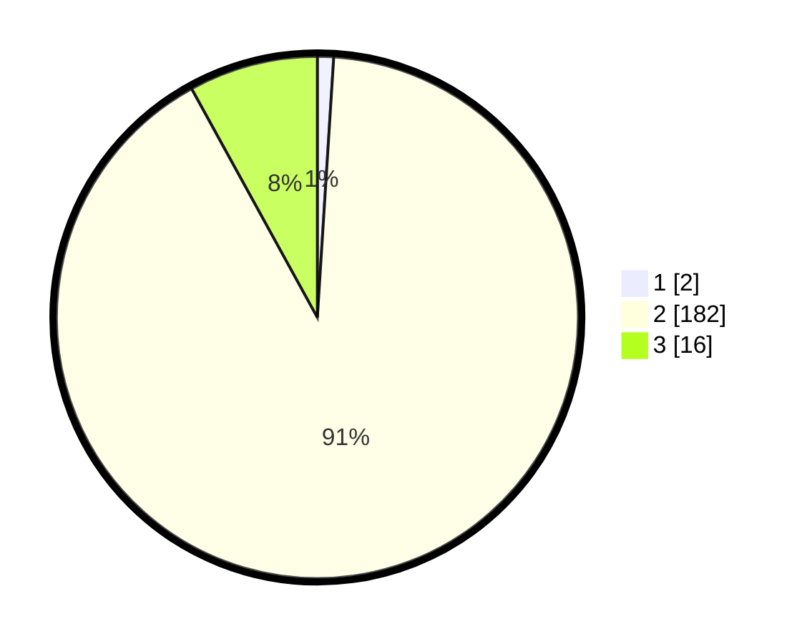

# Hasil

## Grafik

## Tabel

| No. | Nama Paslon    | Suara | Suara (raw) | Persentase |
|:--- |:-------------- | -----:| -----------:| ----------:|
| 1   | ANIES MUHAIMIN | 2     | [2][p-1]    | 1,00       |
| 2   | PRABOWO GIBRAN | 182   | [182][p-2]  | 91,00      |
| 3   | GANJAR MAHFUD  | 16    | [16][p-3]   | 8,00       |

[p-1]: https://github.com/gigit-pemilu/pemilu-2024-35-jawa-timur/blob/main/pilpres/hitung-suara/sub/35-jawa-timur/sub/08-lumajang/sub/11-pasrujambe/sub/2006-pagowan/sub/008-tps/sub/paslon-1.txt
[p-2]: https://github.com/gigit-pemilu/pemilu-2024-35-jawa-timur/blob/main/pilpres/hitung-suara/sub/35-jawa-timur/sub/08-lumajang/sub/11-pasrujambe/sub/2006-pagowan/sub/008-tps/sub/paslon-2.txt
[p-3]: https://github.com/gigit-pemilu/pemilu-2024-35-jawa-timur/blob/main/pilpres/hitung-suara/sub/35-jawa-timur/sub/08-lumajang/sub/11-pasrujambe/sub/2006-pagowan/sub/008-tps/sub/paslon-3.txt

## Foto C Plano

https://sirekap-obj-formc.kpu.go.id/545d/pemilu/ppwp/35/08/11/20/06/3508112006008-20240214-210432--acb8a7fb-f9bc-4e87-ac99-23590abd2d5b.jpg

https://sirekap-obj-formc.kpu.go.id/545d/pemilu/ppwp/35/08/11/20/06/3508112006008-20240214-210246--0af2784a-e628-43a8-b24e-65630566b6b8.jpg

https://sirekap-obj-formc.kpu.go.id/545d/pemilu/ppwp/35/08/11/20/06/3508112006008-20240214-235437--e8240024-b7da-49d2-add1-98d05afb09b2.jpg

## Metadata

| Key        | Value               |
| ---------- | ------------------- |
| Time Stamp | 2024-02-17 16:00:02 |

