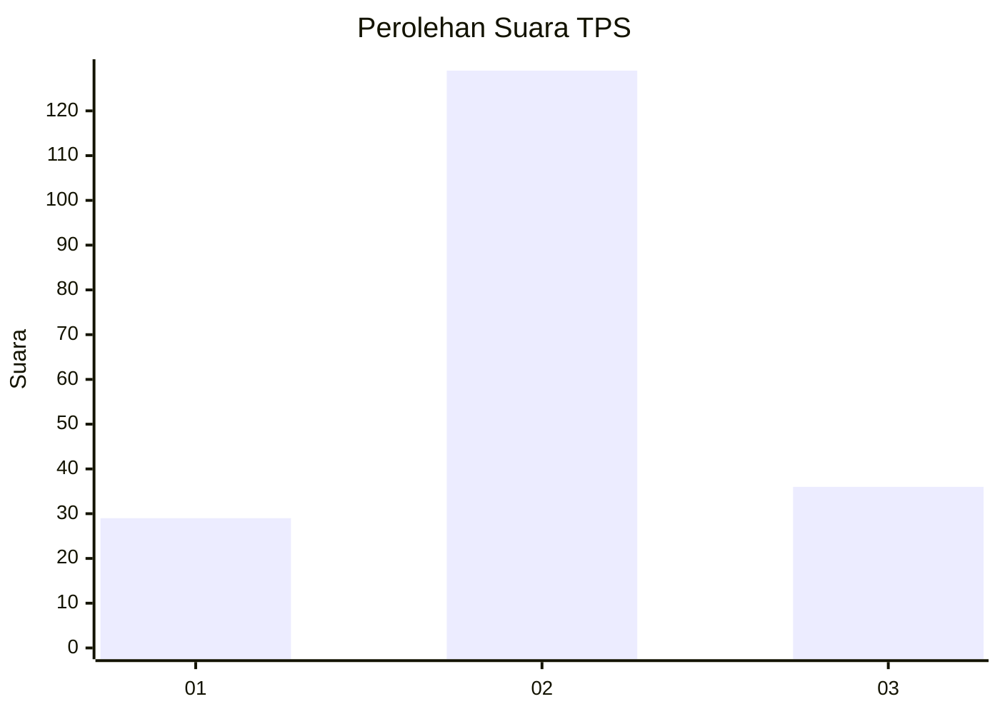
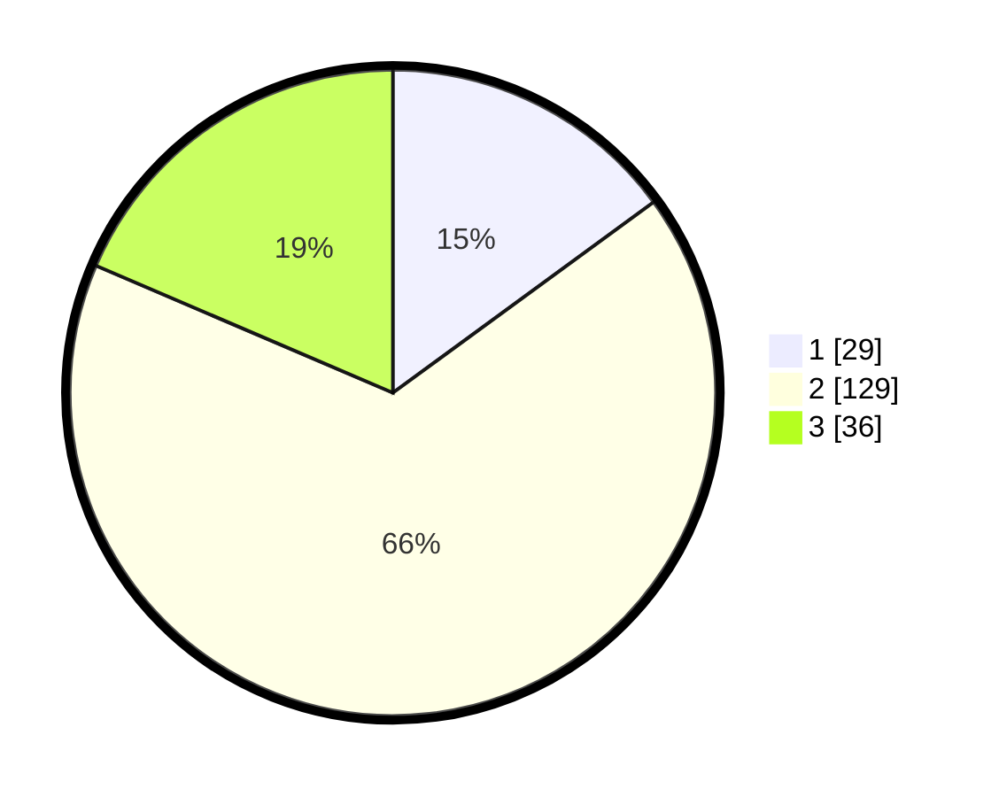

# Hasil

## Grafik

## Tabel

| No. | Nama Paslon    | Suara | Suara (raw) | Persentase |
|:--- |:-------------- | -----:| -----------:| ----------:|
| 1   | ANIES MUHAIMIN | 29    | [29][p-1]   | 14,95      |
| 2   | PRABOWO GIBRAN | 129   | [129][p-2]  | 66,49      |
| 3   | GANJAR MAHFUD  | 36    | [36][p-3]   | 18,56      |

[p-1]: https://github.com/gigit-pemilu/pemilu-2024/blob/main/pilpres/hitung-suara/sub/35-jawa-timur/sub/08-lumajang/sub/11-pasrujambe/sub/2007-karanganom/sub/005-tps/sub/paslon-1.txt
[p-2]: https://github.com/gigit-pemilu/pemilu-2024/blob/main/pilpres/hitung-suara/sub/35-jawa-timur/sub/08-lumajang/sub/11-pasrujambe/sub/2007-karanganom/sub/005-tps/sub/paslon-2.txt
[p-3]: https://github.com/gigit-pemilu/pemilu-2024/blob/main/pilpres/hitung-suara/sub/35-jawa-timur/sub/08-lumajang/sub/11-pasrujambe/sub/2007-karanganom/sub/005-tps/sub/paslon-3.txt

## Foto C Plano

https://sirekap-obj-formc.kpu.go.id/2627/pemilu/ppwp/35/08/11/20/07/3508112007005-20240226-204609--edc655e8-ed84-4994-894b-25836101bd78.jpg

https://sirekap-obj-formc.kpu.go.id/2627/pemilu/ppwp/35/08/11/20/07/3508112007005-20240226-204034--d0911fad-1b7a-417b-9d5f-b36a6136a763.jpg

## Metadata

| Key        | Value               |
| ---------- | ------------------- |
| Time Stamp | 2024-02-26 22:00:00 |

