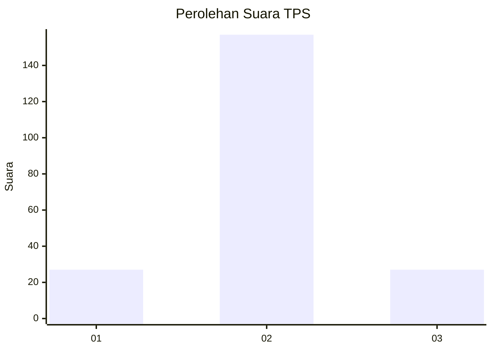
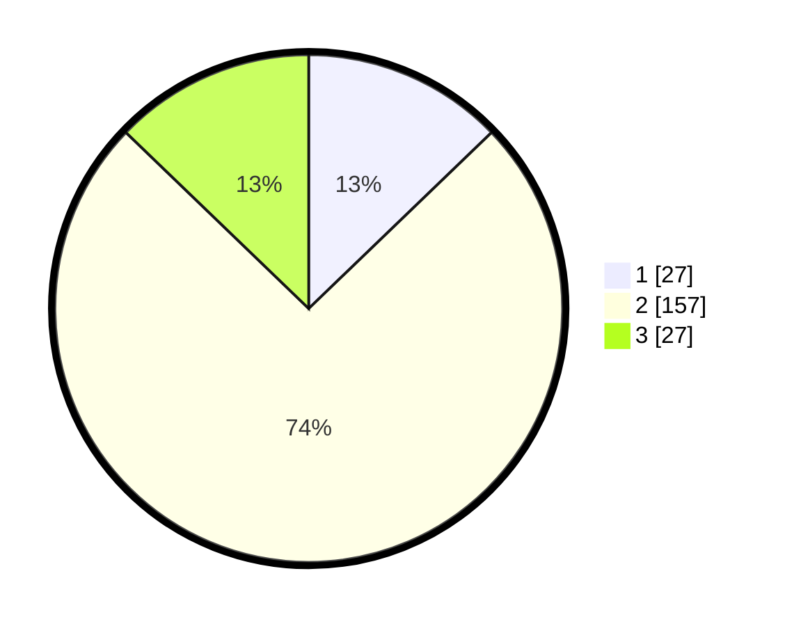

# Hasil

## Grafik

## Tabel

| No. | Nama Paslon    | Suara | Suara (raw) | Persentase |
|:--- |:-------------- | -----:| -----------:| ----------:|
| 1   | ANIES MUHAIMIN | 27    | [27][p-1]   | 12,80      |
| 2   | PRABOWO GIBRAN | 157   | [157][p-2]  | 74,41      |
| 3   | GANJAR MAHFUD  | 27    | [27][p-3]   | 12,80      |

[p-1]: https://github.com/gigit-pemilu/pemilu-2024/blob/main/pilpres/hitung-suara/sub/35-jawa-timur/sub/08-lumajang/sub/12-senduro/sub/2001-purworejo/sub/002-tps/sub/paslon-1.txt
[p-2]: https://github.com/gigit-pemilu/pemilu-2024/blob/main/pilpres/hitung-suara/sub/35-jawa-timur/sub/08-lumajang/sub/12-senduro/sub/2001-purworejo/sub/002-tps/sub/paslon-2.txt
[p-3]: https://github.com/gigit-pemilu/pemilu-2024/blob/main/pilpres/hitung-suara/sub/35-jawa-timur/sub/08-lumajang/sub/12-senduro/sub/2001-purworejo/sub/002-tps/sub/paslon-3.txt

## Foto C Plano

https://sirekap-obj-formc.kpu.go.id/ec9a/pemilu/ppwp/35/08/12/20/01/3508122001002-20240214-200312--387dc7c1-cd62-40c2-8b4f-1db2ecbd839f.jpg

https://sirekap-obj-formc.kpu.go.id/ec9a/pemilu/ppwp/35/08/12/20/01/3508122001002-20240219-111602--75fa4df2-9d88-476e-957f-268251443f95.jpg

https://sirekap-obj-formc.kpu.go.id/ec9a/pemilu/ppwp/35/08/12/20/01/3508122001002-20240219-111734--5cb8dced-ad4d-4179-9a13-cd77e5bf136b.jpg

## Metadata

| Key        | Value               |
| ---------- | ------------------- |
| Time Stamp | 2024-02-19 12:00:00 |

