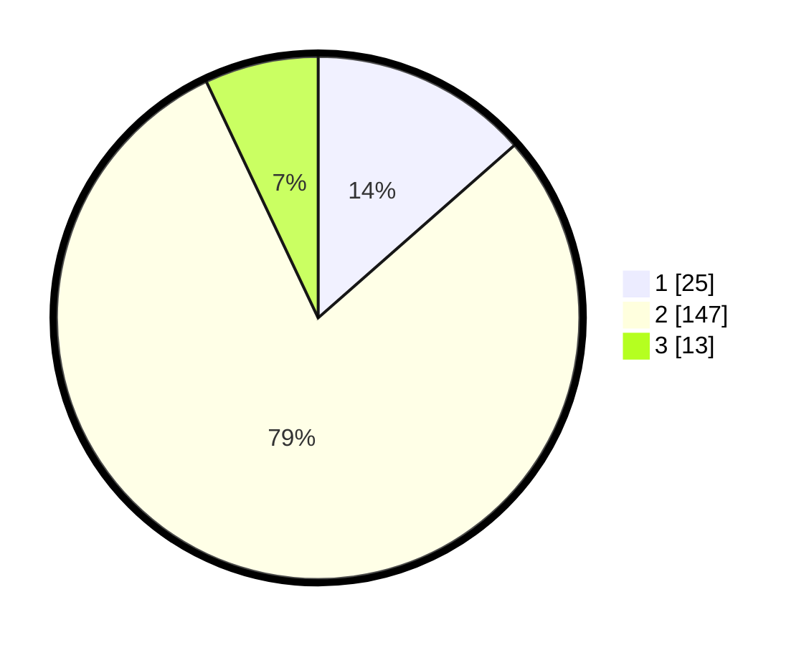

# Hasil

## Grafik

## Tabel

| No. | Nama Paslon    | Suara | Suara (raw) | Persentase |
|:--- |:-------------- | -----:| -----------:| ----------:|
| 1   | ANIES MUHAIMIN | 25    | [25][p-1]   | 13,51      |
| 2   | PRABOWO GIBRAN | 147   | [147][p-2]  | 79,46      |
| 3   | GANJAR MAHFUD  | 13    | [13][p-3]   | 7,03       |

[p-1]: https://github.com/gigit-pemilu/pemilu-2024-35-jawa-timur/blob/main/pilpres/hitung-suara/sub/35-jawa-timur/sub/08-lumajang/sub/12-senduro/sub/2001-purworejo/sub/003-tps/sub/paslon-1.txt
[p-2]: https://github.com/gigit-pemilu/pemilu-2024-35-jawa-timur/blob/main/pilpres/hitung-suara/sub/35-jawa-timur/sub/08-lumajang/sub/12-senduro/sub/2001-purworejo/sub/003-tps/sub/paslon-2.txt
[p-3]: https://github.com/gigit-pemilu/pemilu-2024-35-jawa-timur/blob/main/pilpres/hitung-suara/sub/35-jawa-timur/sub/08-lumajang/sub/12-senduro/sub/2001-purworejo/sub/003-tps/sub/paslon-3.txt

## Foto C Plano

https://sirekap-obj-formc.kpu.go.id/35a3/pemilu/ppwp/35/08/12/20/01/3508122001003-20240215-010247--001ab3aa-6017-4b27-957e-0e8dcf6fa7a0.jpg

https://sirekap-obj-formc.kpu.go.id/35a3/pemilu/ppwp/35/08/12/20/01/3508122001003-20240219-124527--e564d54d-4c66-4150-8e7a-81e3a4ae341c.jpg

https://sirekap-obj-formc.kpu.go.id/35a3/pemilu/ppwp/35/08/12/20/01/3508122001003-20240219-124639--cba150f7-b19d-4a91-87d7-bba4e57cc145.jpg

## Metadata

| Key        | Value               |
| ---------- | ------------------- |
| Time Stamp | 2024-02-19 13:00:00 |

