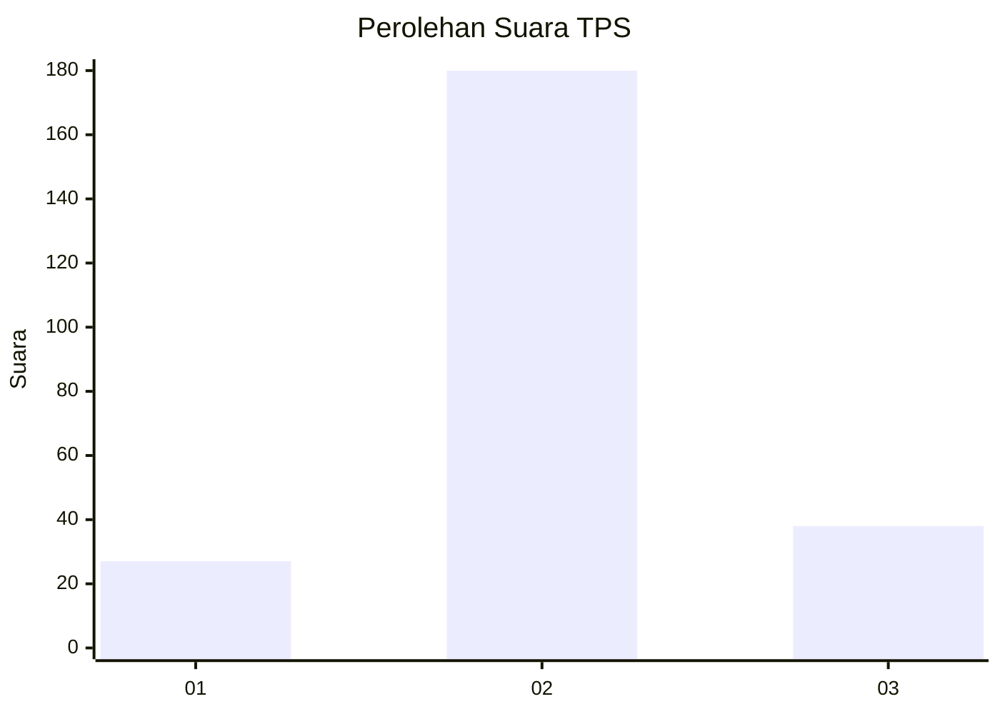
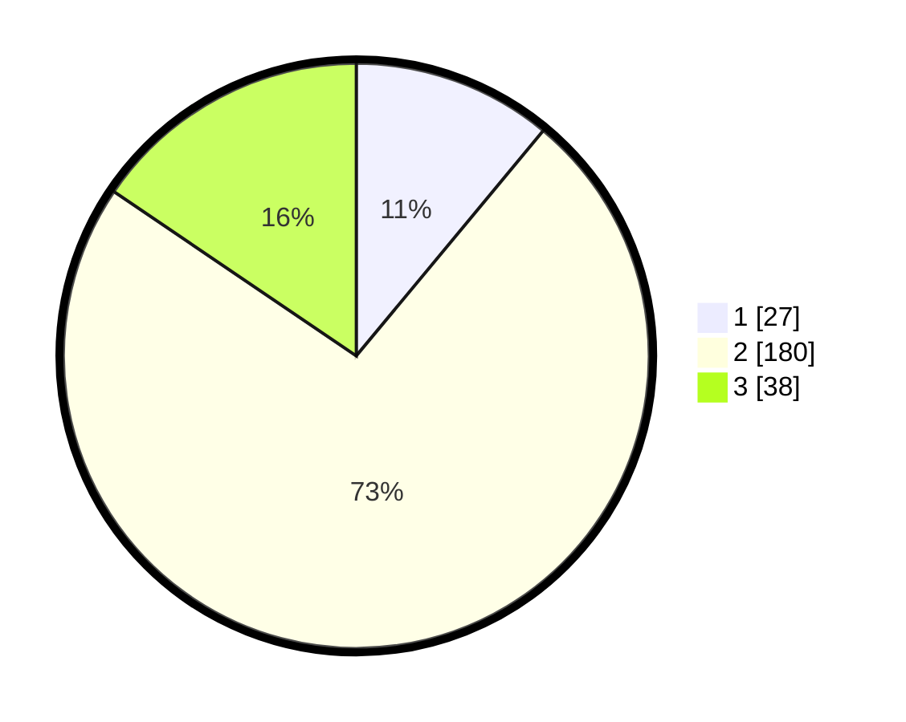

# Hasil

## Grafik

## Tabel

| No. | Nama Paslon    | Suara | Suara (raw) | Persentase |
|:--- |:-------------- | -----:| -----------:| ----------:|
| 1   | ANIES MUHAIMIN | 27    | [27][p-1]   | 11,02      |
| 2   | PRABOWO GIBRAN | 180   | [180][p-2]  | 73,47      |
| 3   | GANJAR MAHFUD  | 38    | [38][p-3]   | 15,51      |

[p-1]: https://github.com/gigit-pemilu/pemilu-2024-35-jawa-timur/blob/main/pilpres/hitung-suara/sub/35-jawa-timur/sub/08-lumajang/sub/12-senduro/sub/2001-purworejo/sub/014-tps/sub/paslon-1.txt
[p-2]: https://github.com/gigit-pemilu/pemilu-2024-35-jawa-timur/blob/main/pilpres/hitung-suara/sub/35-jawa-timur/sub/08-lumajang/sub/12-senduro/sub/2001-purworejo/sub/014-tps/sub/paslon-2.txt
[p-3]: https://github.com/gigit-pemilu/pemilu-2024-35-jawa-timur/blob/main/pilpres/hitung-suara/sub/35-jawa-timur/sub/08-lumajang/sub/12-senduro/sub/2001-purworejo/sub/014-tps/sub/paslon-3.txt

## Foto C Plano

https://sirekap-obj-formc.kpu.go.id/c3cc/pemilu/ppwp/35/08/12/20/01/3508122001014-20240215-044014--cf43b204-c9d2-4673-a299-ad490e6c02e3.jpg

https://sirekap-obj-formc.kpu.go.id/c3cc/pemilu/ppwp/35/08/12/20/01/3508122001014-20240219-172343--7f1231e4-22cc-41a7-967f-64c3cf628c05.jpg

https://sirekap-obj-formc.kpu.go.id/c3cc/pemilu/ppwp/35/08/12/20/01/3508122001014-20240219-172628--2d4a0799-5d8a-4be5-b599-587c15913558.jpg

## Metadata

| Key        | Value               |
| ---------- | ------------------- |
| Time Stamp | 2024-02-19 18:00:00 |

