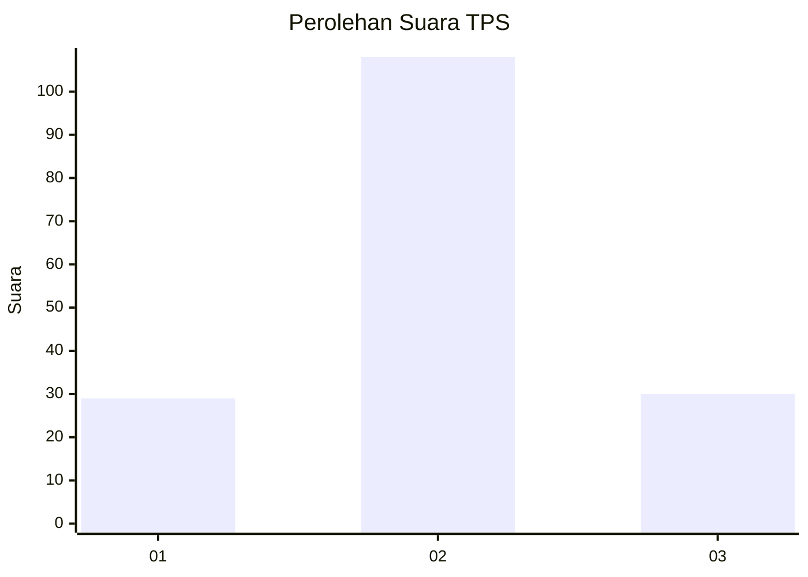
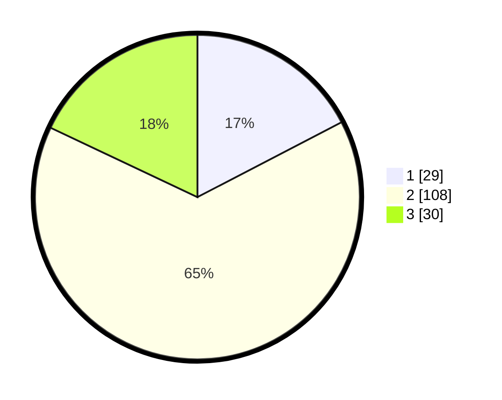

# Hasil

## Grafik

## Tabel

| No. | Nama Paslon    | Suara | Suara (raw) | Persentase |
|:--- |:-------------- | -----:| -----------:| ----------:|
| 1   | ANIES MUHAIMIN | 29    | [29][p-1]   | 17,37      |
| 2   | PRABOWO GIBRAN | 108   | [108][p-2]  | 64,67      |
| 3   | GANJAR MAHFUD  | 30    | [30][p-3]   | 17,96      |

[p-1]: https://github.com/gigit-pemilu/pemilu-2024/blob/main/pilpres/hitung-suara/sub/35-jawa-timur/sub/08-lumajang/sub/12-senduro/sub/2003-pandansari/sub/002-tps/sub/paslon-1.txt
[p-2]: https://github.com/gigit-pemilu/pemilu-2024/blob/main/pilpres/hitung-suara/sub/35-jawa-timur/sub/08-lumajang/sub/12-senduro/sub/2003-pandansari/sub/002-tps/sub/paslon-2.txt
[p-3]: https://github.com/gigit-pemilu/pemilu-2024/blob/main/pilpres/hitung-suara/sub/35-jawa-timur/sub/08-lumajang/sub/12-senduro/sub/2003-pandansari/sub/002-tps/sub/paslon-3.txt

## Foto C Plano

https://sirekap-obj-formc.kpu.go.id/8bbc/pemilu/ppwp/35/08/12/20/03/3508122003002-20240214-195133--f53808f8-d6f0-4737-88f3-602d607de99f.jpg

https://sirekap-obj-formc.kpu.go.id/8bbc/pemilu/ppwp/35/08/12/20/03/3508122003002-20240214-195215--397525df-ea90-4200-a53a-dae0b054d004.jpg

https://sirekap-obj-formc.kpu.go.id/8bbc/pemilu/ppwp/35/08/12/20/03/3508122003002-20240214-204850--4d4eeb8c-8c84-4d83-971b-444059674857.jpg

## Metadata

| Key        | Value               |
| ---------- | ------------------- |
| Time Stamp | 2024-02-15 04:00:24 |

