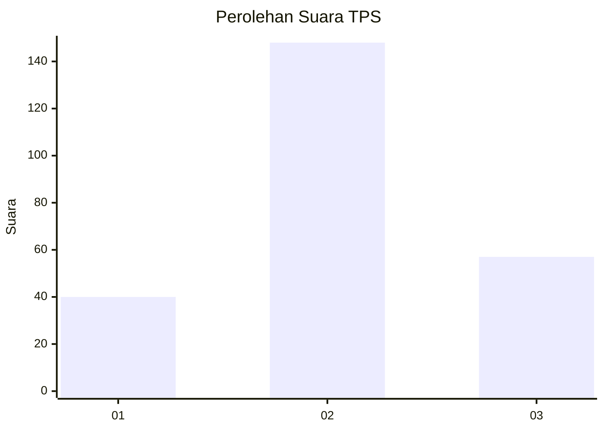
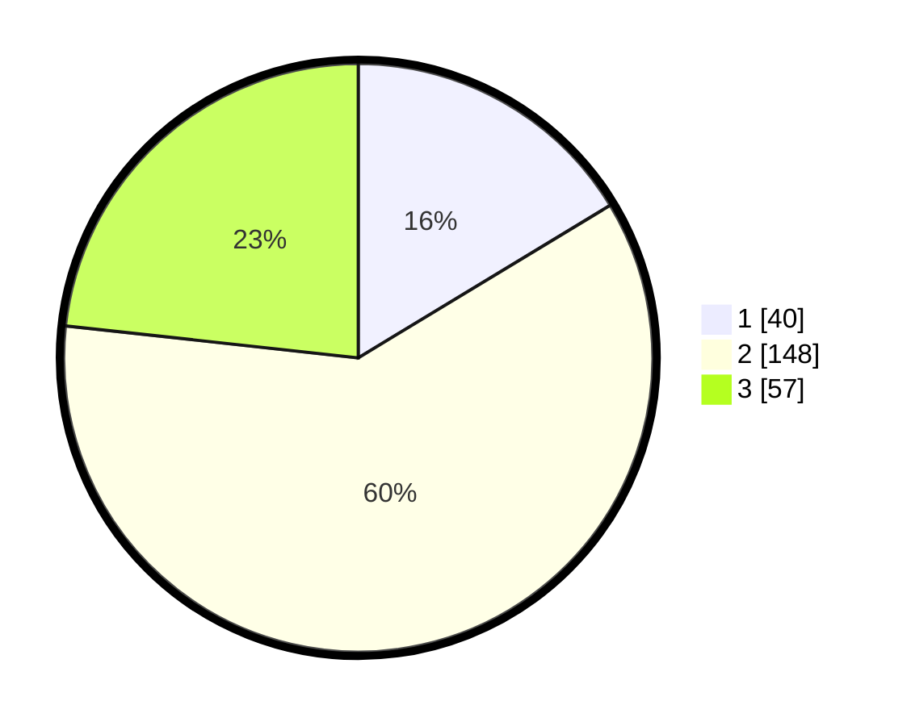

# Hasil

## Grafik

## Tabel

| No. | Nama Paslon    | Suara | Suara (raw) | Persentase |
|:--- |:-------------- | -----:| -----------:| ----------:|
| 1   | ANIES MUHAIMIN | 40    | [40][p-1]   | 16,33      |
| 2   | PRABOWO GIBRAN | 148   | [148][p-2]  | 60,41      |
| 3   | GANJAR MAHFUD  | 57    | [57][p-3]   | 23,27      |

[p-1]: https://github.com/gigit-pemilu/pemilu-2024-35-jawa-timur/blob/main/pilpres/hitung-suara/sub/35-jawa-timur/sub/08-lumajang/sub/12-senduro/sub/2006-kandangtepus/sub/001-tps/sub/paslon-1.txt
[p-2]: https://github.com/gigit-pemilu/pemilu-2024-35-jawa-timur/blob/main/pilpres/hitung-suara/sub/35-jawa-timur/sub/08-lumajang/sub/12-senduro/sub/2006-kandangtepus/sub/001-tps/sub/paslon-2.txt
[p-3]: https://github.com/gigit-pemilu/pemilu-2024-35-jawa-timur/blob/main/pilpres/hitung-suara/sub/35-jawa-timur/sub/08-lumajang/sub/12-senduro/sub/2006-kandangtepus/sub/001-tps/sub/paslon-3.txt

## Foto C Plano

https://sirekap-obj-formc.kpu.go.id/d33d/pemilu/ppwp/35/08/12/20/06/3508122006001-20240214-213441--6d3276e9-cef9-4630-902d-0f0aa0a77b76.jpg

https://sirekap-obj-formc.kpu.go.id/d33d/pemilu/ppwp/35/08/12/20/06/3508122006001-20240214-213613--6b0a4862-6910-461c-b799-903dc25d35b2.jpg

https://sirekap-obj-formc.kpu.go.id/d33d/pemilu/ppwp/35/08/12/20/06/3508122006001-20240214-213716--93a176f8-7cb0-4b4b-b514-4a2cf3c1379c.jpg

## Metadata

| Key        | Value               |
| ---------- | ------------------- |
| Time Stamp | 2024-02-17 16:00:02 |

