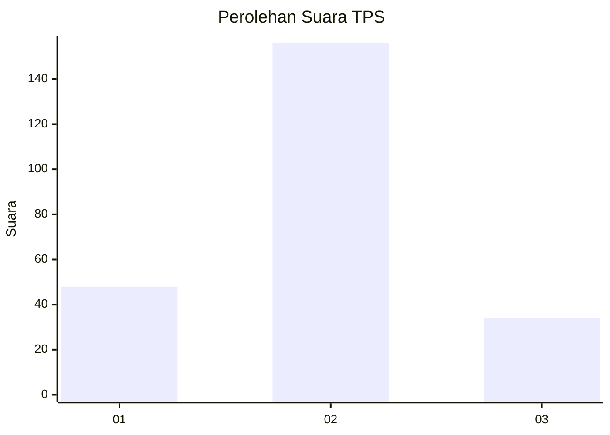
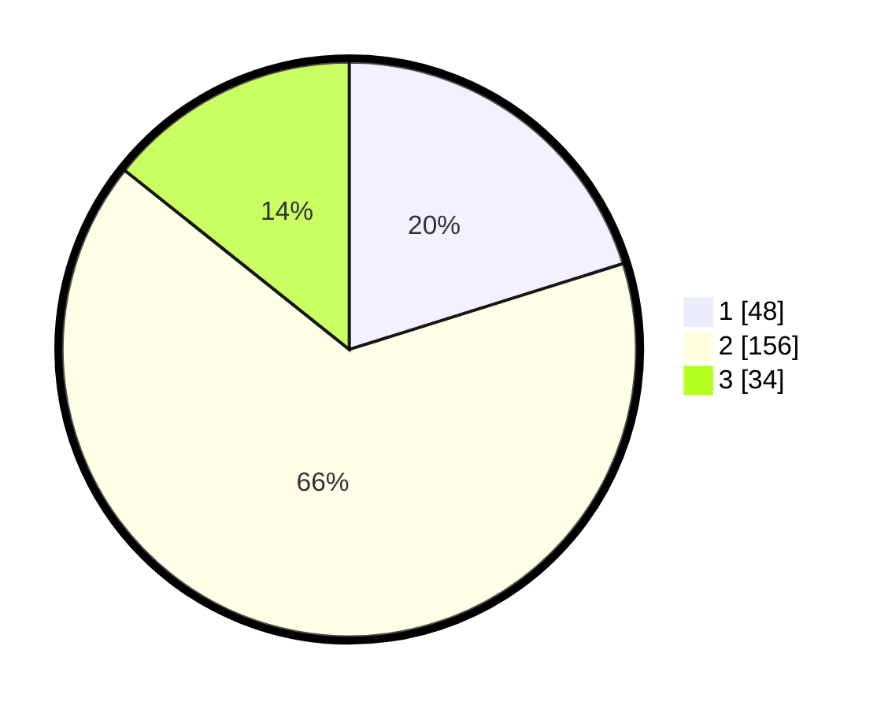

# Hasil

## Grafik

## Tabel

| No. | Nama Paslon    | Suara | Suara (raw) | Persentase |
|:--- |:-------------- | -----:| -----------:| ----------:|
| 1   | ANIES MUHAIMIN | 48    | [48][p-1]   | 20,17      |
| 2   | PRABOWO GIBRAN | 156   | [156][p-2]  | 65,55      |
| 3   | GANJAR MAHFUD  | 34    | [34][p-3]   | 14,29      |

[p-1]: https://github.com/gigit-pemilu/pemilu-2024-35-jawa-timur/blob/main/pilpres/hitung-suara/sub/35-jawa-timur/sub/08-lumajang/sub/12-senduro/sub/2006-kandangtepus/sub/003-tps/sub/paslon-1.txt
[p-2]: https://github.com/gigit-pemilu/pemilu-2024-35-jawa-timur/blob/main/pilpres/hitung-suara/sub/35-jawa-timur/sub/08-lumajang/sub/12-senduro/sub/2006-kandangtepus/sub/003-tps/sub/paslon-2.txt
[p-3]: https://github.com/gigit-pemilu/pemilu-2024-35-jawa-timur/blob/main/pilpres/hitung-suara/sub/35-jawa-timur/sub/08-lumajang/sub/12-senduro/sub/2006-kandangtepus/sub/003-tps/sub/paslon-3.txt

## Foto C Plano

https://sirekap-obj-formc.kpu.go.id/83ef/pemilu/ppwp/35/08/12/20/06/3508122006003-20240215-001938--a2bc2725-8789-45ab-8787-fe46287fecd5.jpg

https://sirekap-obj-formc.kpu.go.id/83ef/pemilu/ppwp/35/08/12/20/06/3508122006003-20240215-002223--af02defa-5904-4ba2-92e7-e8668d9b94e3.jpg

https://sirekap-obj-formc.kpu.go.id/83ef/pemilu/ppwp/35/08/12/20/06/3508122006003-20240214-204721--4c6deef2-91af-4805-9cca-45000e716b95.jpg

## Metadata

| Key        | Value               |
| ---------- | ------------------- |
| Time Stamp | 2024-02-15 20:00:44 |

