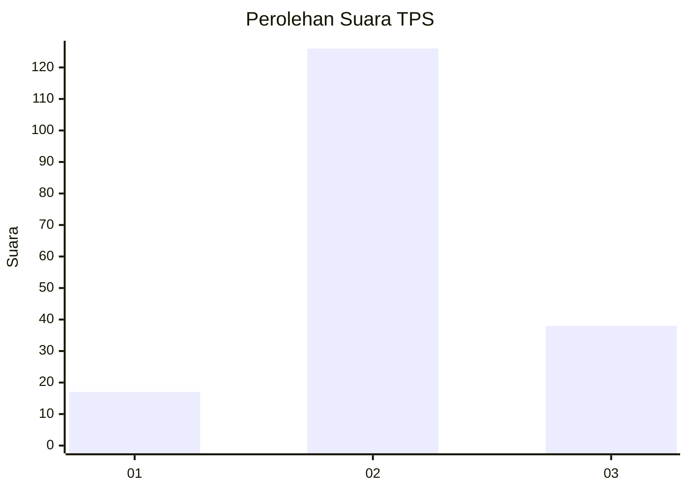
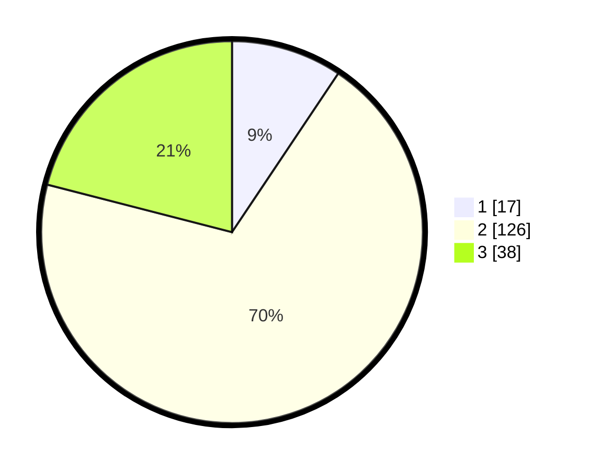

# Hasil

## Grafik

## Tabel

| No. | Nama Paslon    | Suara | Suara (raw) | Persentase |
|:--- |:-------------- | -----:| -----------:| ----------:|
| 1   | ANIES MUHAIMIN | 17    | [17][p-1]   | 9,39       |
| 2   | PRABOWO GIBRAN | 126   | [126][p-2]  | 69,61      |
| 3   | GANJAR MAHFUD  | 38    | [38][p-3]   | 20,99      |

[p-1]: https://github.com/gigit-pemilu/pemilu-2024/blob/main/pilpres/hitung-suara/sub/35-jawa-timur/sub/08-lumajang/sub/12-senduro/sub/2006-kandangtepus/sub/007-tps/sub/paslon-1.txt
[p-2]: https://github.com/gigit-pemilu/pemilu-2024/blob/main/pilpres/hitung-suara/sub/35-jawa-timur/sub/08-lumajang/sub/12-senduro/sub/2006-kandangtepus/sub/007-tps/sub/paslon-2.txt
[p-3]: https://github.com/gigit-pemilu/pemilu-2024/blob/main/pilpres/hitung-suara/sub/35-jawa-timur/sub/08-lumajang/sub/12-senduro/sub/2006-kandangtepus/sub/007-tps/sub/paslon-3.txt

## Foto C Plano

https://sirekap-obj-formc.kpu.go.id/1590/pemilu/ppwp/35/08/12/20/06/3508122006007-20240214-204405--bd27f7b1-1738-4944-9faa-4219a8e6b1ba.jpg

https://sirekap-obj-formc.kpu.go.id/1590/pemilu/ppwp/35/08/12/20/06/3508122006007-20240214-204534--dcf7b598-ad97-432f-b20f-f364065b2373.jpg

https://sirekap-obj-formc.kpu.go.id/1590/pemilu/ppwp/35/08/12/20/06/3508122006007-20240214-204632--34f704cc-cbef-46d7-bcc3-6a6b4f18dd3c.jpg

## Metadata

| Key        | Value               |
| ---------- | ------------------- |
| Time Stamp | 2024-02-19 06:16:00 |

