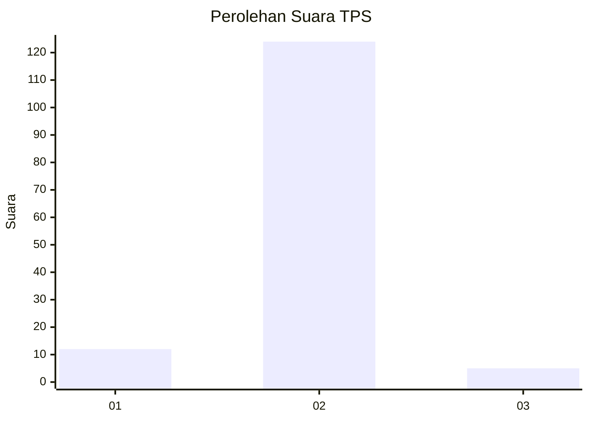
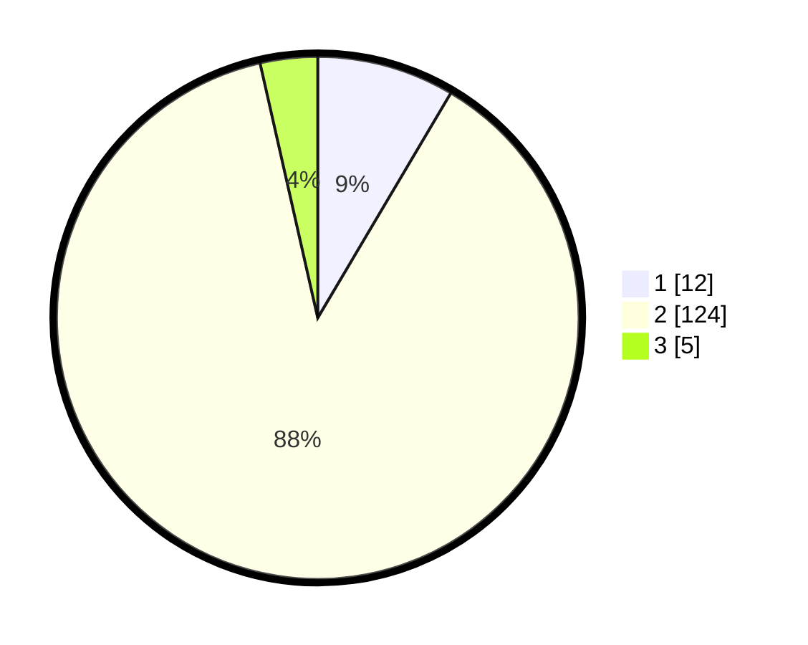

# Hasil

## Grafik

## Tabel

| No. | Nama Paslon    | Suara | Suara (raw) | Persentase |
|:--- |:-------------- | -----:| -----------:| ----------:|
| 1   | ANIES MUHAIMIN | 12    | [12][p-1]   | 8,51       |
| 2   | PRABOWO GIBRAN | 124   | [124][p-2]  | 87,94      |
| 3   | GANJAR MAHFUD  | 5     | [5][p-3]    | 3,55       |

[p-1]: https://github.com/gigit-pemilu/pemilu-2024/blob/main/pilpres/hitung-suara/sub/35-jawa-timur/sub/08-lumajang/sub/12-senduro/sub/2006-kandangtepus/sub/014-tps/sub/paslon-1.txt
[p-2]: https://github.com/gigit-pemilu/pemilu-2024/blob/main/pilpres/hitung-suara/sub/35-jawa-timur/sub/08-lumajang/sub/12-senduro/sub/2006-kandangtepus/sub/014-tps/sub/paslon-2.txt
[p-3]: https://github.com/gigit-pemilu/pemilu-2024/blob/main/pilpres/hitung-suara/sub/35-jawa-timur/sub/08-lumajang/sub/12-senduro/sub/2006-kandangtepus/sub/014-tps/sub/paslon-3.txt

## Foto C Plano

https://sirekap-obj-formc.kpu.go.id/e1ee/pemilu/ppwp/35/08/12/20/06/3508122006014-20240215-003233--91a4c526-b321-47ec-b549-9413ff79c91f.jpg

https://sirekap-obj-formc.kpu.go.id/e1ee/pemilu/ppwp/35/08/12/20/06/3508122006014-20240215-003348--69b6cd35-e1eb-4c6d-a97e-0de5ac11a3b1.jpg

https://sirekap-obj-formc.kpu.go.id/e1ee/pemilu/ppwp/35/08/12/20/06/3508122006014-20240215-003433--148f5282-fcf7-431f-a33c-993a3aeb151f.jpg

## Metadata

| Key        | Value               |
| ---------- | ------------------- |
| Time Stamp | 2024-02-19 06:16:00 |

