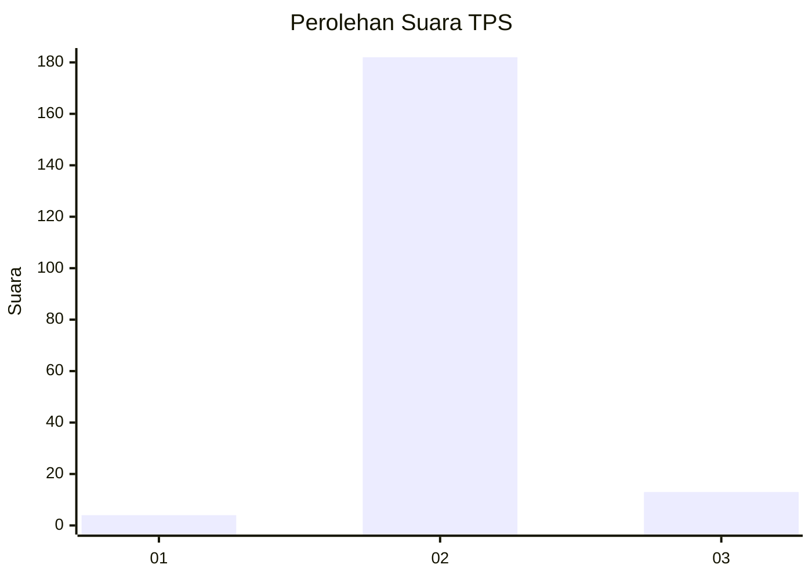
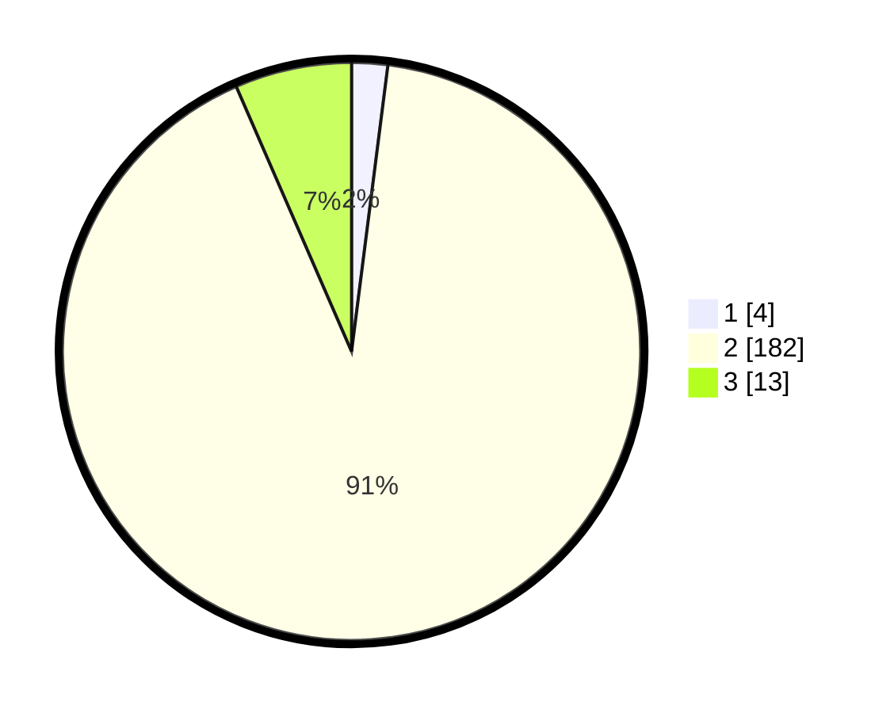

# Hasil

## Grafik

## Tabel

| No. | Nama Paslon    | Suara | Suara (raw) | Persentase |
|:--- |:-------------- | -----:| -----------:| ----------:|
| 1   | ANIES MUHAIMIN | 4     | [4][p-1]    | 2,01       |
| 2   | PRABOWO GIBRAN | 182   | [182][p-2]  | 91,46      |
| 3   | GANJAR MAHFUD  | 13    | [13][p-3]   | 6,53       |

[p-1]: https://github.com/gigit-pemilu/pemilu-2024/blob/main/pilpres/hitung-suara/sub/35-jawa-timur/sub/08-lumajang/sub/12-senduro/sub/2006-kandangtepus/sub/015-tps/sub/paslon-1.txt
[p-2]: https://github.com/gigit-pemilu/pemilu-2024/blob/main/pilpres/hitung-suara/sub/35-jawa-timur/sub/08-lumajang/sub/12-senduro/sub/2006-kandangtepus/sub/015-tps/sub/paslon-2.txt
[p-3]: https://github.com/gigit-pemilu/pemilu-2024/blob/main/pilpres/hitung-suara/sub/35-jawa-timur/sub/08-lumajang/sub/12-senduro/sub/2006-kandangtepus/sub/015-tps/sub/paslon-3.txt

## Foto C Plano

https://sirekap-obj-formc.kpu.go.id/6222/pemilu/ppwp/35/08/12/20/06/3508122006015-20240214-223056--171f0979-73b4-4e32-b1fc-fd0ae28a3b0d.jpg

https://sirekap-obj-formc.kpu.go.id/6222/pemilu/ppwp/35/08/12/20/06/3508122006015-20240214-223205--67bb9784-717a-4174-b45e-339f69288298.jpg

https://sirekap-obj-formc.kpu.go.id/6222/pemilu/ppwp/35/08/12/20/06/3508122006015-20240214-223251--f0592fe7-c2f1-48b9-af78-259e0e8685bd.jpg

## Metadata

| Key        | Value               |
| ---------- | ------------------- |
| Time Stamp | 2024-02-19 06:16:00 |

