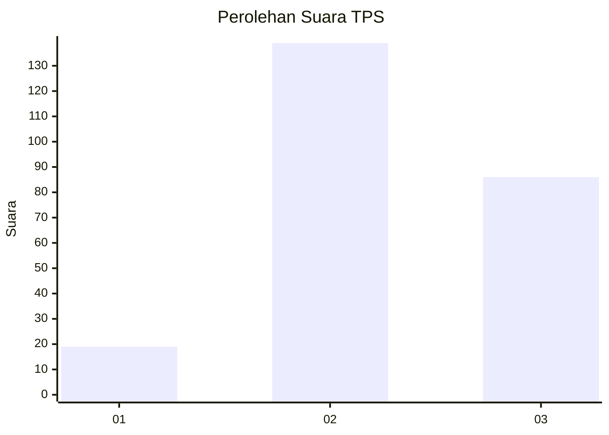
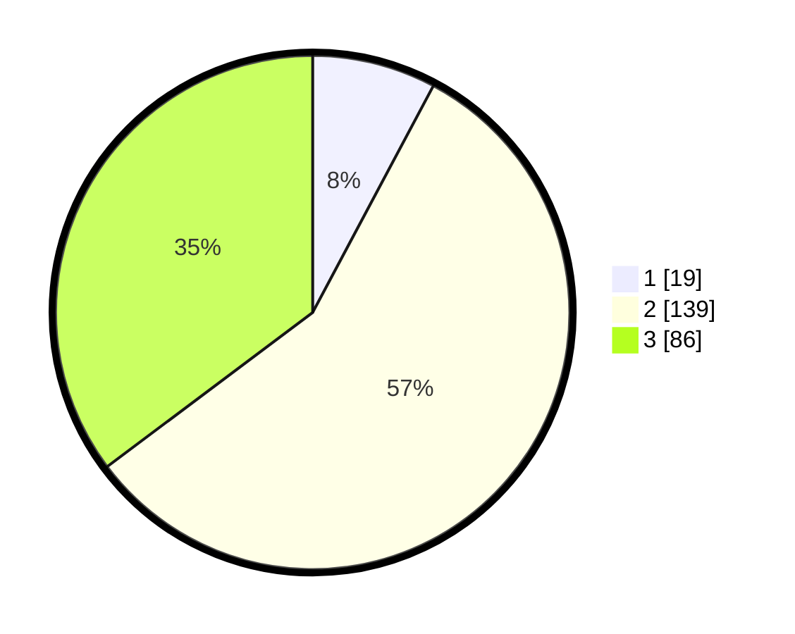

# Hasil

## Grafik

## Tabel

| No. | Nama Paslon    | Suara | Suara (raw) | Persentase |
|:--- |:-------------- | -----:| -----------:| ----------:|
| 1   | ANIES MUHAIMIN | 19    | [19][p-1]   | 7,79       |
| 2   | PRABOWO GIBRAN | 139   | [139][p-2]  | 56,97      |
| 3   | GANJAR MAHFUD  | 86    | [86][p-3]   | 35,25      |

[p-1]: https://github.com/gigit-pemilu/pemilu-2024/blob/main/pilpres/hitung-suara/sub/35-jawa-timur/sub/08-lumajang/sub/12-senduro/sub/2006-kandangtepus/sub/026-tps/sub/paslon-1.txt
[p-2]: https://github.com/gigit-pemilu/pemilu-2024/blob/main/pilpres/hitung-suara/sub/35-jawa-timur/sub/08-lumajang/sub/12-senduro/sub/2006-kandangtepus/sub/026-tps/sub/paslon-2.txt
[p-3]: https://github.com/gigit-pemilu/pemilu-2024/blob/main/pilpres/hitung-suara/sub/35-jawa-timur/sub/08-lumajang/sub/12-senduro/sub/2006-kandangtepus/sub/026-tps/sub/paslon-3.txt

## Foto C Plano

https://sirekap-obj-formc.kpu.go.id/faee/pemilu/ppwp/35/08/12/20/06/3508122006026-20240215-023730--c2fd9a16-d132-42ec-bebf-be259edf97f5.jpg

https://sirekap-obj-formc.kpu.go.id/faee/pemilu/ppwp/35/08/12/20/06/3508122006026-20240215-023839--c3ae1860-a453-4c04-adec-bcdb3cf105ac.jpg

https://sirekap-obj-formc.kpu.go.id/faee/pemilu/ppwp/35/08/12/20/06/3508122006026-20240215-023931--1229c955-63a1-44ff-b367-f17e2b34c331.jpg

## Metadata

| Key        | Value               |
| ---------- | ------------------- |
| Time Stamp | 2024-02-17 16:00:02 |

