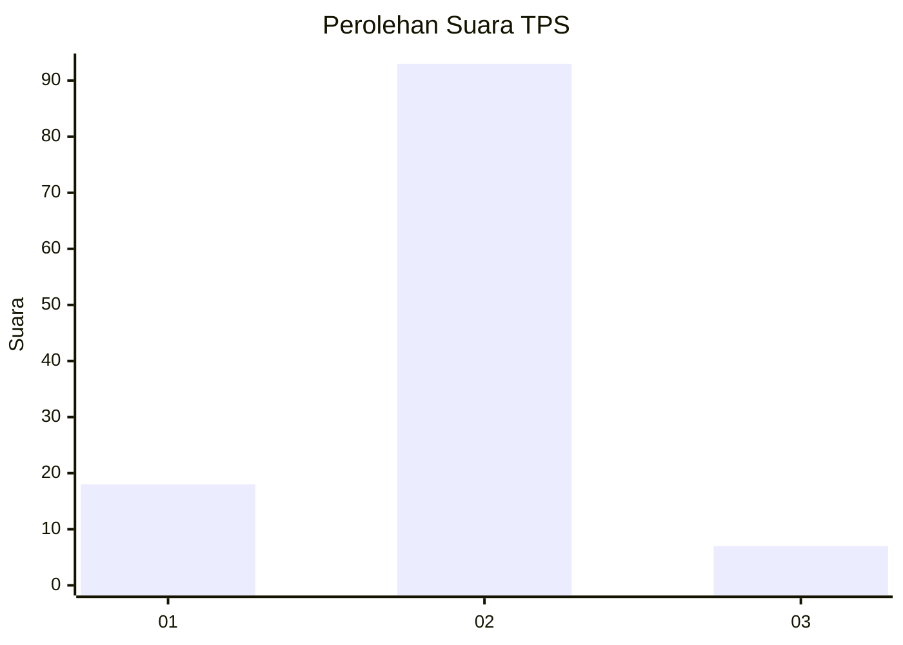
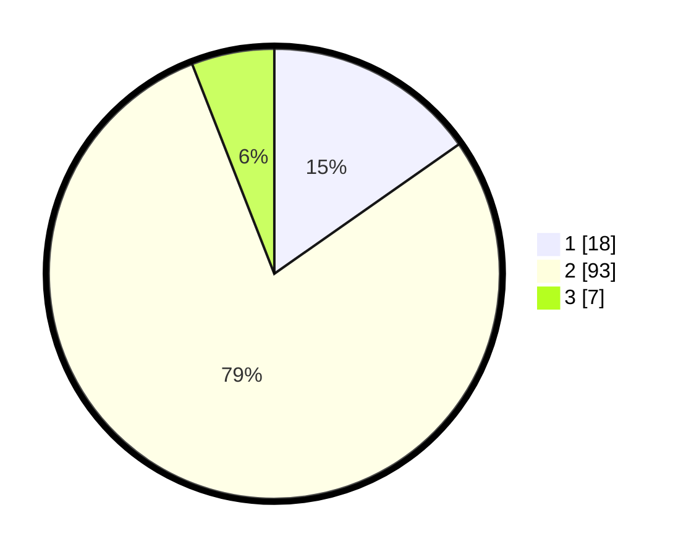

# Hasil

## Grafik

## Tabel

| No. | Nama Paslon    | Suara | Suara (raw) | Persentase |
|:--- |:-------------- | -----:| -----------:| ----------:|
| 1   | ANIES MUHAIMIN | 18    | [18][p-1]   | 15,25      |
| 2   | PRABOWO GIBRAN | 93    | [93][p-2]   | 78,81      |
| 3   | GANJAR MAHFUD  | 7     | [7][p-3]    | 5,93       |

[p-1]: https://github.com/gigit-pemilu/pemilu-2024/blob/main/pilpres/hitung-suara/sub/35-jawa-timur/sub/08-lumajang/sub/12-senduro/sub/2007-kandangan/sub/010-tps/sub/paslon-1.txt
[p-2]: https://github.com/gigit-pemilu/pemilu-2024/blob/main/pilpres/hitung-suara/sub/35-jawa-timur/sub/08-lumajang/sub/12-senduro/sub/2007-kandangan/sub/010-tps/sub/paslon-2.txt
[p-3]: https://github.com/gigit-pemilu/pemilu-2024/blob/main/pilpres/hitung-suara/sub/35-jawa-timur/sub/08-lumajang/sub/12-senduro/sub/2007-kandangan/sub/010-tps/sub/paslon-3.txt

## Foto C Plano

https://sirekap-obj-formc.kpu.go.id/d9f2/pemilu/ppwp/35/08/12/20/07/3508122007010-20240214-162245--1bc51a50-7e2d-4b01-88eb-1d784573db79.jpg

https://sirekap-obj-formc.kpu.go.id/d9f2/pemilu/ppwp/35/08/12/20/07/3508122007010-20240214-155817--30402e04-5537-499b-81b8-dfcea3b1731d.jpg

https://sirekap-obj-formc.kpu.go.id/d9f2/pemilu/ppwp/35/08/12/20/07/3508122007010-20240214-160152--2b5030c1-e73a-420f-ab50-1691c7654885.jpg

## Metadata

| Key        | Value               |
| ---------- | ------------------- |
| Time Stamp | 2024-02-14 21:46:01 |

