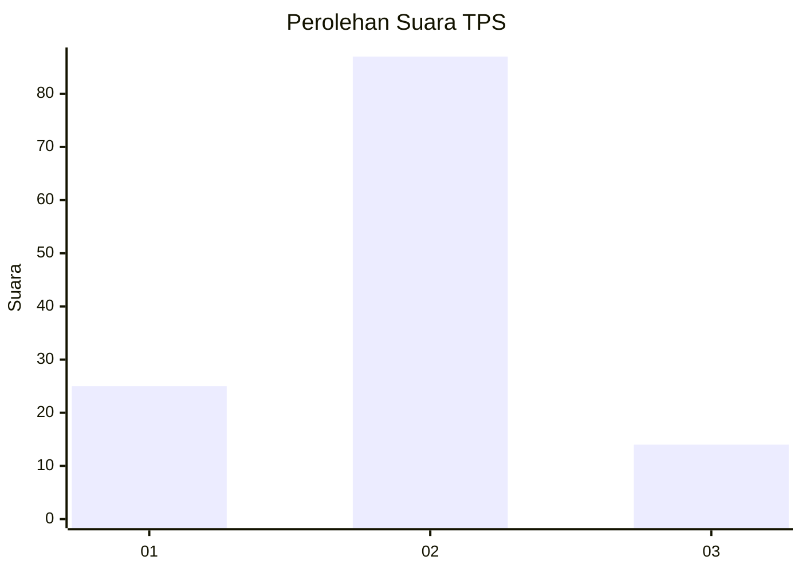
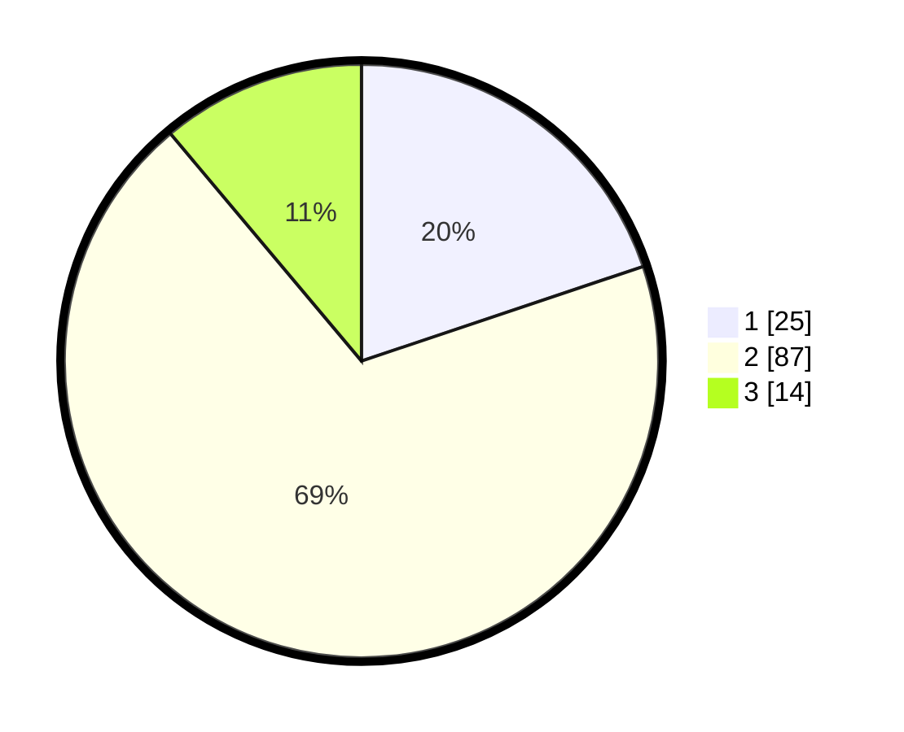

# Hasil

## Grafik

## Tabel

| No. | Nama Paslon    | Suara | Suara (raw) | Persentase |
|:--- |:-------------- | -----:| -----------:| ----------:|
| 1   | ANIES MUHAIMIN | 25    | [25][p-1]   | 19,84      |
| 2   | PRABOWO GIBRAN | 87    | [87][p-2]   | 69,05      |
| 3   | GANJAR MAHFUD  | 14    | [14][p-3]   | 11,11      |

[p-1]: https://github.com/gigit-pemilu/pemilu-2024-35-jawa-timur/blob/main/pilpres/hitung-suara/sub/35-jawa-timur/sub/08-lumajang/sub/12-senduro/sub/2007-kandangan/sub/012-tps/sub/paslon-1.txt
[p-2]: https://github.com/gigit-pemilu/pemilu-2024-35-jawa-timur/blob/main/pilpres/hitung-suara/sub/35-jawa-timur/sub/08-lumajang/sub/12-senduro/sub/2007-kandangan/sub/012-tps/sub/paslon-2.txt
[p-3]: https://github.com/gigit-pemilu/pemilu-2024-35-jawa-timur/blob/main/pilpres/hitung-suara/sub/35-jawa-timur/sub/08-lumajang/sub/12-senduro/sub/2007-kandangan/sub/012-tps/sub/paslon-3.txt

## Foto C Plano

https://sirekap-obj-formc.kpu.go.id/995a/pemilu/ppwp/35/08/12/20/07/3508122007012-20240214-202903--c0326906-3008-4e14-8218-7eceaae7c8aa.jpg

https://sirekap-obj-formc.kpu.go.id/995a/pemilu/ppwp/35/08/12/20/07/3508122007012-20240214-204140--aa608300-105d-4d9a-bddc-0d79407f6a85.jpg

https://sirekap-obj-formc.kpu.go.id/995a/pemilu/ppwp/35/08/12/20/07/3508122007012-20240214-204304--f8300acc-427b-46b6-be7a-13a330a0bb60.jpg

## Metadata

| Key        | Value               |
| ---------- | ------------------- |
| Time Stamp | 2024-02-15 00:41:44 |

