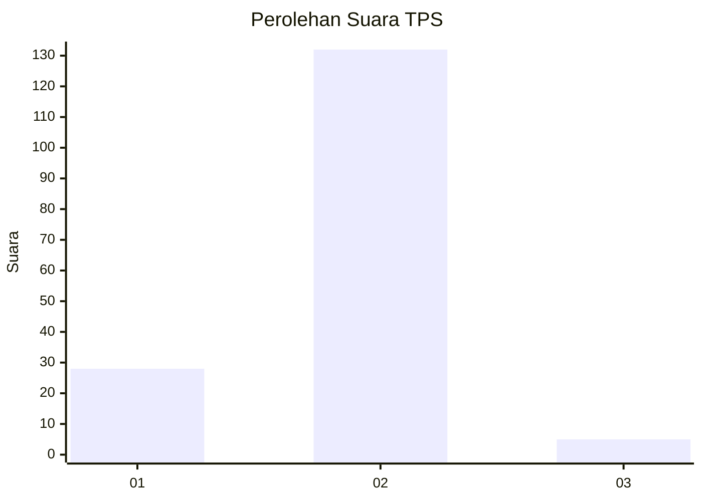
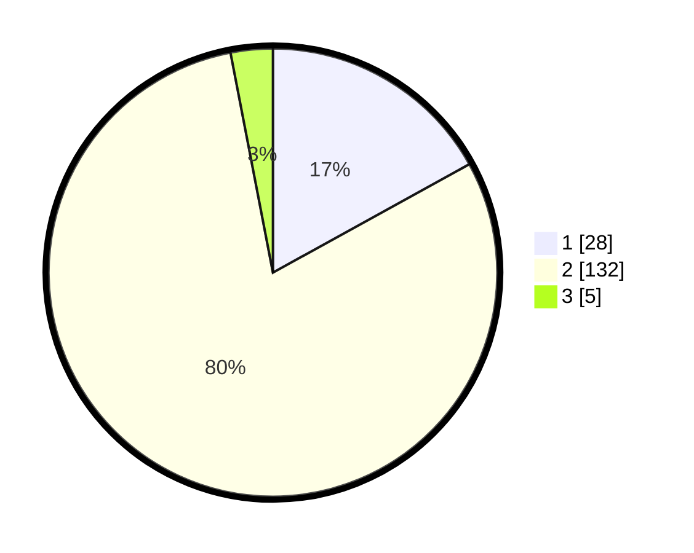

# Hasil

## Grafik

## Tabel

| No. | Nama Paslon    | Suara | Suara (raw) | Persentase |
|:--- |:-------------- | -----:| -----------:| ----------:|
| 1   | ANIES MUHAIMIN | 28    | [28][p-1]   | 16,97      |
| 2   | PRABOWO GIBRAN | 132   | [132][p-2]  | 80,00      |
| 3   | GANJAR MAHFUD  | 5     | [5][p-3]    | 3,03       |

[p-1]: https://github.com/gigit-pemilu/pemilu-2024/blob/main/pilpres/hitung-suara/sub/35-jawa-timur/sub/08-lumajang/sub/12-senduro/sub/2008-bedayu/sub/001-tps/sub/paslon-1.txt
[p-2]: https://github.com/gigit-pemilu/pemilu-2024/blob/main/pilpres/hitung-suara/sub/35-jawa-timur/sub/08-lumajang/sub/12-senduro/sub/2008-bedayu/sub/001-tps/sub/paslon-2.txt
[p-3]: https://github.com/gigit-pemilu/pemilu-2024/blob/main/pilpres/hitung-suara/sub/35-jawa-timur/sub/08-lumajang/sub/12-senduro/sub/2008-bedayu/sub/001-tps/sub/paslon-3.txt

## Foto C Plano

https://sirekap-obj-formc.kpu.go.id/95ff/pemilu/ppwp/35/08/12/20/08/3508122008001-20240216-140120--b8e33120-5b22-4f45-997f-1e1ef21a134b.jpg

https://sirekap-obj-formc.kpu.go.id/95ff/pemilu/ppwp/35/08/12/20/08/3508122008001-20240216-140101--5b04db2f-7b0e-4b02-b673-60cb011c19af.jpg

## Metadata

| Key        | Value               |
| ---------- | ------------------- |
| Time Stamp | 2024-02-24 22:31:28 |

