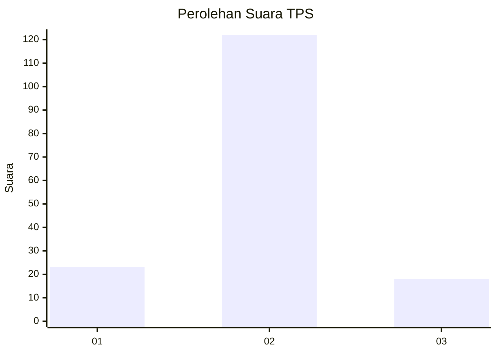
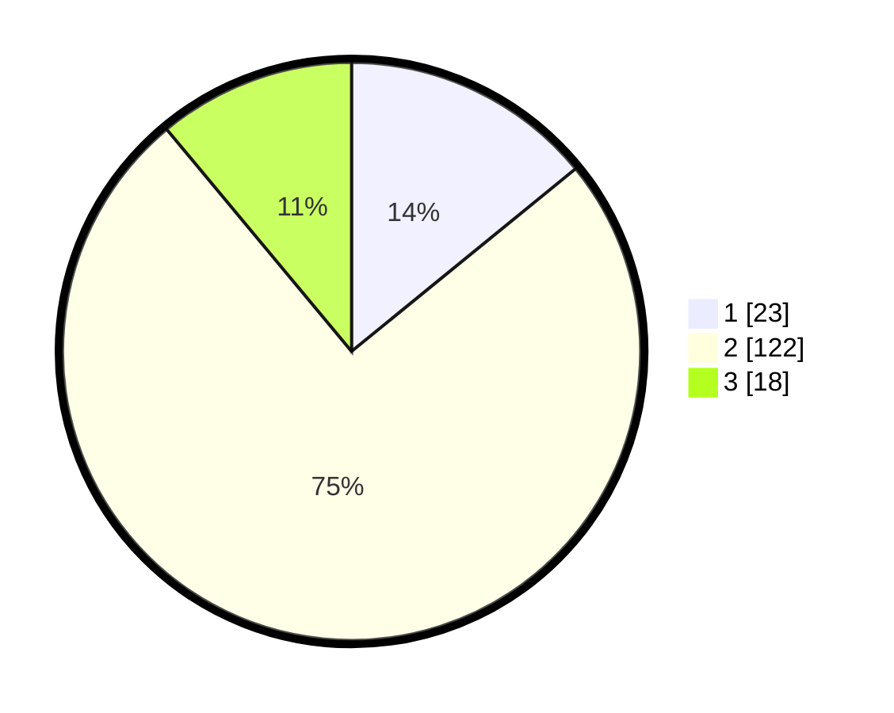

# Hasil

## Grafik

## Tabel

| No. | Nama Paslon    | Suara | Suara (raw) | Persentase |
|:--- |:-------------- | -----:| -----------:| ----------:|
| 1   | ANIES MUHAIMIN | 23    | [23][p-1]   | 14,11      |
| 2   | PRABOWO GIBRAN | 122   | [122][p-2]  | 74,85      |
| 3   | GANJAR MAHFUD  | 18    | [18][p-3]   | 11,04      |

[p-1]: https://github.com/gigit-pemilu/pemilu-2024/blob/main/pilpres/hitung-suara/sub/35-jawa-timur/sub/08-lumajang/sub/12-senduro/sub/2008-bedayu/sub/002-tps/sub/paslon-1.txt
[p-2]: https://github.com/gigit-pemilu/pemilu-2024/blob/main/pilpres/hitung-suara/sub/35-jawa-timur/sub/08-lumajang/sub/12-senduro/sub/2008-bedayu/sub/002-tps/sub/paslon-2.txt
[p-3]: https://github.com/gigit-pemilu/pemilu-2024/blob/main/pilpres/hitung-suara/sub/35-jawa-timur/sub/08-lumajang/sub/12-senduro/sub/2008-bedayu/sub/002-tps/sub/paslon-3.txt

## Foto C Plano

https://sirekap-obj-formc.kpu.go.id/16aa/pemilu/ppwp/35/08/12/20/08/3508122008002-20240215-035900--ccbc6c54-e72c-4ef9-a094-04d34bcbc115.jpg

https://sirekap-obj-formc.kpu.go.id/16aa/pemilu/ppwp/35/08/12/20/08/3508122008002-20240215-040116--9fac890e-58ac-481b-a95f-efe11f851f48.jpg

https://sirekap-obj-formc.kpu.go.id/16aa/pemilu/ppwp/35/08/12/20/08/3508122008002-20240215-040433--6738e23c-73b5-44bd-9af4-d6616c1be69a.jpg

## Metadata

| Key        | Value               |
| ---------- | ------------------- |
| Time Stamp | 2024-02-19 06:16:00 |

