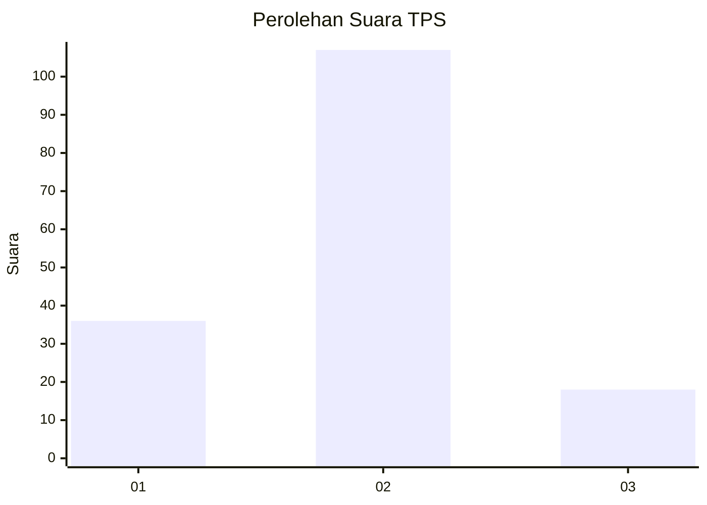
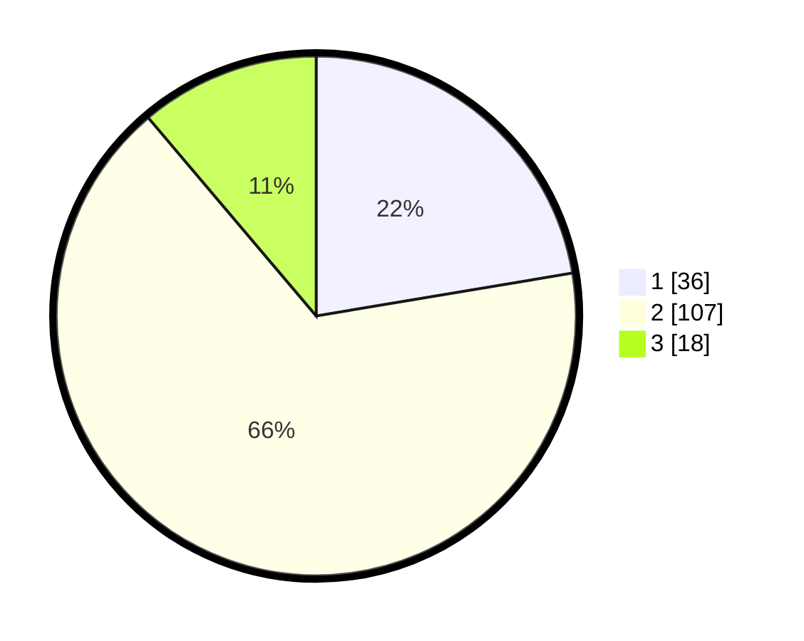

# Hasil

## Grafik

## Tabel

| No. | Nama Paslon    | Suara | Suara (raw) | Persentase |
|:--- |:-------------- | -----:| -----------:| ----------:|
| 1   | ANIES MUHAIMIN | 36    | [36][p-1]   | 22,36      |
| 2   | PRABOWO GIBRAN | 107   | [107][p-2]  | 66,46      |
| 3   | GANJAR MAHFUD  | 18    | [18][p-3]   | 11,18      |

[p-1]: https://github.com/gigit-pemilu/pemilu-2024-35-jawa-timur/blob/main/pilpres/hitung-suara/sub/35-jawa-timur/sub/08-lumajang/sub/12-senduro/sub/2008-bedayu/sub/006-tps/sub/paslon-1.txt
[p-2]: https://github.com/gigit-pemilu/pemilu-2024-35-jawa-timur/blob/main/pilpres/hitung-suara/sub/35-jawa-timur/sub/08-lumajang/sub/12-senduro/sub/2008-bedayu/sub/006-tps/sub/paslon-2.txt
[p-3]: https://github.com/gigit-pemilu/pemilu-2024-35-jawa-timur/blob/main/pilpres/hitung-suara/sub/35-jawa-timur/sub/08-lumajang/sub/12-senduro/sub/2008-bedayu/sub/006-tps/sub/paslon-3.txt

## Foto C Plano

https://sirekap-obj-formc.kpu.go.id/c745/pemilu/ppwp/35/08/12/20/08/3508122008006-20240214-204620--8e4de652-94a3-419c-aeac-1e62086e68d6.jpg

https://sirekap-obj-formc.kpu.go.id/c745/pemilu/ppwp/35/08/12/20/08/3508122008006-20240214-212051--2e4834fc-1bef-4bbb-b558-dc34755c3707.jpg

https://sirekap-obj-formc.kpu.go.id/c745/pemilu/ppwp/35/08/12/20/08/3508122008006-20240214-212157--d25f6c7b-30a1-4d98-9d01-8958609a0d38.jpg

## Metadata

| Key        | Value               |
| ---------- | ------------------- |
| Time Stamp | 2024-02-19 06:16:00 |

