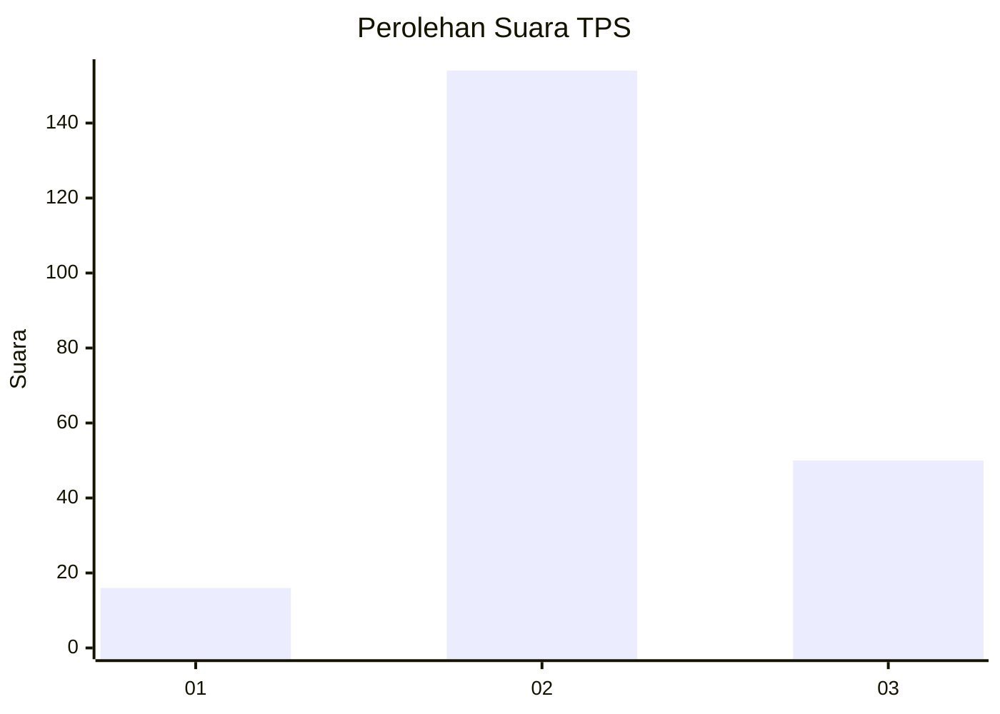
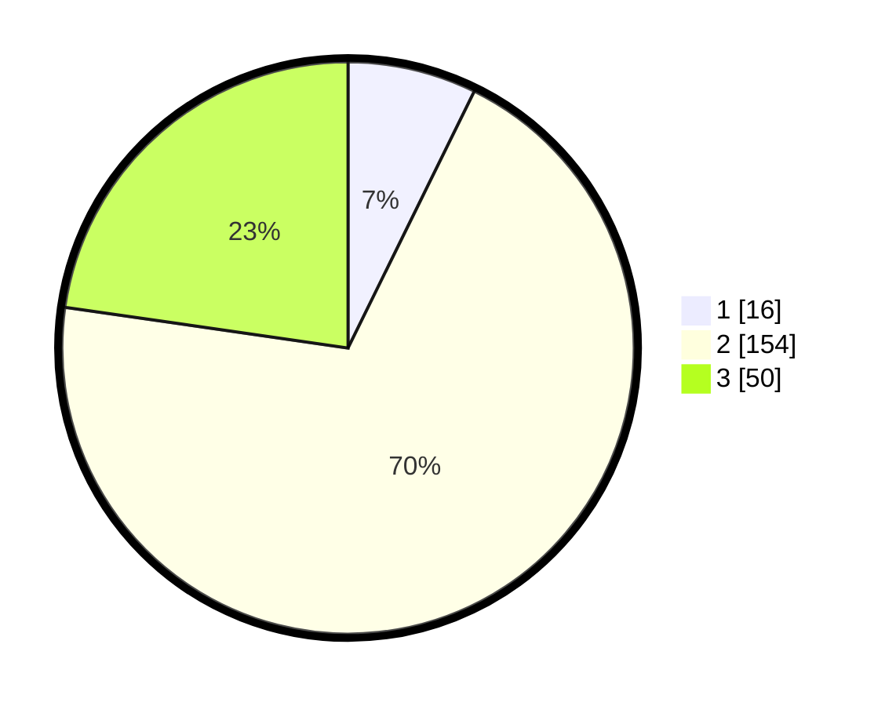

# Hasil

## Grafik

## Tabel

| No. | Nama Paslon    | Suara | Suara (raw) | Persentase |
|:--- |:-------------- | -----:| -----------:| ----------:|
| 1   | ANIES MUHAIMIN | 16    | [16][p-1]   | 7,27       |
| 2   | PRABOWO GIBRAN | 154   | [154][p-2]  | 70,00      |
| 3   | GANJAR MAHFUD  | 50    | [50][p-3]   | 22,73      |

[p-1]: https://github.com/gigit-pemilu/pemilu-2024/blob/main/pilpres/hitung-suara/sub/35-jawa-timur/sub/08-lumajang/sub/12-senduro/sub/2009-bedayutalang/sub/003-tps/sub/paslon-1.txt
[p-2]: https://github.com/gigit-pemilu/pemilu-2024/blob/main/pilpres/hitung-suara/sub/35-jawa-timur/sub/08-lumajang/sub/12-senduro/sub/2009-bedayutalang/sub/003-tps/sub/paslon-2.txt
[p-3]: https://github.com/gigit-pemilu/pemilu-2024/blob/main/pilpres/hitung-suara/sub/35-jawa-timur/sub/08-lumajang/sub/12-senduro/sub/2009-bedayutalang/sub/003-tps/sub/paslon-3.txt

## Foto C Plano

https://sirekap-obj-formc.kpu.go.id/f33d/pemilu/ppwp/35/08/12/20/09/3508122009003-20240214-211232--8b3e7cf7-0837-47c0-ac49-71e754bac57d.jpg

https://sirekap-obj-formc.kpu.go.id/f33d/pemilu/ppwp/35/08/12/20/09/3508122009003-20240214-211240--b0f9d0bc-735e-4cfc-8ad6-d7b16a4624ff.jpg

https://sirekap-obj-formc.kpu.go.id/f33d/pemilu/ppwp/35/08/12/20/09/3508122009003-20240214-211249--c06b8bac-c0ec-4e6d-b6fa-7b3ea78efc22.jpg

## Metadata

| Key        | Value               |
| ---------- | ------------------- |
| Time Stamp | 2024-02-19 06:16:00 |

