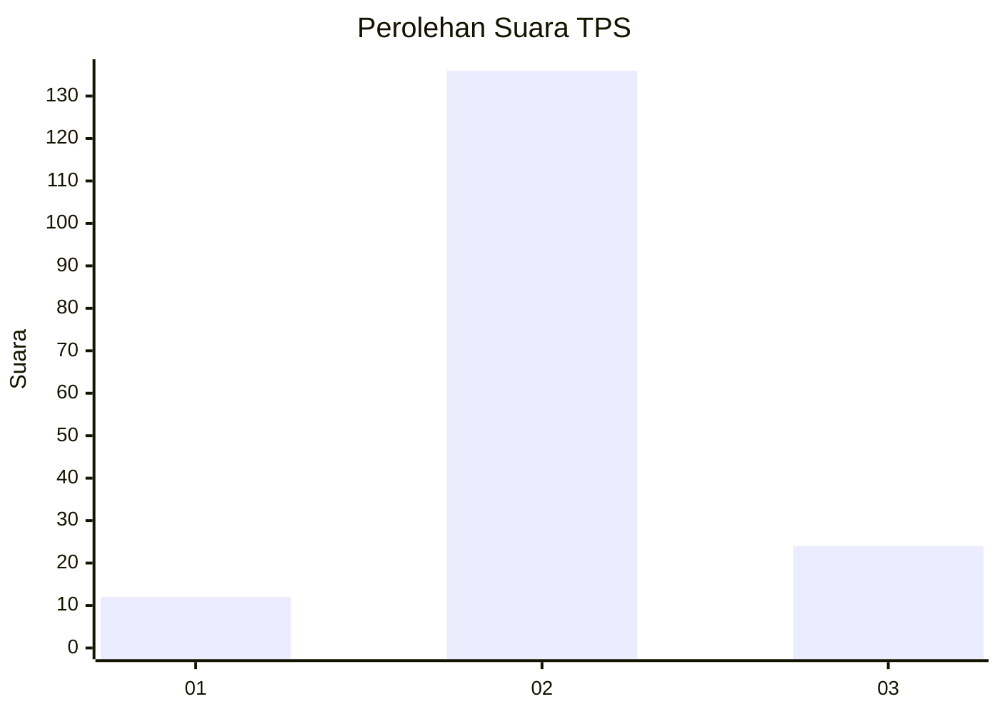
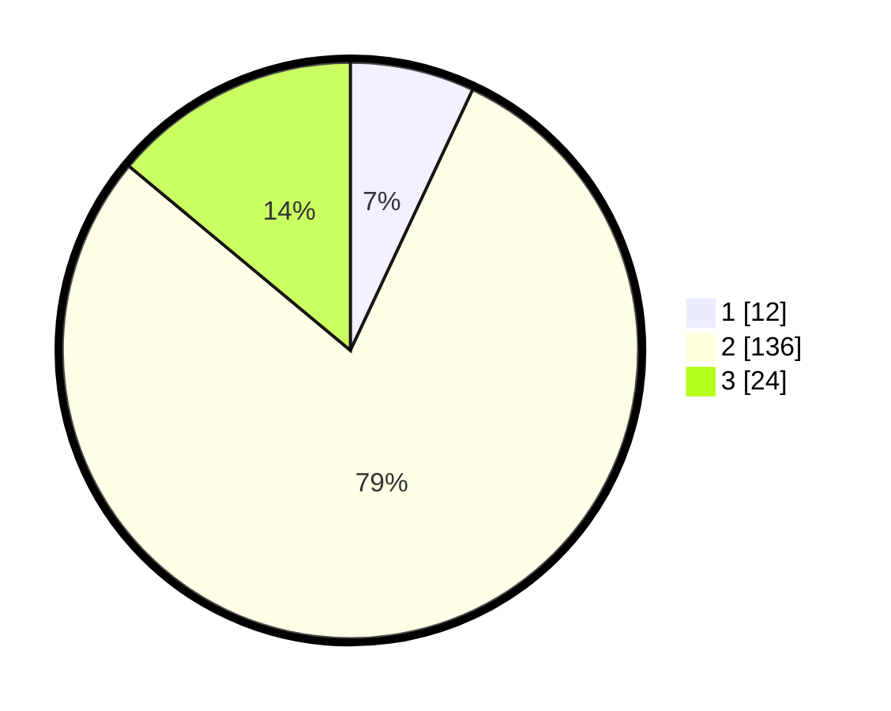

# Hasil

## Grafik

## Tabel

| No. | Nama Paslon    | Suara | Suara (raw) | Persentase |
|:--- |:-------------- | -----:| -----------:| ----------:|
| 1   | ANIES MUHAIMIN | 12    | [12][p-1]   | 6,98       |
| 2   | PRABOWO GIBRAN | 136   | [136][p-2]  | 79,07      |
| 3   | GANJAR MAHFUD  | 24    | [24][p-3]   | 13,95      |

[p-1]: https://github.com/gigit-pemilu/pemilu-2024/blob/main/pilpres/hitung-suara/sub/35-jawa-timur/sub/08-lumajang/sub/12-senduro/sub/2010-wonocepokoayu/sub/002-tps/sub/paslon-1.txt
[p-2]: https://github.com/gigit-pemilu/pemilu-2024/blob/main/pilpres/hitung-suara/sub/35-jawa-timur/sub/08-lumajang/sub/12-senduro/sub/2010-wonocepokoayu/sub/002-tps/sub/paslon-2.txt
[p-3]: https://github.com/gigit-pemilu/pemilu-2024/blob/main/pilpres/hitung-suara/sub/35-jawa-timur/sub/08-lumajang/sub/12-senduro/sub/2010-wonocepokoayu/sub/002-tps/sub/paslon-3.txt

## Foto C Plano

https://sirekap-obj-formc.kpu.go.id/5b9c/pemilu/ppwp/35/08/12/20/10/3508122010002-20240214-141611--6bbfe884-0dc8-4b9c-9e45-f04d8d834c87.jpg

https://sirekap-obj-formc.kpu.go.id/5b9c/pemilu/ppwp/35/08/12/20/10/3508122010002-20240214-215139--017e6a90-d65c-44b6-98d4-a4668367ba7e.jpg

https://sirekap-obj-formc.kpu.go.id/5b9c/pemilu/ppwp/35/08/12/20/10/3508122010002-20240214-141645--9f16e54e-b968-4b18-8663-a422794f6c00.jpg

## Metadata

| Key        | Value               |
| ---------- | ------------------- |
| Time Stamp | 2024-02-19 06:16:00 |

