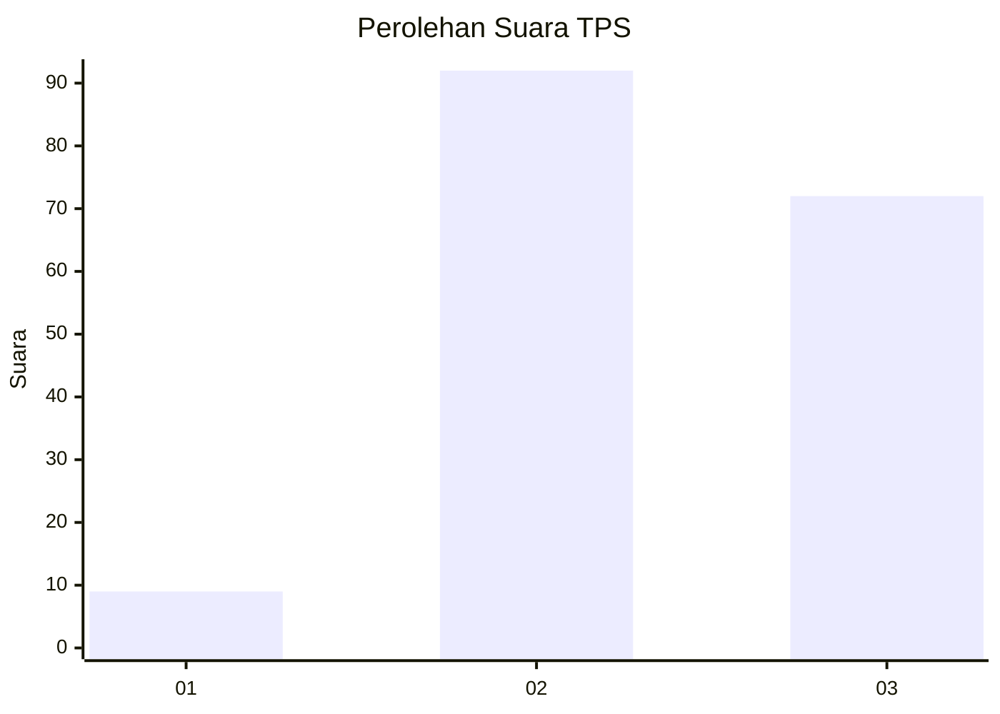
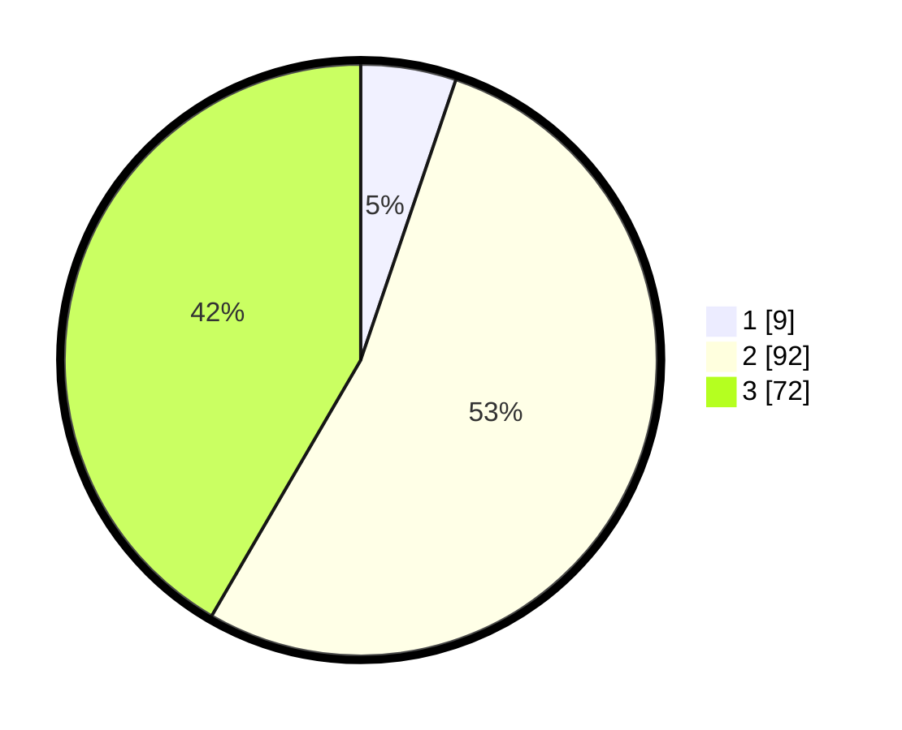

# Hasil

## Grafik

## Tabel

| No. | Nama Paslon    | Suara | Suara (raw) | Persentase |
|:--- |:-------------- | -----:| -----------:| ----------:|
| 1   | ANIES MUHAIMIN | 9     | [9][p-1]    | 5,20       |
| 2   | PRABOWO GIBRAN | 92    | [92][p-2]   | 53,18      |
| 3   | GANJAR MAHFUD  | 72    | [72][p-3]   | 41,62      |

[p-1]: https://github.com/gigit-pemilu/pemilu-2024/blob/main/pilpres/hitung-suara/sub/35-jawa-timur/sub/08-lumajang/sub/12-senduro/sub/2012-ranupani/sub/004-tps/sub/paslon-1.txt
[p-2]: https://github.com/gigit-pemilu/pemilu-2024/blob/main/pilpres/hitung-suara/sub/35-jawa-timur/sub/08-lumajang/sub/12-senduro/sub/2012-ranupani/sub/004-tps/sub/paslon-2.txt
[p-3]: https://github.com/gigit-pemilu/pemilu-2024/blob/main/pilpres/hitung-suara/sub/35-jawa-timur/sub/08-lumajang/sub/12-senduro/sub/2012-ranupani/sub/004-tps/sub/paslon-3.txt

## Foto C Plano

https://sirekap-obj-formc.kpu.go.id/0f70/pemilu/ppwp/35/08/12/20/12/3508122012004-20240214-231108--ac06446f-4da7-45bc-9e9c-3ab556620193.jpg

https://sirekap-obj-formc.kpu.go.id/0f70/pemilu/ppwp/35/08/12/20/12/3508122012004-20240214-233615--e872efef-e303-4af0-bd7b-5b990d8c6fb7.jpg

https://sirekap-obj-formc.kpu.go.id/0f70/pemilu/ppwp/35/08/12/20/12/3508122012004-20240214-231352--c251debe-6ee9-4f5b-bc6c-c82f355a432e.jpg

## Metadata

| Key        | Value               |
| ---------- | ------------------- |
| Time Stamp | 2024-02-19 06:16:00 |

