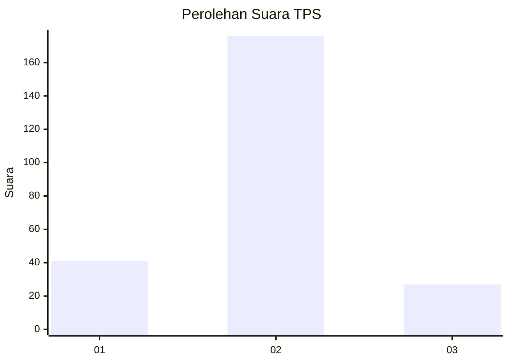
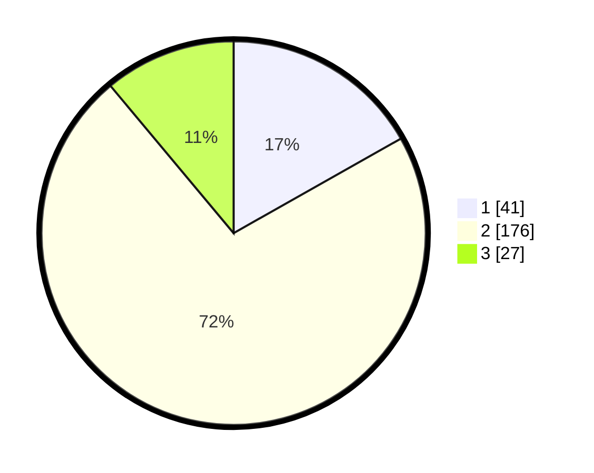

# Hasil

## Grafik

## Tabel

| No. | Nama Paslon    | Suara | Suara (raw) | Persentase |
|:--- |:-------------- | -----:| -----------:| ----------:|
| 1   | ANIES MUHAIMIN | 41    | [41][p-1]   | 16,80      |
| 2   | PRABOWO GIBRAN | 176   | [176][p-2]  | 72,13      |
| 3   | GANJAR MAHFUD  | 27    | [27][p-3]   | 11,07      |

[p-1]: https://github.com/gigit-pemilu/pemilu-2024-35-jawa-timur/blob/main/pilpres/hitung-suara/sub/35-jawa-timur/sub/08-lumajang/sub/13-gucialit/sub/2004-gucialit/sub/010-tps/sub/paslon-1.txt
[p-2]: https://github.com/gigit-pemilu/pemilu-2024-35-jawa-timur/blob/main/pilpres/hitung-suara/sub/35-jawa-timur/sub/08-lumajang/sub/13-gucialit/sub/2004-gucialit/sub/010-tps/sub/paslon-2.txt
[p-3]: https://github.com/gigit-pemilu/pemilu-2024-35-jawa-timur/blob/main/pilpres/hitung-suara/sub/35-jawa-timur/sub/08-lumajang/sub/13-gucialit/sub/2004-gucialit/sub/010-tps/sub/paslon-3.txt

## Foto C Plano

https://sirekap-obj-formc.kpu.go.id/44c5/pemilu/ppwp/35/08/13/20/04/3508132004010-20240214-234940--e7c29ef7-2063-42aa-aca3-59b7badd757e.jpg

https://sirekap-obj-formc.kpu.go.id/44c5/pemilu/ppwp/35/08/13/20/04/3508132004010-20240214-235210--a56214a1-48ec-45f2-9d44-0a9eb0886fef.jpg

https://sirekap-obj-formc.kpu.go.id/44c5/pemilu/ppwp/35/08/13/20/04/3508132004010-20240216-022155--729cb73d-87bd-4d15-a4d2-944de5bafeac.jpg

## Metadata

| Key        | Value               |
| ---------- | ------------------- |
| Time Stamp | 2024-02-16 13:00:29 |

