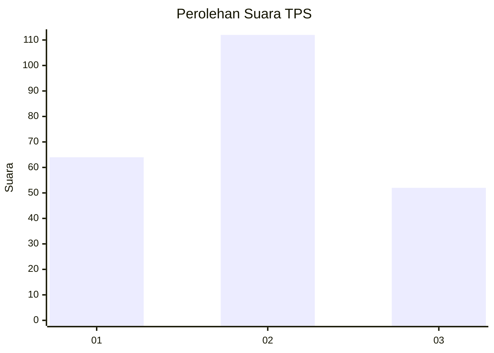
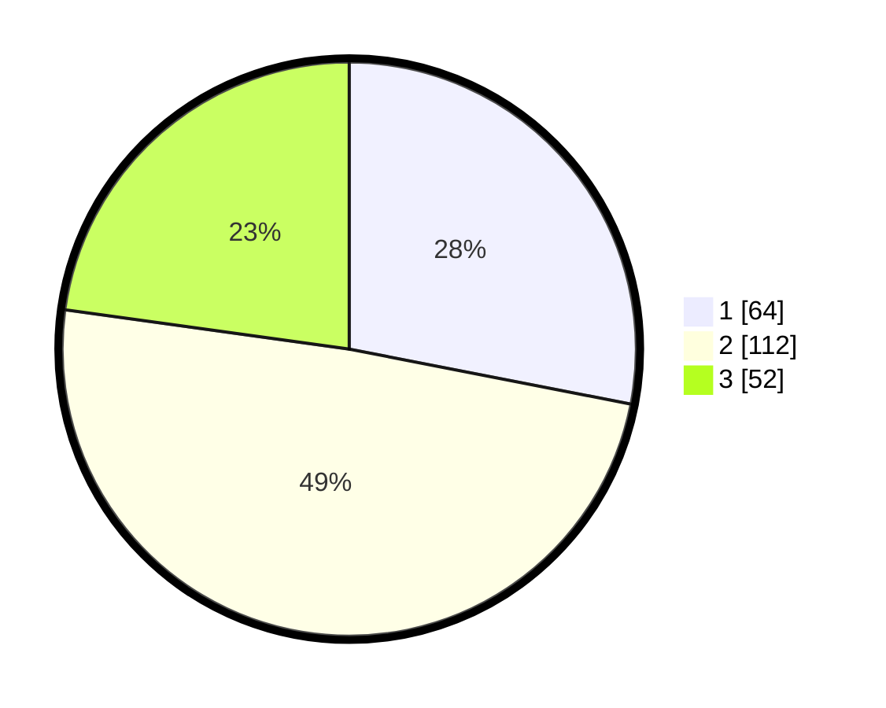

# Hasil

## Grafik

## Tabel

| No. | Nama Paslon    | Suara | Suara (raw) | Persentase |
|:--- |:-------------- | -----:| -----------:| ----------:|
| 1   | ANIES MUHAIMIN | 64    | [64][p-1]   | 28,07      |
| 2   | PRABOWO GIBRAN | 112   | [112][p-2]  | 49,12      |
| 3   | GANJAR MAHFUD  | 52    | [52][p-3]   | 22,81      |

[p-1]: https://github.com/gigit-pemilu/pemilu-2024-35-jawa-timur/blob/main/pilpres/hitung-suara/sub/35-jawa-timur/sub/08-lumajang/sub/13-gucialit/sub/2006-kertowono/sub/007-tps/sub/paslon-1.txt
[p-2]: https://github.com/gigit-pemilu/pemilu-2024-35-jawa-timur/blob/main/pilpres/hitung-suara/sub/35-jawa-timur/sub/08-lumajang/sub/13-gucialit/sub/2006-kertowono/sub/007-tps/sub/paslon-2.txt
[p-3]: https://github.com/gigit-pemilu/pemilu-2024-35-jawa-timur/blob/main/pilpres/hitung-suara/sub/35-jawa-timur/sub/08-lumajang/sub/13-gucialit/sub/2006-kertowono/sub/007-tps/sub/paslon-3.txt

## Foto C Plano

https://sirekap-obj-formc.kpu.go.id/3f81/pemilu/ppwp/35/08/13/20/06/3508132006007-20240214-202125--755e8e47-8f42-4d60-8218-c192ac4c265b.jpg

https://sirekap-obj-formc.kpu.go.id/3f81/pemilu/ppwp/35/08/13/20/06/3508132006007-20240214-202541--20333652-bd91-4d49-b0c0-467982b77cf1.jpg

https://sirekap-obj-formc.kpu.go.id/3f81/pemilu/ppwp/35/08/13/20/06/3508132006007-20240214-202341--df9c6ce7-3fbe-4ccb-9eb5-e51f550522a2.jpg

## Metadata

| Key        | Value               |
| ---------- | ------------------- |
| Time Stamp | 2024-02-16 13:00:29 |

