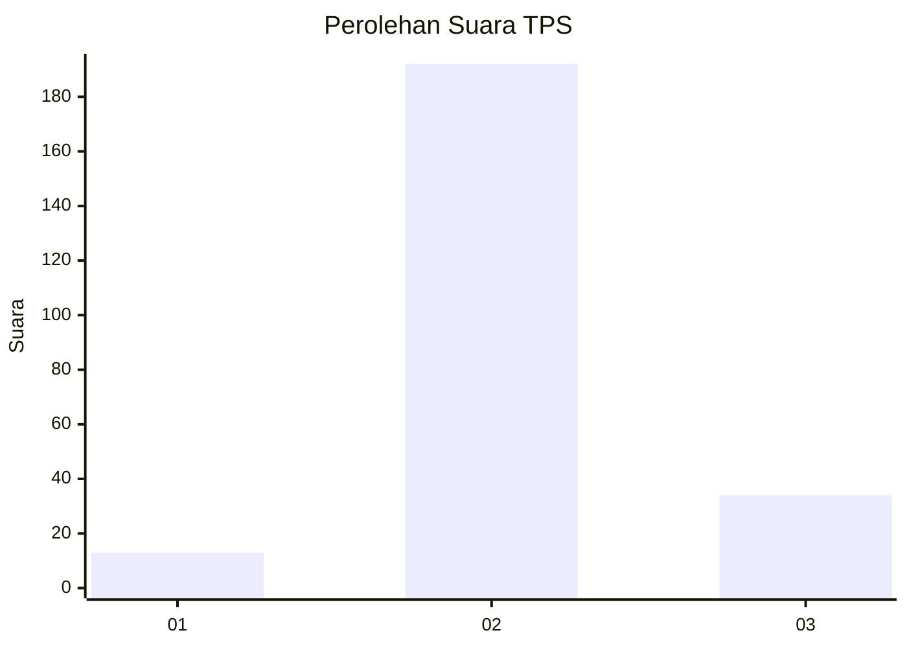
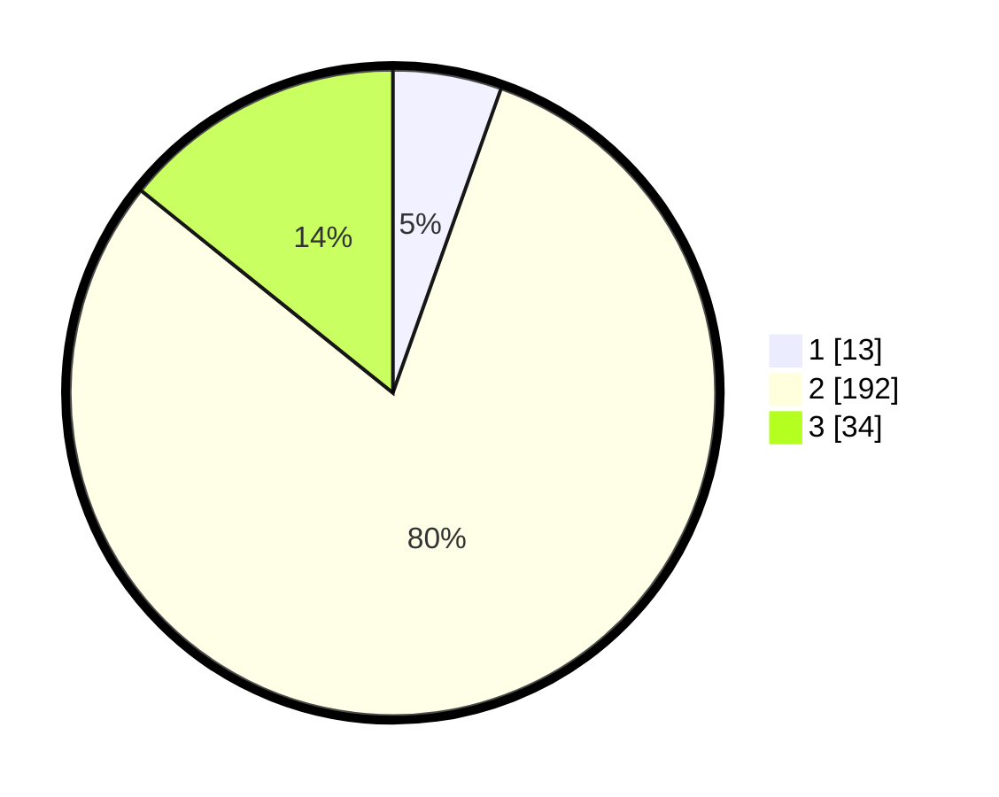

# Hasil

## Grafik

## Tabel

| No. | Nama Paslon    | Suara | Suara (raw) | Persentase |
|:--- |:-------------- | -----:| -----------:| ----------:|
| 1   | ANIES MUHAIMIN | 13    | [13][p-1]   | 5,44       |
| 2   | PRABOWO GIBRAN | 192   | [192][p-2]  | 80,33      |
| 3   | GANJAR MAHFUD  | 34    | [34][p-3]   | 14,23      |

[p-1]: https://github.com/gigit-pemilu/pemilu-2024/blob/main/pilpres/hitung-suara/sub/35-jawa-timur/sub/08-lumajang/sub/14-padang/sub/2003-mojo/sub/002-tps/sub/paslon-1.txt
[p-2]: https://github.com/gigit-pemilu/pemilu-2024/blob/main/pilpres/hitung-suara/sub/35-jawa-timur/sub/08-lumajang/sub/14-padang/sub/2003-mojo/sub/002-tps/sub/paslon-2.txt
[p-3]: https://github.com/gigit-pemilu/pemilu-2024/blob/main/pilpres/hitung-suara/sub/35-jawa-timur/sub/08-lumajang/sub/14-padang/sub/2003-mojo/sub/002-tps/sub/paslon-3.txt

## Foto C Plano

https://sirekap-obj-formc.kpu.go.id/cc38/pemilu/ppwp/35/08/14/20/03/3508142003002-20240215-020137--1f6f99fc-1ce3-46ea-a484-d4549efe9e48.jpg

https://sirekap-obj-formc.kpu.go.id/cc38/pemilu/ppwp/35/08/14/20/03/3508142003002-20240215-020325--0ef75b1f-19ef-42cb-b677-654a7ceb7f7a.jpg

https://sirekap-obj-formc.kpu.go.id/cc38/pemilu/ppwp/35/08/14/20/03/3508142003002-20240215-020314--53d4ad9b-7d26-4f39-92e4-4c771d19c9f9.jpg

## Metadata

| Key        | Value               |
| ---------- | ------------------- |
| Time Stamp | 2024-02-16 13:30:32 |

