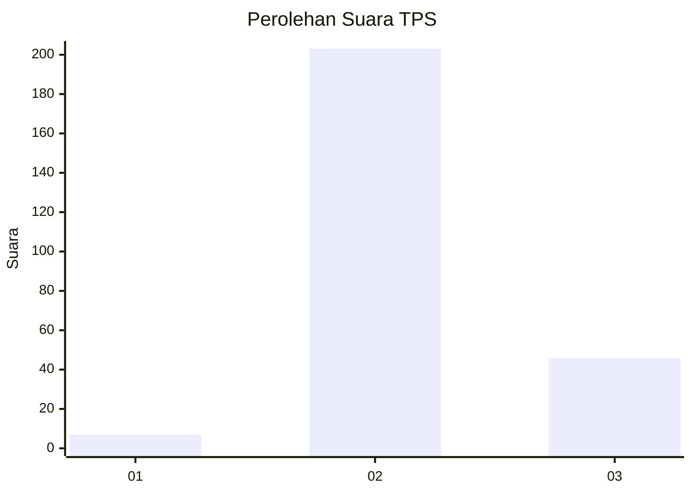

# Hasil

## Grafik

## Tabel

| No. | Nama Paslon    | Suara | Suara (raw) | Persentase |
|:--- |:-------------- | -----:| -----------:| ----------:|
| 1   | ANIES MUHAIMIN | 7     | [7][p-1]    | 2,73       |
| 2   | PRABOWO GIBRAN | 203   | [203][p-2]  | 79,30      |
| 3   | GANJAR MAHFUD  | 46    | [46][p-3]   | 17,97      |

[p-1]: https://github.com/gigit-pemilu/pemilu-2024/blob/main/pilpres/hitung-suara/sub/35-jawa-timur/sub/08-lumajang/sub/14-padang/sub/2003-mojo/sub/007-tps/sub/paslon-1.txt
[p-2]: https://github.com/gigit-pemilu/pemilu-2024/blob/main/pilpres/hitung-suara/sub/35-jawa-timur/sub/08-lumajang/sub/14-padang/sub/2003-mojo/sub/007-tps/sub/paslon-2.txt
[p-3]: https://github.com/gigit-pemilu/pemilu-2024/blob/main/pilpres/hitung-suara/sub/35-jawa-timur/sub/08-lumajang/sub/14-padang/sub/2003-mojo/sub/007-tps/sub/paslon-3.txt

## Foto C Plano

https://sirekap-obj-formc.kpu.go.id/825c/pemilu/ppwp/35/08/14/20/03/3508142003007-20240215-070527--39b659e0-b175-4847-837e-23313372f8c5.jpg

https://sirekap-obj-formc.kpu.go.id/825c/pemilu/ppwp/35/08/14/20/03/3508142003007-20240214-215545--e728d990-3f8d-4ae5-b0b4-640a8afcdf9b.jpg

https://sirekap-obj-formc.kpu.go.id/825c/pemilu/ppwp/35/08/14/20/03/3508142003007-20240215-070601--bcbfd5b2-8972-48fd-8b79-b8af6df4ffad.jpg

## Metadata

| Key        | Value               |
| ---------- | ------------------- |
| Time Stamp | 2024-02-16 12:51:22 |

