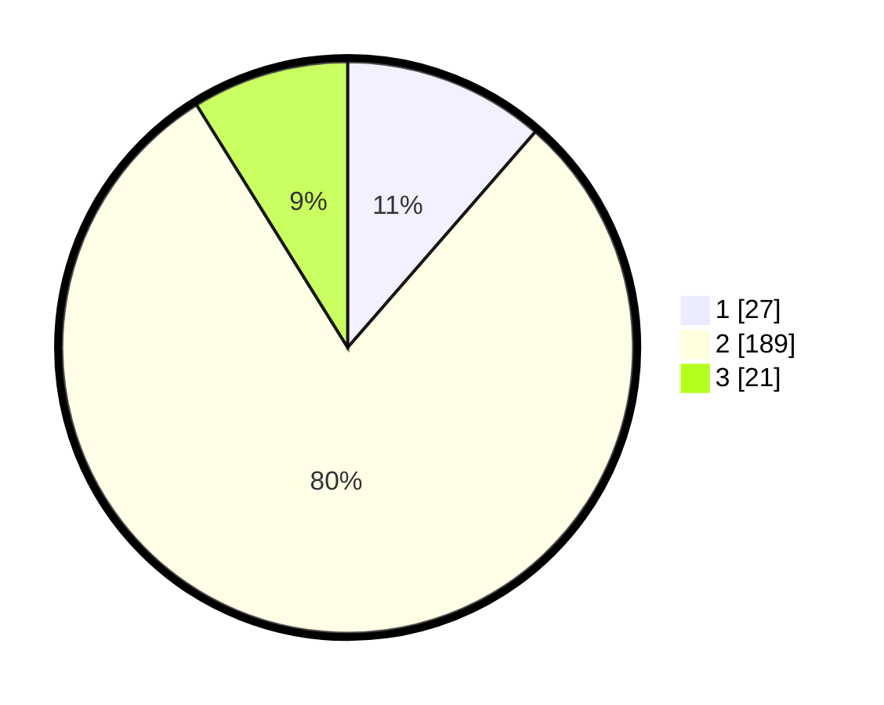

# Hasil

## Grafik

## Tabel

| No. | Nama Paslon    | Suara | Suara (raw) | Persentase |
|:--- |:-------------- | -----:| -----------:| ----------:|
| 1   | ANIES MUHAIMIN | 27    | [27][p-1]   | 11,39      |
| 2   | PRABOWO GIBRAN | 189   | [189][p-2]  | 79,75      |
| 3   | GANJAR MAHFUD  | 21    | [21][p-3]   | 8,86       |

[p-1]: https://github.com/gigit-pemilu/pemilu-2024/blob/main/pilpres/hitung-suara/sub/35-jawa-timur/sub/08-lumajang/sub/14-padang/sub/2003-mojo/sub/011-tps/sub/paslon-1.txt
[p-2]: https://github.com/gigit-pemilu/pemilu-2024/blob/main/pilpres/hitung-suara/sub/35-jawa-timur/sub/08-lumajang/sub/14-padang/sub/2003-mojo/sub/011-tps/sub/paslon-2.txt
[p-3]: https://github.com/gigit-pemilu/pemilu-2024/blob/main/pilpres/hitung-suara/sub/35-jawa-timur/sub/08-lumajang/sub/14-padang/sub/2003-mojo/sub/011-tps/sub/paslon-3.txt

## Foto C Plano

https://sirekap-obj-formc.kpu.go.id/5f46/pemilu/ppwp/35/08/14/20/03/3508142003011-20240215-042623--fb6573f9-9599-4258-bdcd-8e89125f4d1c.jpg

https://sirekap-obj-formc.kpu.go.id/5f46/pemilu/ppwp/35/08/14/20/03/3508142003011-20240215-042720--ec8d7889-496e-4b93-9826-e860af00965a.jpg

https://sirekap-obj-formc.kpu.go.id/5f46/pemilu/ppwp/35/08/14/20/03/3508142003011-20240215-043016--3f155906-fe0d-4411-ad14-54a0d56cfb24.jpg

## Metadata

| Key        | Value               |
| ---------- | ------------------- |
| Time Stamp | 2024-02-16 13:30:32 |

