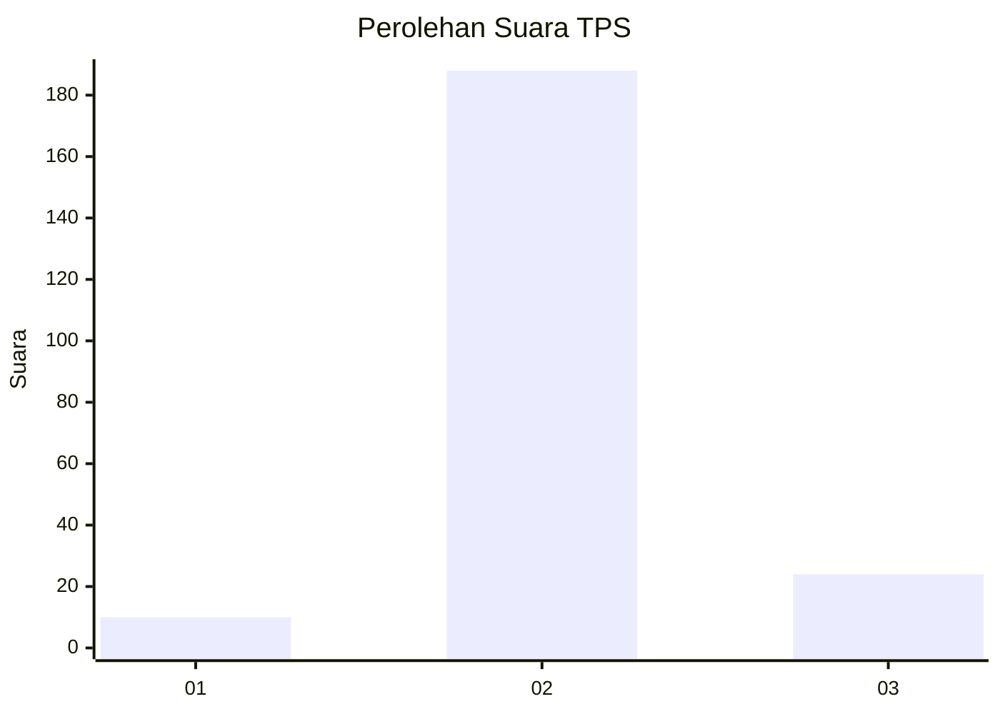
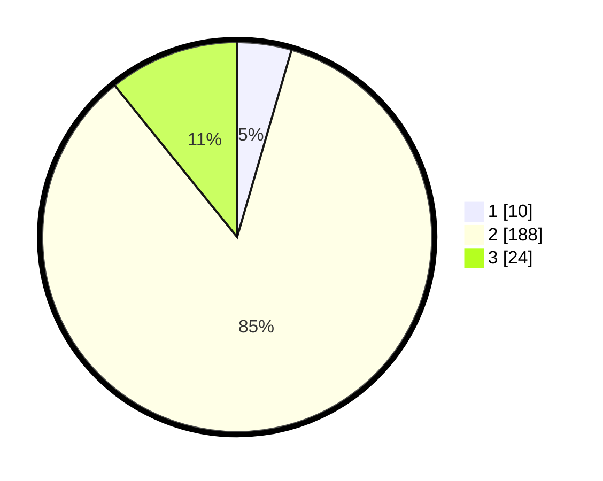

# Hasil

## Grafik

## Tabel

| No. | Nama Paslon    | Suara | Suara (raw) | Persentase |
|:--- |:-------------- | -----:| -----------:| ----------:|
| 1   | ANIES MUHAIMIN | 10    | [10][p-1]   | 4,50       |
| 2   | PRABOWO GIBRAN | 188   | [188][p-2]  | 84,68      |
| 3   | GANJAR MAHFUD  | 24    | [24][p-3]   | 10,81      |

[p-1]: https://github.com/gigit-pemilu/pemilu-2024/blob/main/pilpres/hitung-suara/sub/35-jawa-timur/sub/08-lumajang/sub/14-padang/sub/2007-kalisemut/sub/003-tps/sub/paslon-1.txt
[p-2]: https://github.com/gigit-pemilu/pemilu-2024/blob/main/pilpres/hitung-suara/sub/35-jawa-timur/sub/08-lumajang/sub/14-padang/sub/2007-kalisemut/sub/003-tps/sub/paslon-2.txt
[p-3]: https://github.com/gigit-pemilu/pemilu-2024/blob/main/pilpres/hitung-suara/sub/35-jawa-timur/sub/08-lumajang/sub/14-padang/sub/2007-kalisemut/sub/003-tps/sub/paslon-3.txt

## Foto C Plano

https://sirekap-obj-formc.kpu.go.id/e9b4/pemilu/ppwp/35/08/14/20/07/3508142007003-20240214-205615--92dc6909-19ec-46b8-8ad1-59221f3a1356.jpg

https://sirekap-obj-formc.kpu.go.id/e9b4/pemilu/ppwp/35/08/14/20/07/3508142007003-20240215-023819--6ee76618-9db0-4733-aa46-175cbdcdaaf1.jpg

https://sirekap-obj-formc.kpu.go.id/e9b4/pemilu/ppwp/35/08/14/20/07/3508142007003-20240214-212111--1c31e6c4-6523-4aa2-98d7-e9cb9b4d8c94.jpg

## Metadata

| Key        | Value               |
| ---------- | ------------------- |
| Time Stamp | 2024-02-16 13:30:32 |

