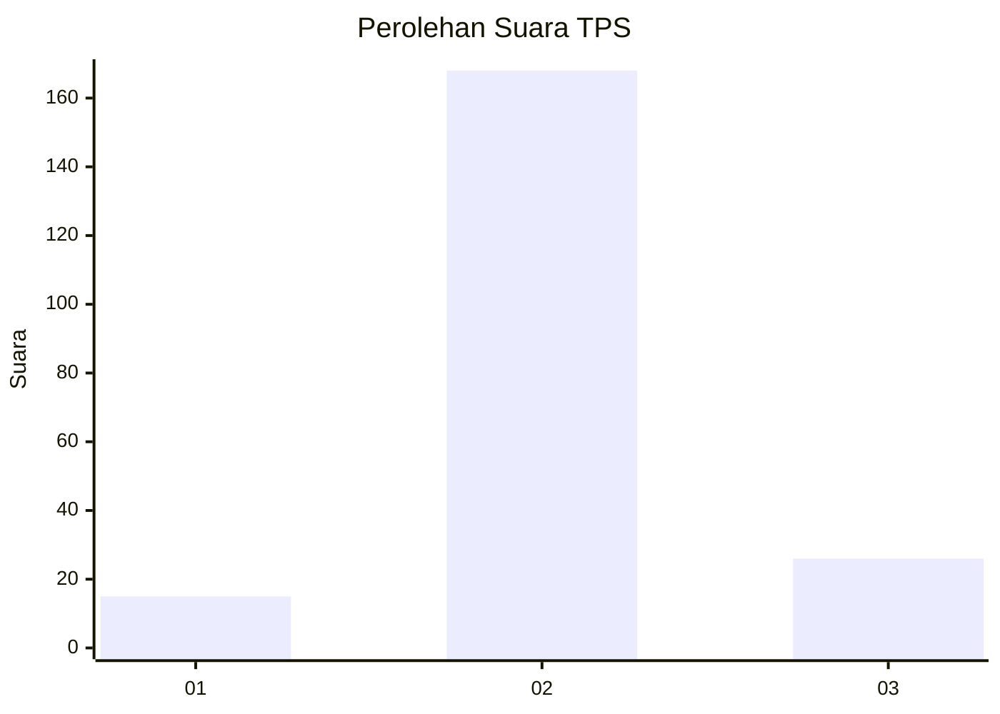
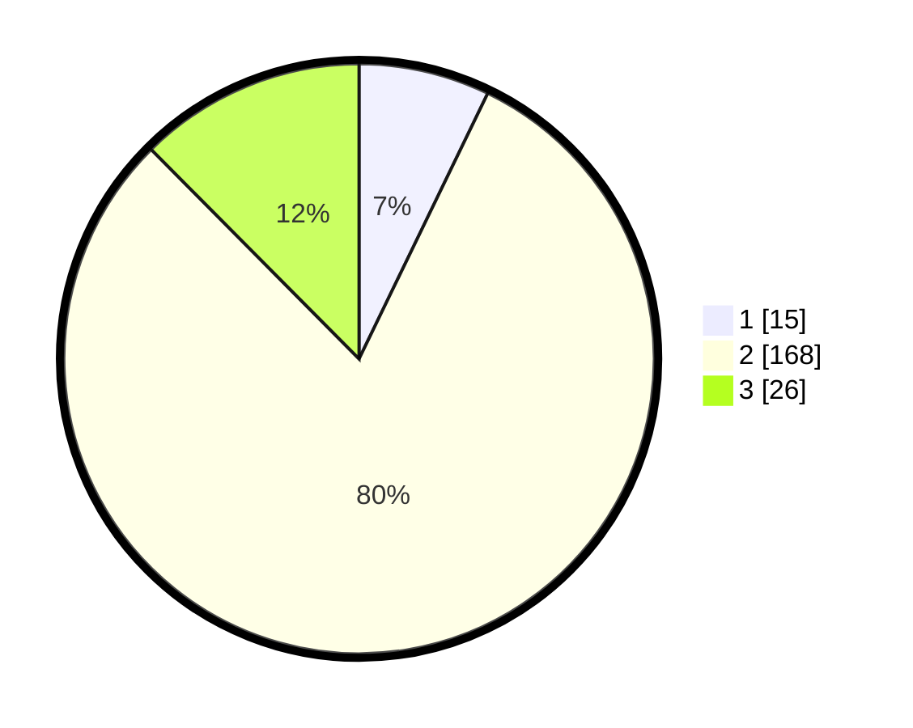

# Hasil

## Grafik

## Tabel

| No. | Nama Paslon    | Suara | Suara (raw) | Persentase |
|:--- |:-------------- | -----:| -----------:| ----------:|
| 1   | ANIES MUHAIMIN | 15    | [15][p-1]   | 7,18       |
| 2   | PRABOWO GIBRAN | 168   | [168][p-2]  | 80,38      |
| 3   | GANJAR MAHFUD  | 26    | [26][p-3]   | 12,44      |

[p-1]: https://github.com/gigit-pemilu/pemilu-2024-35-jawa-timur/blob/main/pilpres/hitung-suara/sub/35-jawa-timur/sub/08-lumajang/sub/14-padang/sub/2007-kalisemut/sub/011-tps/sub/paslon-1.txt
[p-2]: https://github.com/gigit-pemilu/pemilu-2024-35-jawa-timur/blob/main/pilpres/hitung-suara/sub/35-jawa-timur/sub/08-lumajang/sub/14-padang/sub/2007-kalisemut/sub/011-tps/sub/paslon-2.txt
[p-3]: https://github.com/gigit-pemilu/pemilu-2024-35-jawa-timur/blob/main/pilpres/hitung-suara/sub/35-jawa-timur/sub/08-lumajang/sub/14-padang/sub/2007-kalisemut/sub/011-tps/sub/paslon-3.txt

## Foto C Plano

https://sirekap-obj-formc.kpu.go.id/9eba/pemilu/ppwp/35/08/14/20/07/3508142007011-20240215-014713--db3bfd87-8c4d-4d0b-b0d3-01c56c24afad.jpg

https://sirekap-obj-formc.kpu.go.id/9eba/pemilu/ppwp/35/08/14/20/07/3508142007011-20240216-145119--ea0d2517-85cc-4d07-a22e-d19c3a218560.jpg

https://sirekap-obj-formc.kpu.go.id/9eba/pemilu/ppwp/35/08/14/20/07/3508142007011-20240216-145116--b25b1b18-4b94-4660-be08-82beab6096ca.jpg

## Metadata

| Key        | Value               |
| ---------- | ------------------- |
| Time Stamp | 2024-02-17 10:00:02 |

