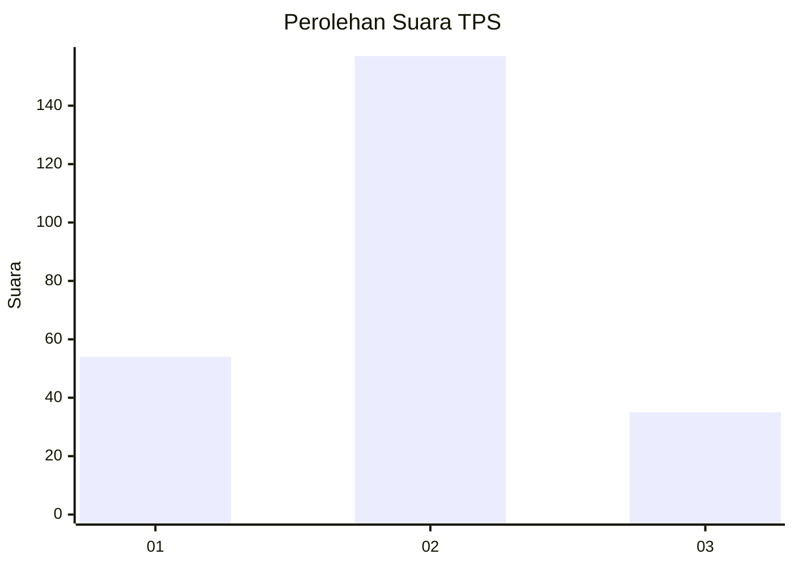
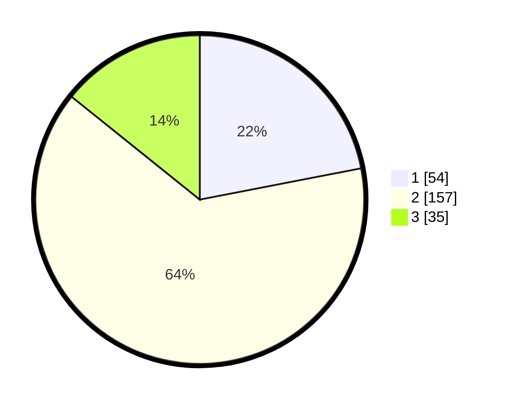

# Hasil

## Grafik

## Tabel

| No. | Nama Paslon    | Suara | Suara (raw) | Persentase |
|:--- |:-------------- | -----:| -----------:| ----------:|
| 1   | ANIES MUHAIMIN | 54    | [54][p-1]   | 21,95      |
| 2   | PRABOWO GIBRAN | 157   | [157][p-2]  | 63,82      |
| 3   | GANJAR MAHFUD  | 35    | [35][p-3]   | 14,23      |

[p-1]: https://github.com/gigit-pemilu/pemilu-2024/blob/main/pilpres/hitung-suara/sub/35-jawa-timur/sub/08-lumajang/sub/15-sukodono/sub/2001-klanting/sub/007-tps/sub/paslon-1.txt
[p-2]: https://github.com/gigit-pemilu/pemilu-2024/blob/main/pilpres/hitung-suara/sub/35-jawa-timur/sub/08-lumajang/sub/15-sukodono/sub/2001-klanting/sub/007-tps/sub/paslon-2.txt
[p-3]: https://github.com/gigit-pemilu/pemilu-2024/blob/main/pilpres/hitung-suara/sub/35-jawa-timur/sub/08-lumajang/sub/15-sukodono/sub/2001-klanting/sub/007-tps/sub/paslon-3.txt

## Foto C Plano

https://sirekap-obj-formc.kpu.go.id/2d5e/pemilu/ppwp/35/08/15/20/01/3508152001007-20240214-195221--85bdcb13-1de3-46c4-8550-f7763bf0b06d.jpg

https://sirekap-obj-formc.kpu.go.id/2d5e/pemilu/ppwp/35/08/15/20/01/3508152001007-20240214-193248--ef91e65d-05b7-4c0b-98af-b9e04d855bcd.jpg

https://sirekap-obj-formc.kpu.go.id/2d5e/pemilu/ppwp/35/08/15/20/01/3508152001007-20240214-192822--9130c7a6-4f4b-4224-9ad8-518d08e403d8.jpg

## Metadata

| Key        | Value               |
| ---------- | ------------------- |
| Time Stamp | 2024-02-14 21:46:01 |

## DATA PEMILIH TETAP

Jumlah pemilih dalam DPT: **272**.
 * L: **125**.
 * P: **147**.

## DATA PENGGUNA HAK PILIH

Jumlah pengguna hak pilih dalam DPT: **243**.
 * L: **108**.
 * P: **135**.

Jumlah pengguna hak pilih dalam DPTb: **4**.
 * L: **4**.
 * P: **0**.

Jumlah pengguna hak pilih dalam DPK: **2**.
 * L: **1**.
 * P: **1**.

Jumlah pengguna hak pilih: **249**.
 * L: **113**.
 * P: **136**.

## JUMLAH SUARA SAH DAN TIDAK SAH

JUMLAH SELURUH SUARA SAH: **246**.

JUMLAH SUARA TIDAK SAH: **3**.

JUMLAH SELURUH SUARA SAH DAN SUARA TIDAK SAH: **249**.

