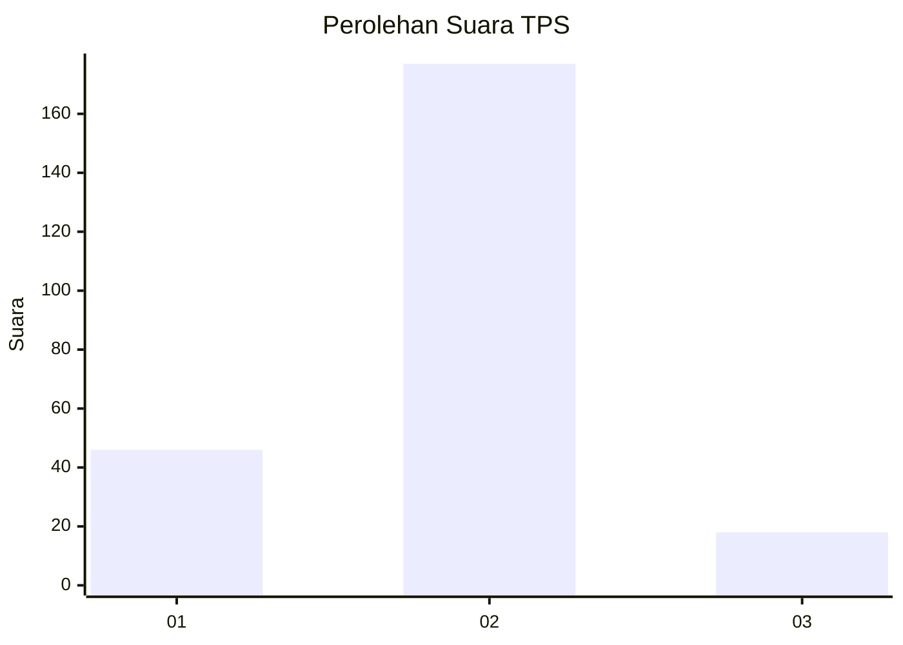
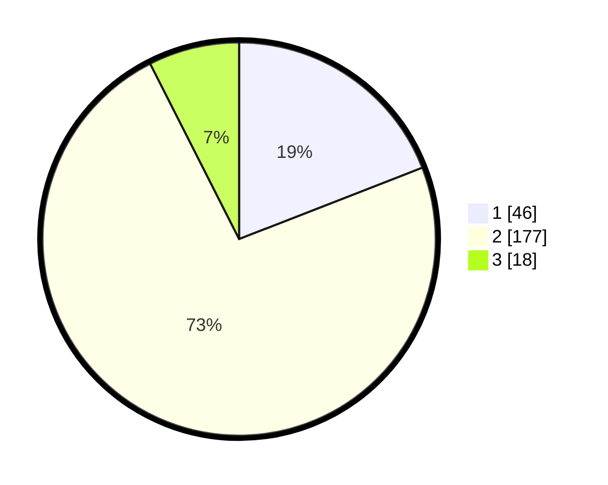

# Hasil

## Grafik

## Tabel

| No. | Nama Paslon    | Suara | Suara (raw) | Persentase |
|:--- |:-------------- | -----:| -----------:| ----------:|
| 1   | ANIES MUHAIMIN | 46    | [46][p-1]   | 19,09      |
| 2   | PRABOWO GIBRAN | 177   | [177][p-2]  | 73,44      |
| 3   | GANJAR MAHFUD  | 18    | [18][p-3]   | 7,47       |

[p-1]: https://github.com/gigit-pemilu/pemilu-2024-35-jawa-timur/blob/main/pilpres/hitung-suara/sub/35-jawa-timur/sub/08-lumajang/sub/15-sukodono/sub/2001-klanting/sub/008-tps/sub/paslon-1.txt
[p-2]: https://github.com/gigit-pemilu/pemilu-2024-35-jawa-timur/blob/main/pilpres/hitung-suara/sub/35-jawa-timur/sub/08-lumajang/sub/15-sukodono/sub/2001-klanting/sub/008-tps/sub/paslon-2.txt
[p-3]: https://github.com/gigit-pemilu/pemilu-2024-35-jawa-timur/blob/main/pilpres/hitung-suara/sub/35-jawa-timur/sub/08-lumajang/sub/15-sukodono/sub/2001-klanting/sub/008-tps/sub/paslon-3.txt

## Foto C Plano

https://sirekap-obj-formc.kpu.go.id/0f56/pemilu/ppwp/35/08/15/20/01/3508152001008-20240215-001603--ad67c620-ca66-4870-8ab3-7271377f8341.jpg

https://sirekap-obj-formc.kpu.go.id/0f56/pemilu/ppwp/35/08/15/20/01/3508152001008-20240215-025441--64271dbf-21e1-4e13-a6f1-d00be3ca5346.jpg

https://sirekap-obj-formc.kpu.go.id/0f56/pemilu/ppwp/35/08/15/20/01/3508152001008-20240215-025617--38577844-65be-46ee-92a1-c7a372f1414d.jpg

## Metadata

| Key        | Value               |
| ---------- | ------------------- |
| Time Stamp | 2024-02-17 11:00:02 |

