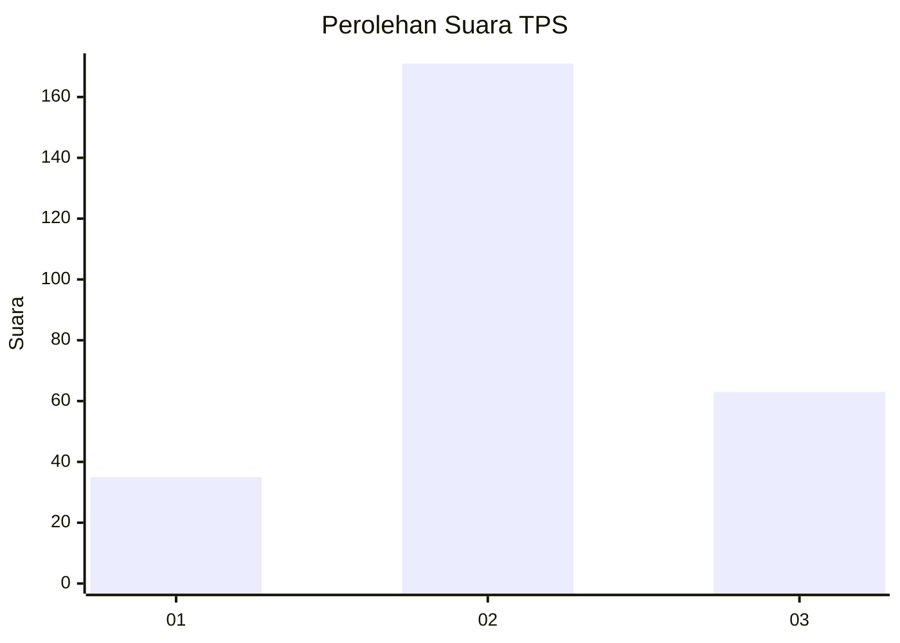
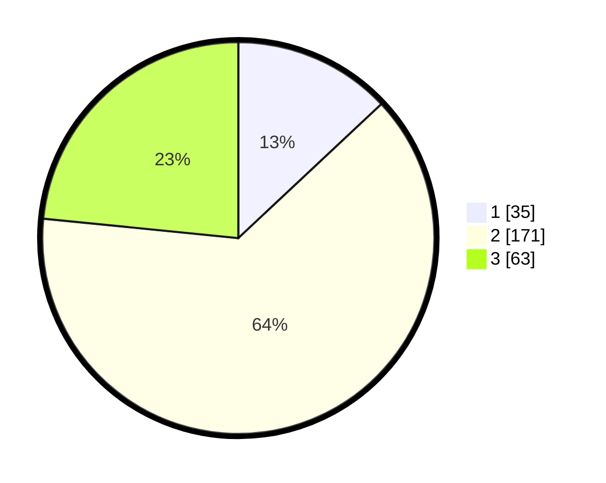

# Hasil

## Grafik

## Tabel

| No. | Nama Paslon    | Suara | Suara (raw) | Persentase |
|:--- |:-------------- | -----:| -----------:| ----------:|
| 1   | ANIES MUHAIMIN | 35    | [35][p-1]   | 13,01      |
| 2   | PRABOWO GIBRAN | 171   | [171][p-2]  | 63,57      |
| 3   | GANJAR MAHFUD  | 63    | [63][p-3]   | 23,42      |

[p-1]: https://github.com/gigit-pemilu/pemilu-2024/blob/main/pilpres/hitung-suara/sub/35-jawa-timur/sub/08-lumajang/sub/15-sukodono/sub/2002-kebonagung/sub/001-tps/sub/paslon-1.txt
[p-2]: https://github.com/gigit-pemilu/pemilu-2024/blob/main/pilpres/hitung-suara/sub/35-jawa-timur/sub/08-lumajang/sub/15-sukodono/sub/2002-kebonagung/sub/001-tps/sub/paslon-2.txt
[p-3]: https://github.com/gigit-pemilu/pemilu-2024/blob/main/pilpres/hitung-suara/sub/35-jawa-timur/sub/08-lumajang/sub/15-sukodono/sub/2002-kebonagung/sub/001-tps/sub/paslon-3.txt

## Foto C Plano

https://sirekap-obj-formc.kpu.go.id/b045/pemilu/ppwp/35/08/15/20/02/3508152002001-20240215-073700--394ad051-1f0f-489c-9520-514562773d4f.jpg

https://sirekap-obj-formc.kpu.go.id/b045/pemilu/ppwp/35/08/15/20/02/3508152002001-20240215-084907--3a2c1c93-c3d4-46bd-90fc-4800229edefb.jpg

https://sirekap-obj-formc.kpu.go.id/b045/pemilu/ppwp/35/08/15/20/02/3508152002001-20240215-084629--cc0ea496-78c8-466c-bc1c-ad8571c0b21f.jpg

## Metadata

| Key        | Value               |
| ---------- | ------------------- |
| Time Stamp | 2024-02-17 12:00:00 |

