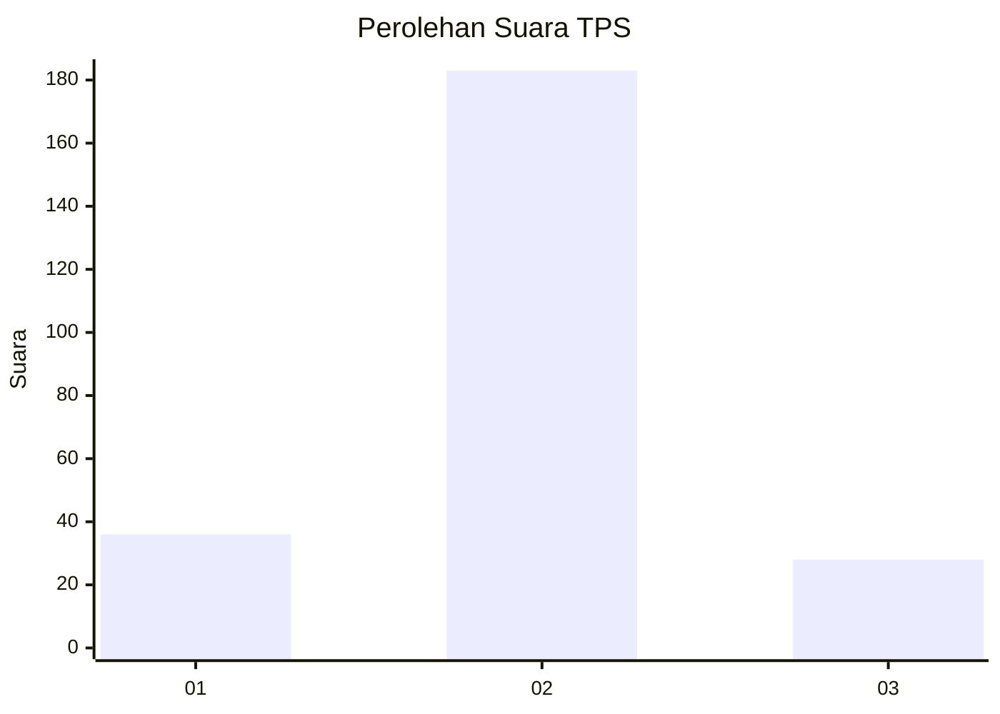
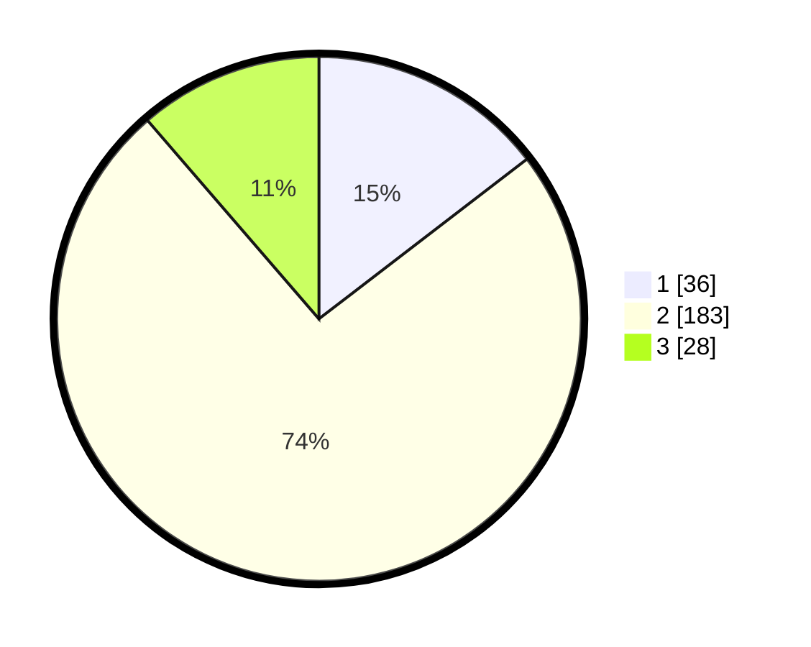

# Hasil

## Grafik

## Tabel

| No. | Nama Paslon    | Suara | Suara (raw) | Persentase |
|:--- |:-------------- | -----:| -----------:| ----------:|
| 1   | ANIES MUHAIMIN | 36    | [36][p-1]   | 14,57      |
| 2   | PRABOWO GIBRAN | 183   | [183][p-2]  | 74,09      |
| 3   | GANJAR MAHFUD  | 28    | [28][p-3]   | 11,34      |

[p-1]: https://github.com/gigit-pemilu/pemilu-2024-35-jawa-timur/blob/main/pilpres/hitung-suara/sub/35-jawa-timur/sub/08-lumajang/sub/15-sukodono/sub/2002-kebonagung/sub/003-tps/sub/paslon-1.txt
[p-2]: https://github.com/gigit-pemilu/pemilu-2024-35-jawa-timur/blob/main/pilpres/hitung-suara/sub/35-jawa-timur/sub/08-lumajang/sub/15-sukodono/sub/2002-kebonagung/sub/003-tps/sub/paslon-2.txt
[p-3]: https://github.com/gigit-pemilu/pemilu-2024-35-jawa-timur/blob/main/pilpres/hitung-suara/sub/35-jawa-timur/sub/08-lumajang/sub/15-sukodono/sub/2002-kebonagung/sub/003-tps/sub/paslon-3.txt

## Foto C Plano

https://sirekap-obj-formc.kpu.go.id/d37c/pemilu/ppwp/35/08/15/20/02/3508152002003-20240215-052727--9dafa12c-c394-4a7b-a7c6-f274df187a00.jpg

https://sirekap-obj-formc.kpu.go.id/d37c/pemilu/ppwp/35/08/15/20/02/3508152002003-20240215-052923--d2954df0-6fdb-4688-9250-3037e082ad41.jpg

https://sirekap-obj-formc.kpu.go.id/d37c/pemilu/ppwp/35/08/15/20/02/3508152002003-20240215-053122--16f6164b-60e7-4c8c-ad12-c1e4d6d92c5a.jpg

## Metadata

| Key        | Value               |
| ---------- | ------------------- |
| Time Stamp | 2024-02-17 11:30:03 |

