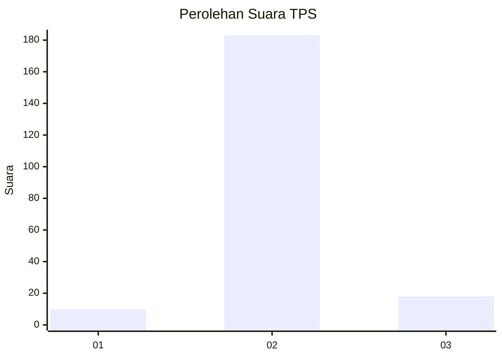
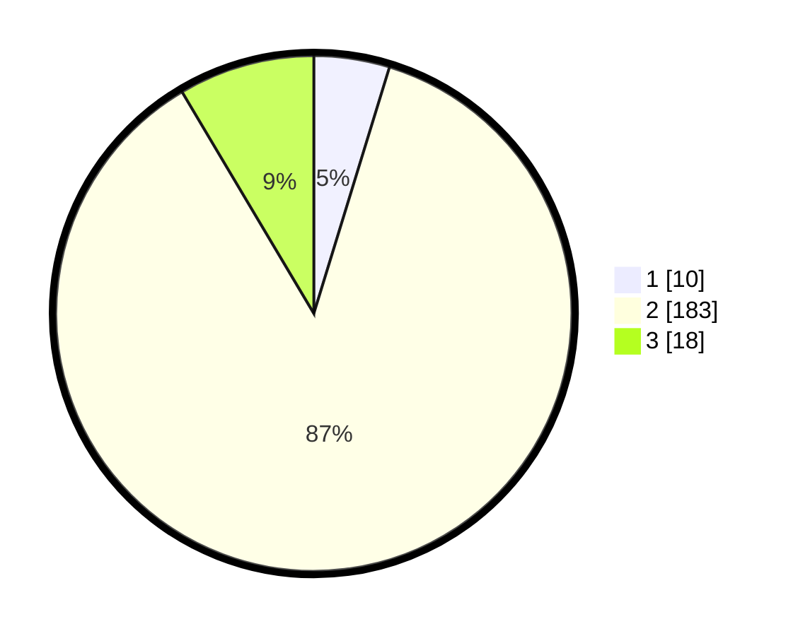

# Hasil

## Grafik

## Tabel

| No. | Nama Paslon    | Suara | Suara (raw) | Persentase |
|:--- |:-------------- | -----:| -----------:| ----------:|
| 1   | ANIES MUHAIMIN | 10    | [10][p-1]   | 4,74       |
| 2   | PRABOWO GIBRAN | 183   | [183][p-2]  | 86,73      |
| 3   | GANJAR MAHFUD  | 18    | [18][p-3]   | 8,53       |

[p-1]: https://github.com/gigit-pemilu/pemilu-2024/blob/main/pilpres/hitung-suara/sub/35-jawa-timur/sub/08-lumajang/sub/15-sukodono/sub/2002-kebonagung/sub/009-tps/sub/paslon-1.txt
[p-2]: https://github.com/gigit-pemilu/pemilu-2024/blob/main/pilpres/hitung-suara/sub/35-jawa-timur/sub/08-lumajang/sub/15-sukodono/sub/2002-kebonagung/sub/009-tps/sub/paslon-2.txt
[p-3]: https://github.com/gigit-pemilu/pemilu-2024/blob/main/pilpres/hitung-suara/sub/35-jawa-timur/sub/08-lumajang/sub/15-sukodono/sub/2002-kebonagung/sub/009-tps/sub/paslon-3.txt

## Foto C Plano

https://sirekap-obj-formc.kpu.go.id/1ddc/pemilu/ppwp/35/08/15/20/02/3508152002009-20240215-070104--6b7ed22f-b2d2-47da-92ec-e8b47f363578.jpg

https://sirekap-obj-formc.kpu.go.id/1ddc/pemilu/ppwp/35/08/15/20/02/3508152002009-20240214-224443--67f5dcb8-7cd1-454f-98d7-bd7bb33460f9.jpg

https://sirekap-obj-formc.kpu.go.id/1ddc/pemilu/ppwp/35/08/15/20/02/3508152002009-20240214-224757--67789164-c8b3-42c9-95dc-00fee6d1d36d.jpg

## Metadata

| Key        | Value               |
| ---------- | ------------------- |
| Time Stamp | 2024-02-15 16:30:25 |

