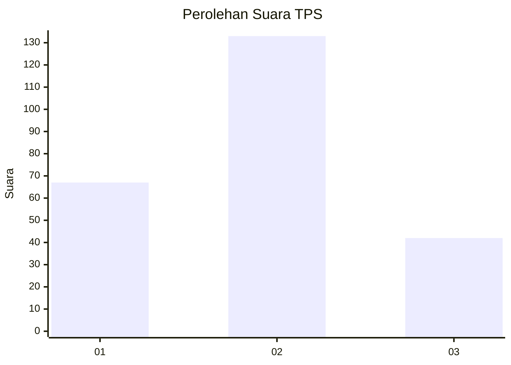
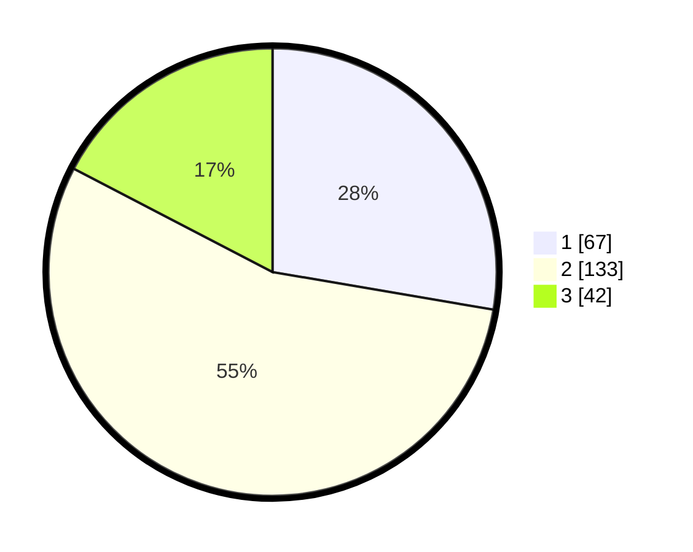

# Hasil

## Grafik

## Tabel

| No. | Nama Paslon    | Suara | Suara (raw) | Persentase |
|:--- |:-------------- | -----:| -----------:| ----------:|
| 1   | ANIES MUHAIMIN | 67    | [67][p-1]   | 27,69      |
| 2   | PRABOWO GIBRAN | 133   | [133][p-2]  | 54,96      |
| 3   | GANJAR MAHFUD  | 42    | [42][p-3]   | 17,36      |

[p-1]: https://github.com/gigit-pemilu/pemilu-2024-35-jawa-timur/blob/main/pilpres/hitung-suara/sub/35-jawa-timur/sub/08-lumajang/sub/15-sukodono/sub/2004-dawuhan-lor/sub/001-tps/sub/paslon-1.txt
[p-2]: https://github.com/gigit-pemilu/pemilu-2024-35-jawa-timur/blob/main/pilpres/hitung-suara/sub/35-jawa-timur/sub/08-lumajang/sub/15-sukodono/sub/2004-dawuhan-lor/sub/001-tps/sub/paslon-2.txt
[p-3]: https://github.com/gigit-pemilu/pemilu-2024-35-jawa-timur/blob/main/pilpres/hitung-suara/sub/35-jawa-timur/sub/08-lumajang/sub/15-sukodono/sub/2004-dawuhan-lor/sub/001-tps/sub/paslon-3.txt

## Foto C Plano

https://sirekap-obj-formc.kpu.go.id/6492/pemilu/ppwp/35/08/15/20/04/3508152004001-20240215-060340--c9149505-c960-4709-aa4f-5a539af9432f.jpg

https://sirekap-obj-formc.kpu.go.id/6492/pemilu/ppwp/35/08/15/20/04/3508152004001-20240215-060447--b7aef77e-1aef-4483-b3b9-c69916416523.jpg

https://sirekap-obj-formc.kpu.go.id/6492/pemilu/ppwp/35/08/15/20/04/3508152004001-20240214-220436--471dab9f-f445-4ba7-8701-708d7358dcb5.jpg

## Metadata

| Key        | Value               |
| ---------- | ------------------- |
| Time Stamp | 2024-02-17 11:30:03 |

