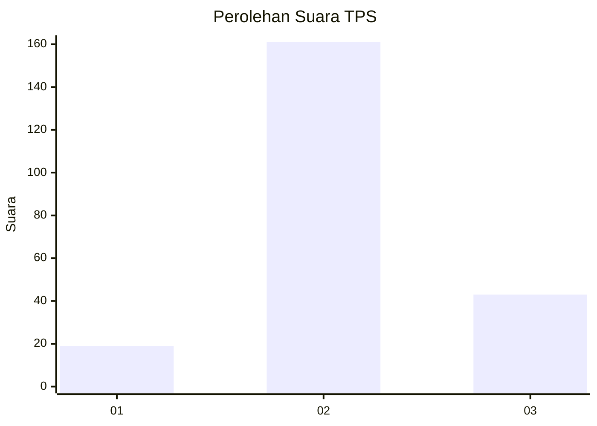
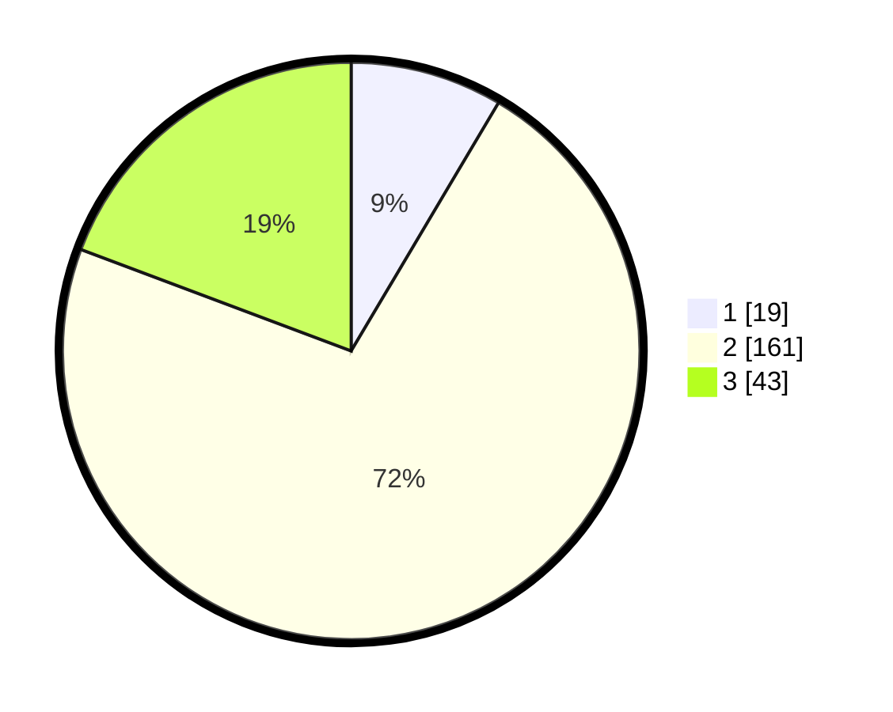

# Hasil

## Grafik

## Tabel

| No. | Nama Paslon    | Suara | Suara (raw) | Persentase |
|:--- |:-------------- | -----:| -----------:| ----------:|
| 1   | ANIES MUHAIMIN | 19    | [19][p-1]   | 8,52       |
| 2   | PRABOWO GIBRAN | 161   | [161][p-2]  | 72,20      |
| 3   | GANJAR MAHFUD  | 43    | [43][p-3]   | 19,28      |

[p-1]: https://github.com/gigit-pemilu/pemilu-2024/blob/main/pilpres/hitung-suara/sub/35-jawa-timur/sub/08-lumajang/sub/15-sukodono/sub/2004-dawuhan-lor/sub/003-tps/sub/paslon-1.txt
[p-2]: https://github.com/gigit-pemilu/pemilu-2024/blob/main/pilpres/hitung-suara/sub/35-jawa-timur/sub/08-lumajang/sub/15-sukodono/sub/2004-dawuhan-lor/sub/003-tps/sub/paslon-2.txt
[p-3]: https://github.com/gigit-pemilu/pemilu-2024/blob/main/pilpres/hitung-suara/sub/35-jawa-timur/sub/08-lumajang/sub/15-sukodono/sub/2004-dawuhan-lor/sub/003-tps/sub/paslon-3.txt

## Foto C Plano

https://sirekap-obj-formc.kpu.go.id/9aff/pemilu/ppwp/35/08/15/20/04/3508152004003-20240215-004509--c324968d-0cf3-4731-919d-ccf679f272b6.jpg

https://sirekap-obj-formc.kpu.go.id/9aff/pemilu/ppwp/35/08/15/20/04/3508152004003-20240215-004646--e8ee6f57-0935-4ea3-82ad-5ac4c6e458f6.jpg

https://sirekap-obj-formc.kpu.go.id/9aff/pemilu/ppwp/35/08/15/20/04/3508152004003-20240215-004741--a61572d3-fa1c-40ca-8a23-f0b42afb6efb.jpg

## Metadata

| Key        | Value               |
| ---------- | ------------------- |
| Time Stamp | 2024-02-15 15:00:29 |

