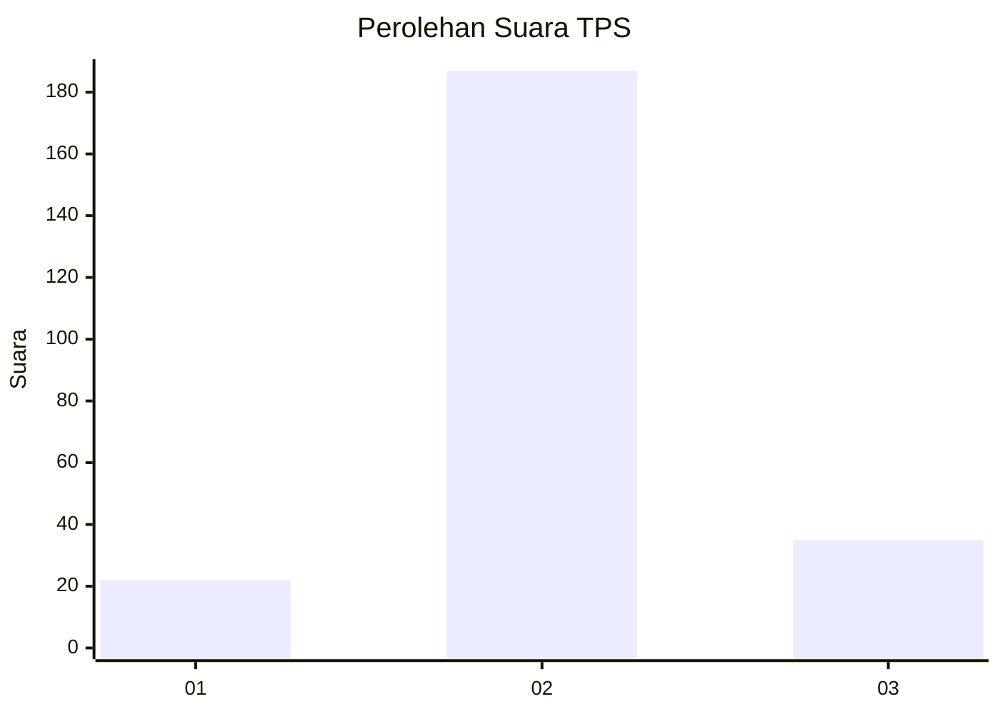

# Hasil

## Grafik

## Tabel

| No. | Nama Paslon    | Suara | Suara (raw) | Persentase |
|:--- |:-------------- | -----:| -----------:| ----------:|
| 1   | ANIES MUHAIMIN | 22    | [22][p-1]   | 9,02       |
| 2   | PRABOWO GIBRAN | 187   | [187][p-2]  | 76,64      |
| 3   | GANJAR MAHFUD  | 35    | [35][p-3]   | 14,34      |

[p-1]: https://github.com/gigit-pemilu/pemilu-2024/blob/main/pilpres/hitung-suara/sub/35-jawa-timur/sub/08-lumajang/sub/15-sukodono/sub/2004-dawuhan-lor/sub/005-tps/sub/paslon-1.txt
[p-2]: https://github.com/gigit-pemilu/pemilu-2024/blob/main/pilpres/hitung-suara/sub/35-jawa-timur/sub/08-lumajang/sub/15-sukodono/sub/2004-dawuhan-lor/sub/005-tps/sub/paslon-2.txt
[p-3]: https://github.com/gigit-pemilu/pemilu-2024/blob/main/pilpres/hitung-suara/sub/35-jawa-timur/sub/08-lumajang/sub/15-sukodono/sub/2004-dawuhan-lor/sub/005-tps/sub/paslon-3.txt

## Foto C Plano

https://sirekap-obj-formc.kpu.go.id/512a/pemilu/ppwp/35/08/15/20/04/3508152004005-20240215-025737--57f9fb98-b682-4896-b4d0-33fe4b171fbe.jpg

https://sirekap-obj-formc.kpu.go.id/512a/pemilu/ppwp/35/08/15/20/04/3508152004005-20240215-023139--6c22b2f3-3d06-445d-a2ab-c05e3f9bea23.jpg

https://sirekap-obj-formc.kpu.go.id/512a/pemilu/ppwp/35/08/15/20/04/3508152004005-20240215-022814--88c225e8-fee2-413c-b585-ff63eaf1e84e.jpg

## Metadata

| Key        | Value               |
| ---------- | ------------------- |
| Time Stamp | 2024-02-15 19:30:26 |

