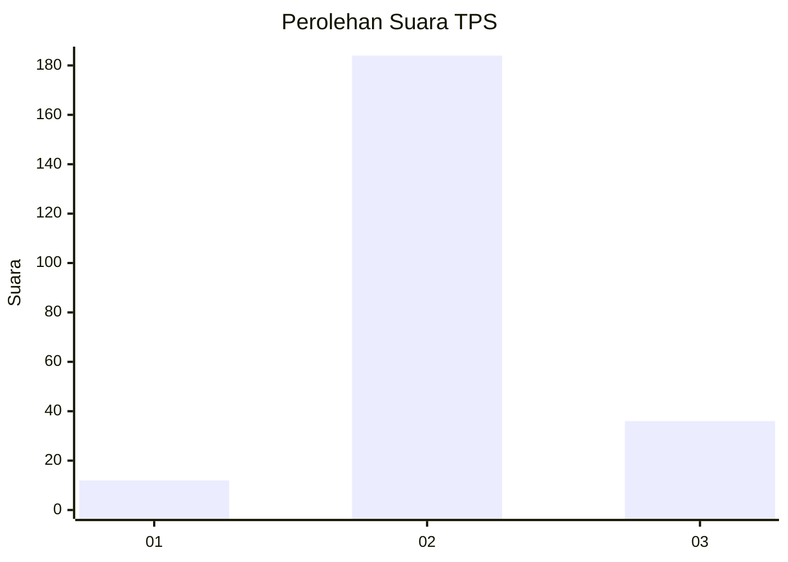
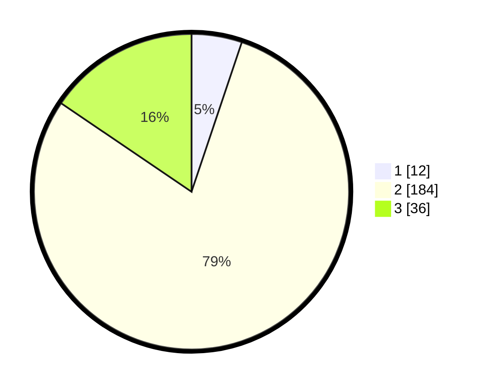

# Hasil

## Grafik

## Tabel

| No. | Nama Paslon    | Suara | Suara (raw) | Persentase |
|:--- |:-------------- | -----:| -----------:| ----------:|
| 1   | ANIES MUHAIMIN | 12    | [12][p-1]   | 5,17       |
| 2   | PRABOWO GIBRAN | 184   | [184][p-2]  | 79,31      |
| 3   | GANJAR MAHFUD  | 36    | [36][p-3]   | 15,52      |

[p-1]: https://github.com/gigit-pemilu/pemilu-2024-35-jawa-timur/blob/main/pilpres/hitung-suara/sub/35-jawa-timur/sub/08-lumajang/sub/15-sukodono/sub/2004-dawuhan-lor/sub/006-tps/sub/paslon-1.txt
[p-2]: https://github.com/gigit-pemilu/pemilu-2024-35-jawa-timur/blob/main/pilpres/hitung-suara/sub/35-jawa-timur/sub/08-lumajang/sub/15-sukodono/sub/2004-dawuhan-lor/sub/006-tps/sub/paslon-2.txt
[p-3]: https://github.com/gigit-pemilu/pemilu-2024-35-jawa-timur/blob/main/pilpres/hitung-suara/sub/35-jawa-timur/sub/08-lumajang/sub/15-sukodono/sub/2004-dawuhan-lor/sub/006-tps/sub/paslon-3.txt

## Foto C Plano

https://sirekap-obj-formc.kpu.go.id/ad38/pemilu/ppwp/35/08/15/20/04/3508152004006-20240215-015409--cb8edfdc-adb7-4f00-b11e-f22463ee034a.jpg

https://sirekap-obj-formc.kpu.go.id/ad38/pemilu/ppwp/35/08/15/20/04/3508152004006-20240215-015531--b349cfa1-3f48-4e84-b914-4b690b2992e0.jpg

https://sirekap-obj-formc.kpu.go.id/ad38/pemilu/ppwp/35/08/15/20/04/3508152004006-20240215-015630--1719e1e9-2831-494b-80a2-7d5da9f9b618.jpg

## Metadata

| Key        | Value               |
| ---------- | ------------------- |
| Time Stamp | 2024-02-15 15:00:29 |

