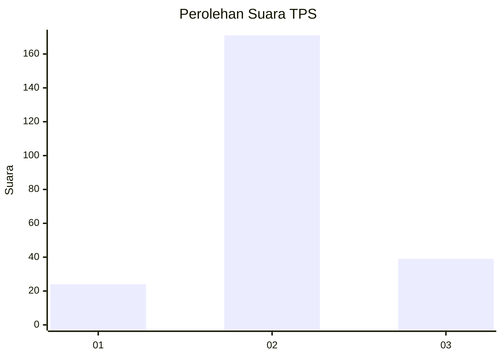
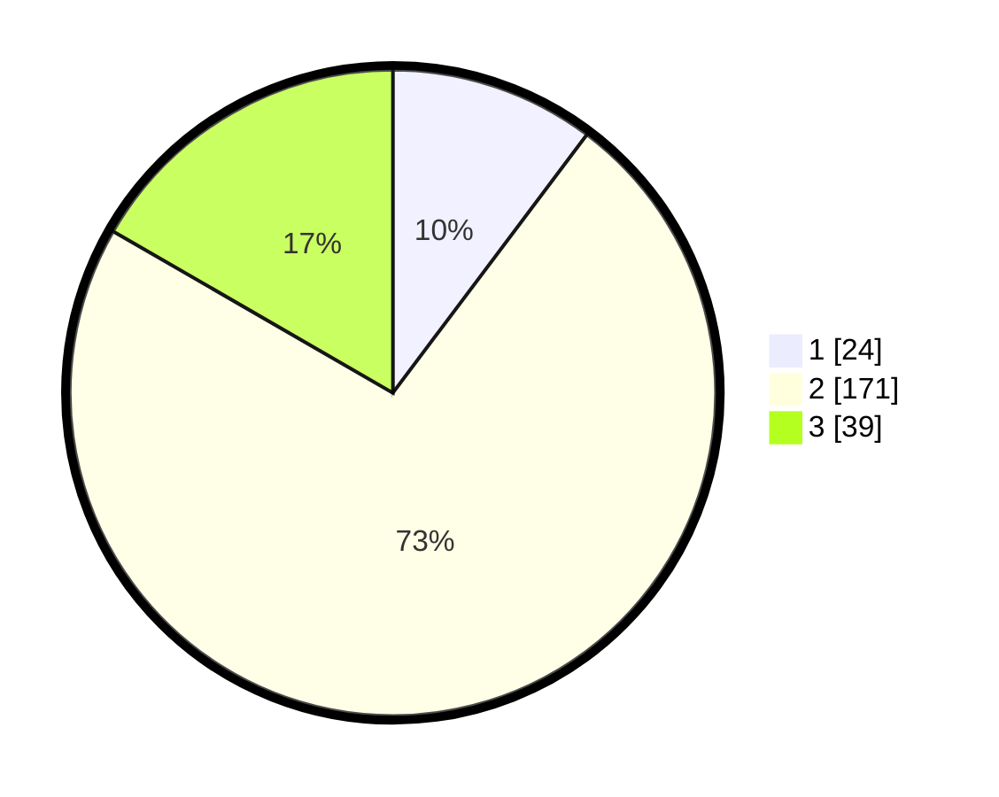

# Hasil

## Grafik

## Tabel

| No. | Nama Paslon    | Suara | Suara (raw) | Persentase |
|:--- |:-------------- | -----:| -----------:| ----------:|
| 1   | ANIES MUHAIMIN | 24    | [24][p-1]   | 10,26      |
| 2   | PRABOWO GIBRAN | 171   | [171][p-2]  | 73,08      |
| 3   | GANJAR MAHFUD  | 39    | [39][p-3]   | 16,67      |

[p-1]: https://github.com/gigit-pemilu/pemilu-2024/blob/main/pilpres/hitung-suara/sub/35-jawa-timur/sub/08-lumajang/sub/15-sukodono/sub/2004-dawuhan-lor/sub/013-tps/sub/paslon-1.txt
[p-2]: https://github.com/gigit-pemilu/pemilu-2024/blob/main/pilpres/hitung-suara/sub/35-jawa-timur/sub/08-lumajang/sub/15-sukodono/sub/2004-dawuhan-lor/sub/013-tps/sub/paslon-2.txt
[p-3]: https://github.com/gigit-pemilu/pemilu-2024/blob/main/pilpres/hitung-suara/sub/35-jawa-timur/sub/08-lumajang/sub/15-sukodono/sub/2004-dawuhan-lor/sub/013-tps/sub/paslon-3.txt

## Foto C Plano

https://sirekap-obj-formc.kpu.go.id/45fb/pemilu/ppwp/35/08/15/20/04/3508152004013-20240215-004719--5479ba57-f352-4829-a56d-65ce9fc2c1e2.jpg

https://sirekap-obj-formc.kpu.go.id/45fb/pemilu/ppwp/35/08/15/20/04/3508152004013-20240215-033922--2e43ec67-a41b-43f9-a2c3-4d6caa06bdaa.jpg

https://sirekap-obj-formc.kpu.go.id/45fb/pemilu/ppwp/35/08/15/20/04/3508152004013-20240215-034033--3ccebba0-6a1f-405a-a402-296c43c627f6.jpg

## Metadata

| Key        | Value               |
| ---------- | ------------------- |
| Time Stamp | 2024-02-17 12:00:00 |

