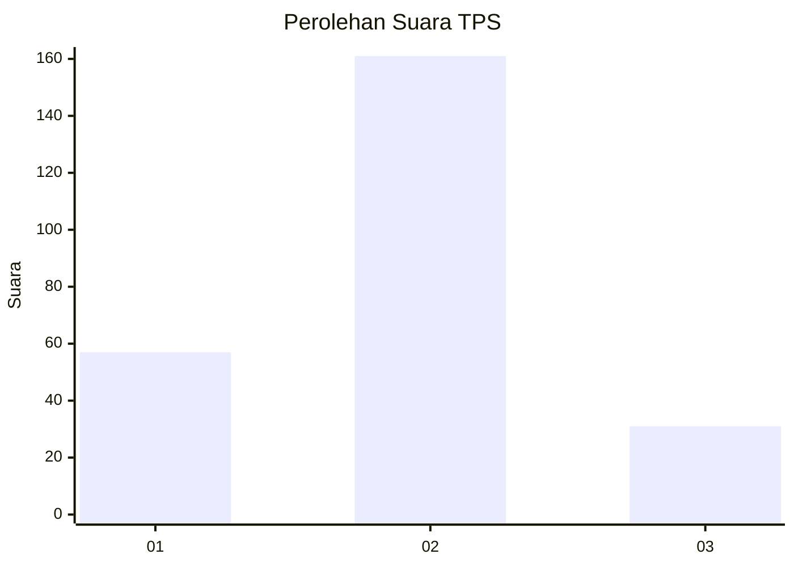
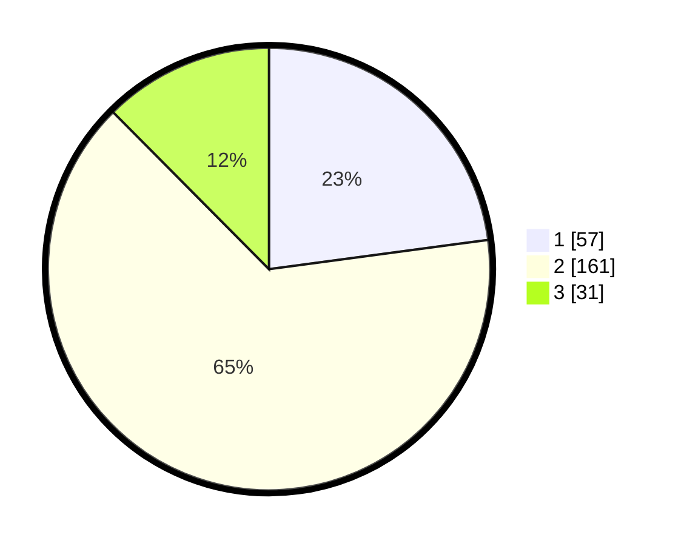

# Hasil

## Grafik

## Tabel

| No. | Nama Paslon    | Suara | Suara (raw) | Persentase |
|:--- |:-------------- | -----:| -----------:| ----------:|
| 1   | ANIES MUHAIMIN | 57    | [57][p-1]   | 22,89      |
| 2   | PRABOWO GIBRAN | 161   | [161][p-2]  | 64,66      |
| 3   | GANJAR MAHFUD  | 31    | [31][p-3]   | 12,45      |

[p-1]: https://github.com/gigit-pemilu/pemilu-2024/blob/main/pilpres/hitung-suara/sub/35-jawa-timur/sub/08-lumajang/sub/15-sukodono/sub/2004-dawuhan-lor/sub/016-tps/sub/paslon-1.txt
[p-2]: https://github.com/gigit-pemilu/pemilu-2024/blob/main/pilpres/hitung-suara/sub/35-jawa-timur/sub/08-lumajang/sub/15-sukodono/sub/2004-dawuhan-lor/sub/016-tps/sub/paslon-2.txt
[p-3]: https://github.com/gigit-pemilu/pemilu-2024/blob/main/pilpres/hitung-suara/sub/35-jawa-timur/sub/08-lumajang/sub/15-sukodono/sub/2004-dawuhan-lor/sub/016-tps/sub/paslon-3.txt

## Foto C Plano

https://sirekap-obj-formc.kpu.go.id/318d/pemilu/ppwp/35/08/15/20/04/3508152004016-20240215-030425--408f3547-c133-4a95-b56f-9001b2ec7efd.jpg

https://sirekap-obj-formc.kpu.go.id/318d/pemilu/ppwp/35/08/15/20/04/3508152004016-20240215-015639--c97f9155-32eb-4b6b-a3bc-d34bc9257362.jpg

https://sirekap-obj-formc.kpu.go.id/318d/pemilu/ppwp/35/08/15/20/04/3508152004016-20240215-015711--d08fd36f-d185-42a2-845c-53930ec5c3e6.jpg

## Metadata

| Key        | Value               |
| ---------- | ------------------- |
| Time Stamp | 2024-02-15 15:00:29 |

