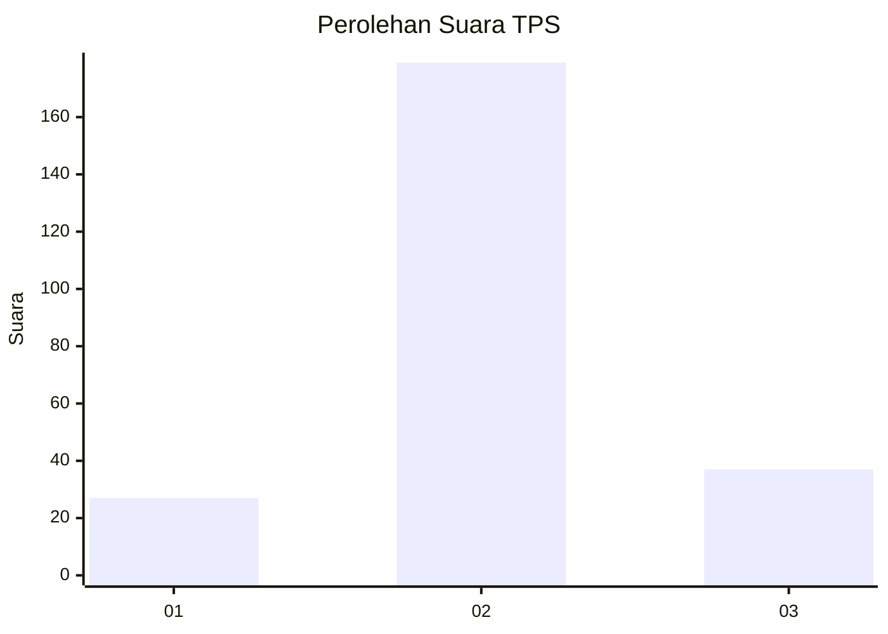
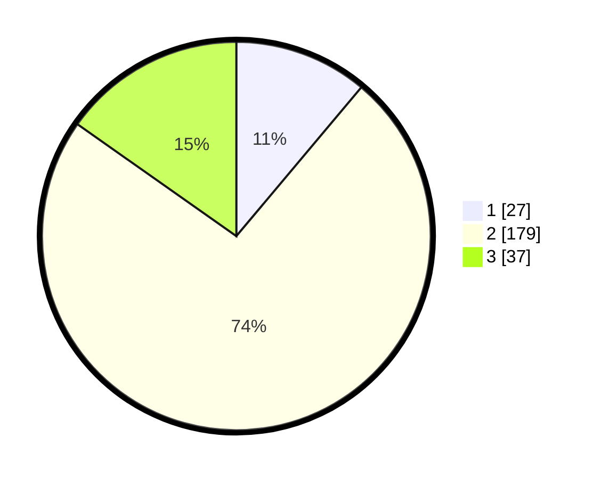

# Hasil

## Grafik

## Tabel

| No. | Nama Paslon    | Suara | Suara (raw) | Persentase |
|:--- |:-------------- | -----:| -----------:| ----------:|
| 1   | ANIES MUHAIMIN | 27    | [27][p-1]   | 11,11      |
| 2   | PRABOWO GIBRAN | 179   | [179][p-2]  | 73,66      |
| 3   | GANJAR MAHFUD  | 37    | [37][p-3]   | 15,23      |

[p-1]: https://github.com/gigit-pemilu/pemilu-2024-35-jawa-timur/blob/main/pilpres/hitung-suara/sub/35-jawa-timur/sub/08-lumajang/sub/15-sukodono/sub/2004-dawuhan-lor/sub/018-tps/sub/paslon-1.txt
[p-2]: https://github.com/gigit-pemilu/pemilu-2024-35-jawa-timur/blob/main/pilpres/hitung-suara/sub/35-jawa-timur/sub/08-lumajang/sub/15-sukodono/sub/2004-dawuhan-lor/sub/018-tps/sub/paslon-2.txt
[p-3]: https://github.com/gigit-pemilu/pemilu-2024-35-jawa-timur/blob/main/pilpres/hitung-suara/sub/35-jawa-timur/sub/08-lumajang/sub/15-sukodono/sub/2004-dawuhan-lor/sub/018-tps/sub/paslon-3.txt

## Foto C Plano

https://sirekap-obj-formc.kpu.go.id/dc50/pemilu/ppwp/35/08/15/20/04/3508152004018-20240214-213313--951ef922-f6fc-40df-8e74-8633ab110ae4.jpg

https://sirekap-obj-formc.kpu.go.id/dc50/pemilu/ppwp/35/08/15/20/04/3508152004018-20240214-213602--669ec1c4-1746-426a-9ae1-25bd10342d80.jpg

https://sirekap-obj-formc.kpu.go.id/dc50/pemilu/ppwp/35/08/15/20/04/3508152004018-20240214-213825--ea39e370-1a23-4357-b907-0416a6d9a1d6.jpg

## Metadata

| Key        | Value               |
| ---------- | ------------------- |
| Time Stamp | 2024-02-17 19:00:04 |

