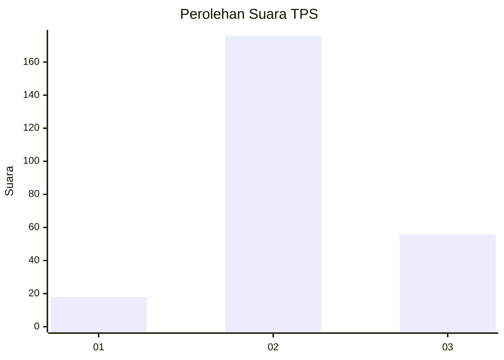
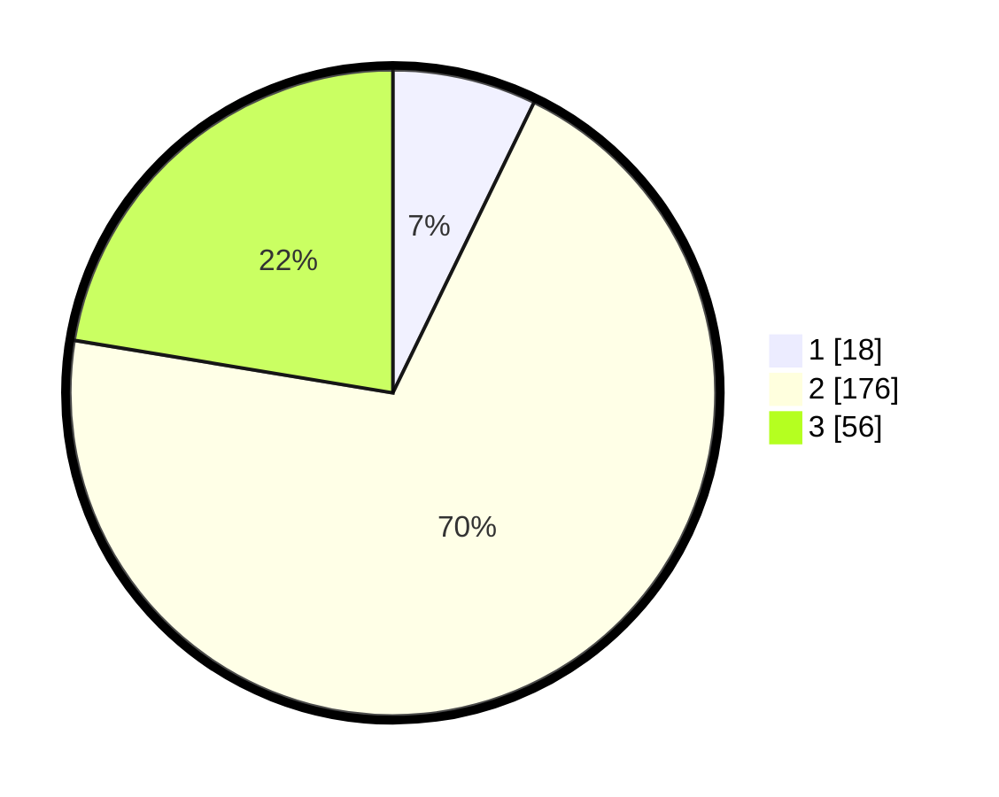

# Hasil

## Grafik

## Tabel

| No. | Nama Paslon    | Suara | Suara (raw) | Persentase |
|:--- |:-------------- | -----:| -----------:| ----------:|
| 1   | ANIES MUHAIMIN | 18    | [18][p-1]   | 7,20       |
| 2   | PRABOWO GIBRAN | 176   | [176][p-2]  | 70,40      |
| 3   | GANJAR MAHFUD  | 56    | [56][p-3]   | 22,40      |

[p-1]: https://github.com/gigit-pemilu/pemilu-2024-35-jawa-timur/blob/main/pilpres/hitung-suara/sub/35-jawa-timur/sub/08-lumajang/sub/15-sukodono/sub/2004-dawuhan-lor/sub/019-tps/sub/paslon-1.txt
[p-2]: https://github.com/gigit-pemilu/pemilu-2024-35-jawa-timur/blob/main/pilpres/hitung-suara/sub/35-jawa-timur/sub/08-lumajang/sub/15-sukodono/sub/2004-dawuhan-lor/sub/019-tps/sub/paslon-2.txt
[p-3]: https://github.com/gigit-pemilu/pemilu-2024-35-jawa-timur/blob/main/pilpres/hitung-suara/sub/35-jawa-timur/sub/08-lumajang/sub/15-sukodono/sub/2004-dawuhan-lor/sub/019-tps/sub/paslon-3.txt

## Foto C Plano

https://sirekap-obj-formc.kpu.go.id/6b6f/pemilu/ppwp/35/08/15/20/04/3508152004019-20240215-034910--68600e19-ed5a-4c46-8597-2633cd0dd4e9.jpg

https://sirekap-obj-formc.kpu.go.id/6b6f/pemilu/ppwp/35/08/15/20/04/3508152004019-20240215-035220--aea39ecf-0fb4-46bc-a617-477b11ca6cca.jpg

https://sirekap-obj-formc.kpu.go.id/6b6f/pemilu/ppwp/35/08/15/20/04/3508152004019-20240215-035455--e2e15119-a46d-48d4-b816-628627dd7e40.jpg

## Metadata

| Key        | Value               |
| ---------- | ------------------- |
| Time Stamp | 2024-02-15 19:30:26 |

