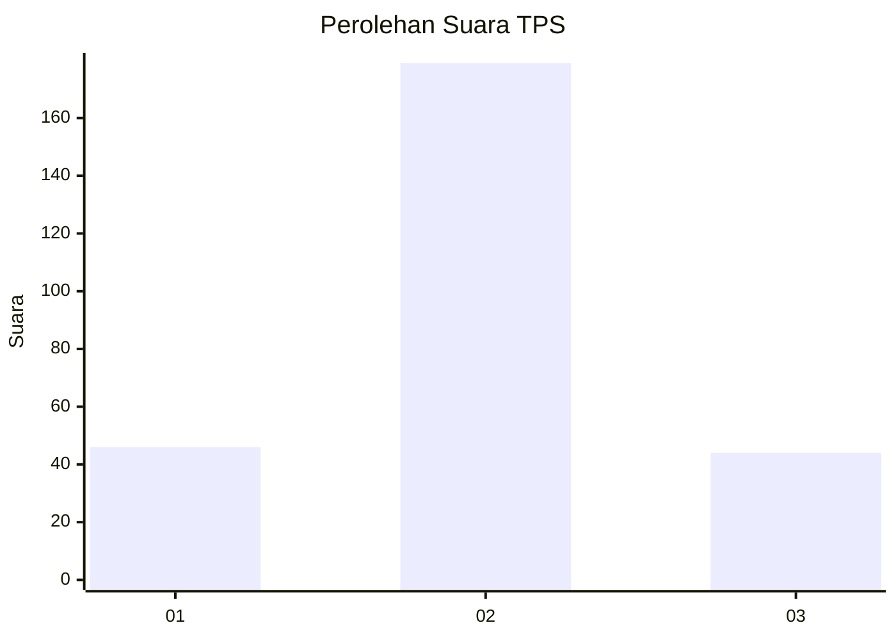
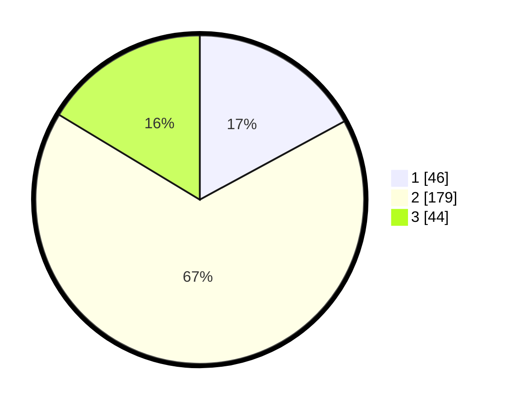

# Hasil

## Grafik

## Tabel

| No. | Nama Paslon    | Suara | Suara (raw) | Persentase |
|:--- |:-------------- | -----:| -----------:| ----------:|
| 1   | ANIES MUHAIMIN | 46    | [46][p-1]   | 17,10      |
| 2   | PRABOWO GIBRAN | 179   | [179][p-2]  | 66,54      |
| 3   | GANJAR MAHFUD  | 44    | [44][p-3]   | 16,36      |

[p-1]: https://github.com/gigit-pemilu/pemilu-2024/blob/main/pilpres/hitung-suara/sub/35-jawa-timur/sub/08-lumajang/sub/15-sukodono/sub/2005-kutorenon/sub/006-tps/sub/paslon-1.txt
[p-2]: https://github.com/gigit-pemilu/pemilu-2024/blob/main/pilpres/hitung-suara/sub/35-jawa-timur/sub/08-lumajang/sub/15-sukodono/sub/2005-kutorenon/sub/006-tps/sub/paslon-2.txt
[p-3]: https://github.com/gigit-pemilu/pemilu-2024/blob/main/pilpres/hitung-suara/sub/35-jawa-timur/sub/08-lumajang/sub/15-sukodono/sub/2005-kutorenon/sub/006-tps/sub/paslon-3.txt

## Foto C Plano

https://sirekap-obj-formc.kpu.go.id/d51d/pemilu/ppwp/35/08/15/20/05/3508152005006-20240214-223708--7d9d55b2-847f-4080-b912-84fc75ebc6a3.jpg

https://sirekap-obj-formc.kpu.go.id/d51d/pemilu/ppwp/35/08/15/20/05/3508152005006-20240214-224939--b32753cb-4cab-41d1-9cf2-869d28245916.jpg

## Metadata

| Key        | Value               |
| ---------- | ------------------- |
| Time Stamp | 2024-02-25 21:00:00 |

